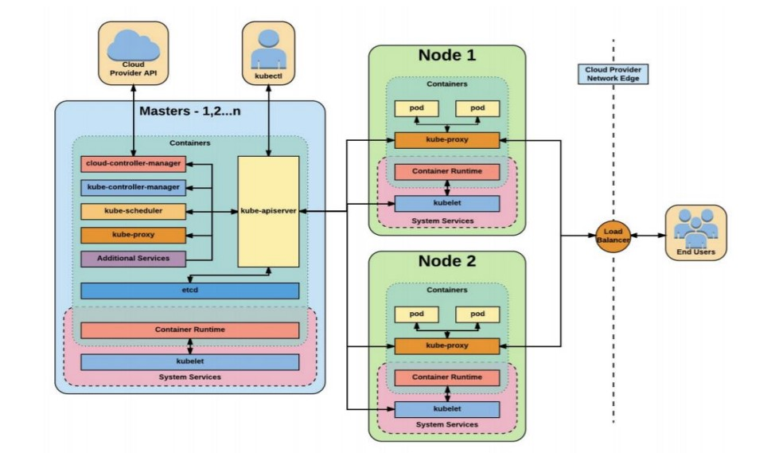

## Kubernetes:
    
Open source platform designed to automate **Deploying, Scaling, and Operating** applications.

• Deploy applications quickly and predictably.

• Scale applications on the fly.

• Roll out new features seamlessly.

• Limit hardware usage. 

It can **Schedule** & **Run** application containers on clustures of phisical or virtual Servers.
It satisfies common need for an applications in production.

• Authentication and Authorization.

• Naming and Discovery of Services.

• Load Balancing.

• Checking Application Health.

• Replicating Application Instances.

• Horizontal Pod Auto-scaling.

• Rolling updates.

• Mounting Storage.

• Secrets and ConfigMaps.

• Monitoring Resources.

• Accessing and Ingesting Logs.

• Debugging Applications

### Kubernetes is:

* Portable:

    *  Physical Servers.
    *  Virtual Servers
    * Public Cloud
    * Private Cloud
    * Hybrid Cloud
    * Multi Cloud

* Extensible:
    * Modular
    * Pluggable
    * Hookable
    * Composable

* Self-healing
    * Auto-placement
    * Auto-restart
    * Auto-replication
    * Auto-scaling

### Various Clusture Setup Tools

Local Machine Solution : Minikube

On Premise: kubeadm, kubespray, kops

Hosted & Cloud Solution: Azure(AKS) , GCP(GKE), AWS(EKS), RedHat(OpenShift)

**kubeadm**:

• kubeadm is a first-class citizen on the Kubernetes ecosystem.

• Secure and recommended way to bootstrap the Kubernetes cluster.

**kubespray**:
* Install highly available Kubernetes clusters on AWS, GCE, Azure, OpenStack, or Bare Metal.

**kops**

* With Kops, we can create, destroy, upgrade, and maintain production-grade, highly-available 
Kubernetes clusters from the command line.

* It can provision the machines as well.

## Architecture

#### kube-apiserver

* Exposes REST interface into the kubernetes control plane and Data Store.
* All clients, including Nodes, Users and other applications interact with kubernetes strictly through the API Server.
* Acting as the gatekeeper to the cluster by handling: 
    * Authentication and Authorization 
    * Request validation 
    * Mutation and Admission control

#### etcd
* Etcd acts as the **Cluster Data Store**.
* Provides a strong, consistent and highly available **key-value store** used for Persisting Cluster State.

#### kube-controller-manager
* Primary daemon that manages all core component control loops.

## Setup & Configuration

## Working with POD & Multi-Container Pod

## kubectl 

## Kubernetes Pattern 

## ReplicaSet

## Nodeport 

## ClustureIP 

## Deployment

## Blue Green Deployment 

## Autoscaler

## MetricsServer

## DaemonSet

## Taint and Tolerations

## Scheduler with nodeSelector 

## Nolume 

### hostPth

### emptyPath

### NFSStatic

## Readiness and Liveness Probes

## Screts and ConfigMaps

## Helm Package Manager

### HELM Chart 
