# Building a Multi-Agent Customer Support System with LangGraph and AWS

> **Lab date:** May 24, 2026 | **Stack:** LangGraph · Amazon Bedrock · Amazon Comprehend · SageMaker A2I · S3 Vector Buckets

---

## Overview

Customer support automation is one of the highest-ROI applications of generative AI — but a single LLM call is rarely enough. Real queries arrive with varying complexity, sentiment, and confidence levels. Some need an instant automated reply; others need a human in the loop.

In this lab I built a **multi-agent customer support pipeline** on AWS using [LangGraph](https://langchain-ai.github.io/langgraph/) as the orchestration framework. The system combines:

- **Amazon Bedrock** (Nova Pro LLM + Titan Text Embeddings v2 + Knowledge Bases) for retrieval and generation
- **Amazon Comprehend** for real-time sentiment analysis
- **SageMaker Augmented AI (A2I)** for human-in-the-loop escalation when confidence is low
- **Amazon S3 Vector Buckets** as the vector store for semantic search

The result is a graph-driven pipeline that decides — dynamically — whether to answer automatically or escalate to a human reviewer.

---

## Architecture

Here's the high-level infrastructure created in this lab:

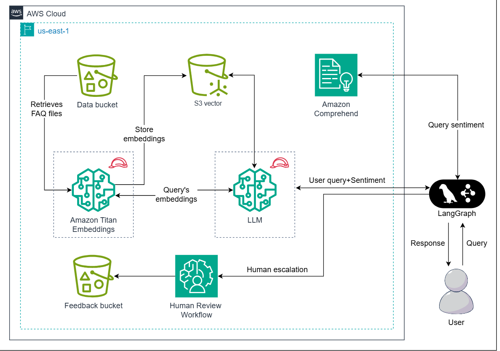

The workflow runs as a **StateGraph** in LangGraph. A supervisor agent receives each incoming question and fans out to two parallel agents (KB retrieval + sentiment analysis). A confidence router then decides whether to generate a polished automated response or hand off to SageMaker A2I for human review.

---

## Step 1: Create the Data Bucket (S3)

The first step is creating an S3 bucket to hold the FAQ documents that will seed the knowledge base.

- Navigate to **S3** in the AWS Management Console and click **Create bucket**
- Region: `us-east-1` (N. Virginia)
- Bucket name: `data-bucket-<random_text>` (must be globally unique)

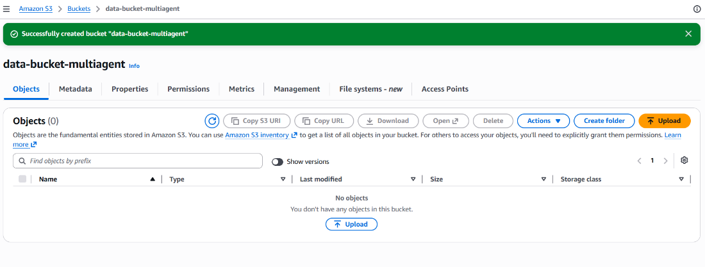

Once the bucket is created, upload your FAQ files using the provided code widget. These files contain the most frequently asked questions from real support chats and will become the knowledge source for the retrieval agent.

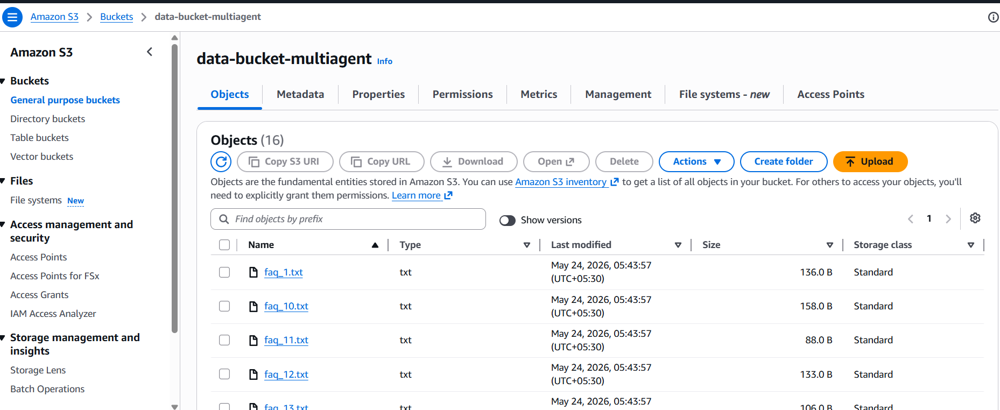

---

## Step 2: Create the Feedback Bucket

A second S3 bucket stores the structured output from human reviewers — essentially the audit trail for every escalated query.

- Bucket name: `feedback-bucket-<random_text>`
- Create a folder named `output/` inside the bucket — this is where SageMaker A2I writes its reviewed responses

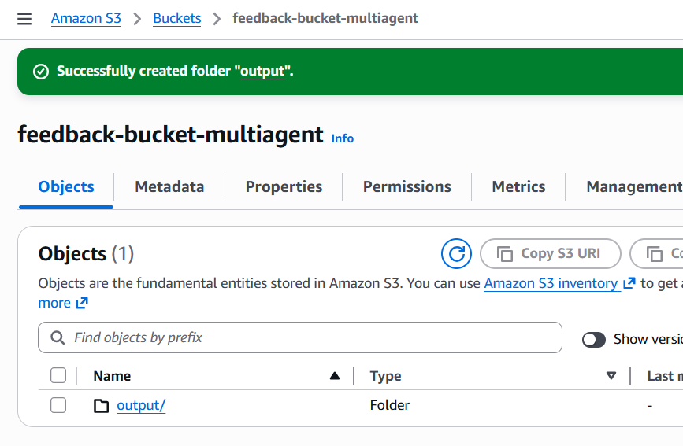

> **Note:** Save the feedback bucket name — you'll reference it when configuring the A2I workflow ARN later.

---

## Step 3: Create an S3 Vector Bucket and Index

[Amazon S3 Vector Buckets](https://docs.aws.amazon.com/AmazonS3/latest/userguide/s3-vectors.html) are a purpose-built storage type for high-dimensional embeddings. Unlike regular S3 buckets, they expose a similarity-search interface integrated with Amazon Bedrock.

- Navigate to **S3 → Vector buckets** and click **Create vector bucket**
- Vector bucket name: `edu-s3-vector`

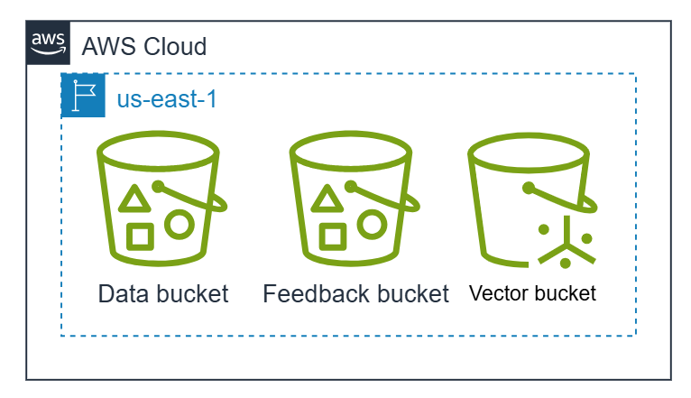

After creating the bucket, create a **vector index** inside it:

- Index name: `edu-s3-vector-index`
- Dimension: **1024** (matches the Titan Text Embeddings v2 output dimensionality)

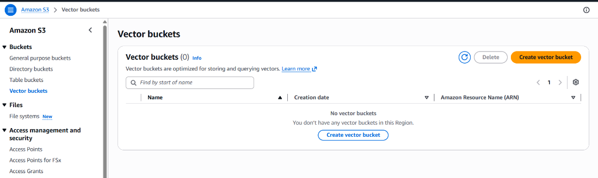

Once complete, the vector bucket and index are ready to receive embeddings generated from the FAQ documents.

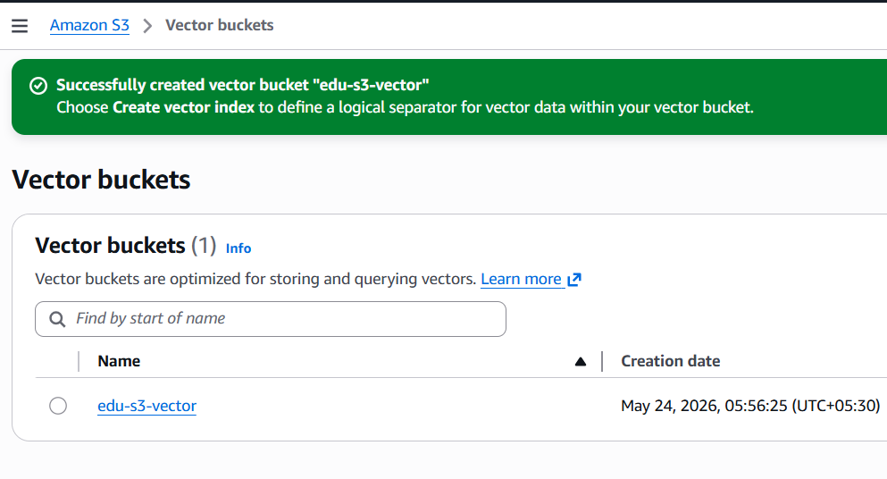

---

## Step 4: Create the Bedrock Knowledge Base

[Amazon Bedrock Knowledge Bases](https://docs.aws.amazon.com/bedrock/latest/userguide/knowledge-base.html) provide a fully managed RAG pipeline — they handle document ingestion, embedding generation, and vector storage so you don't have to wire it up manually.

**Models used in this lab:**

| Model | Role |
|---|---|
| [Titan Text Embeddings v2](https://docs.aws.amazon.com/bedrock/latest/userguide/titan-embedding-models.html) | Generates 1024-dim embeddings for semantic search |
| [Amazon Nova Pro](https://docs.aws.amazon.com/bedrock/latest/userguide/amazon-nova.html) | Synthesizes the final customer support response |

### Setup steps

- Go to **Amazon Bedrock → Knowledge Bases** and click **Create → Knowledge Base with vector store**
- Name: `faqs-knowledge-base`
- IAM Role: `AmazonBedrock_KB_Role` (pre-provisioned; grants Bedrock access to S3 and Secrets Manager)

The IAM role used here has policies for:
- `bedrock:InvokeModel` on `amazon.titan-embed-text-v2:0`
- `s3:ListBucket` and `s3:GetObject` on the data bucket
- `secretsmanager:GetSecretValue` for secure credential access

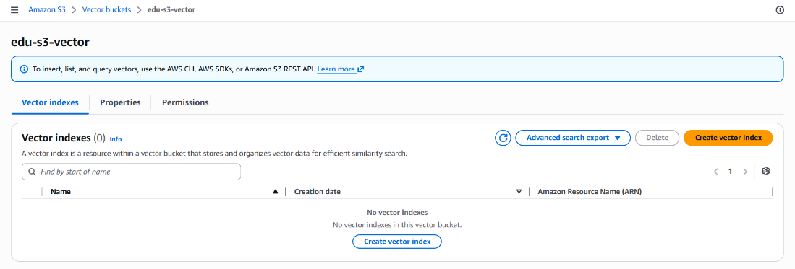

- Data source type: **Amazon S3**
- S3 source: `data-bucket-<random_text>` (your FAQ files)

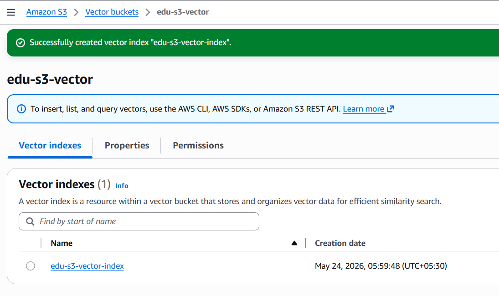

- Embedding model: **Titan Text Embeddings v2**
- Vector store: **Use existing → S3 Vectors → `edu-s3-vector`**
- Vector index: `edu-s3-vector-index`

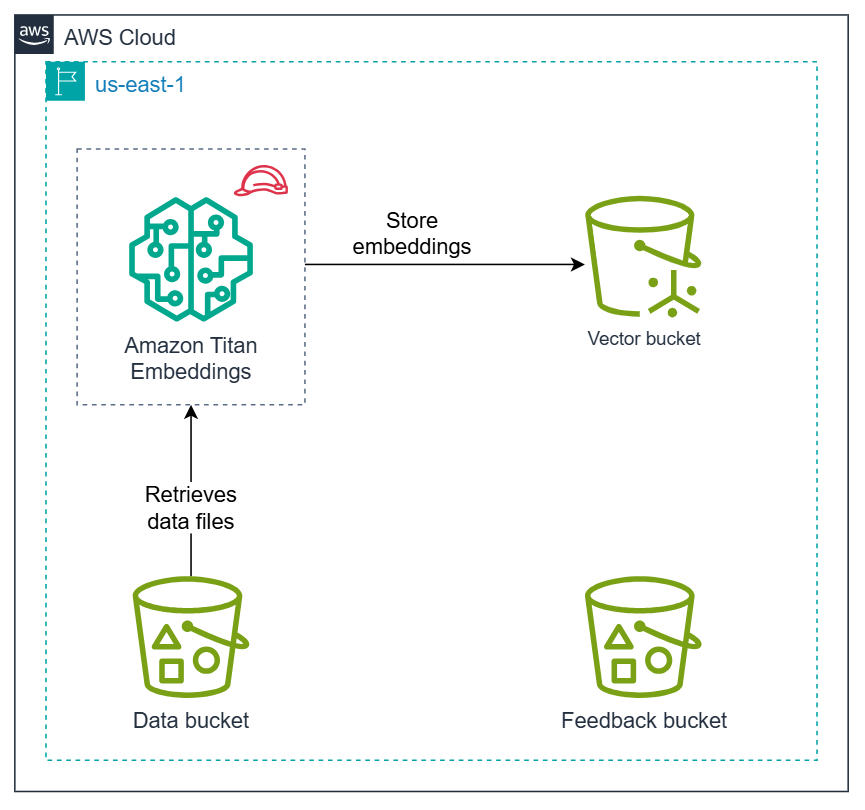

After creation, **sync the knowledge base** — this triggers Bedrock to chunk the FAQ documents, generate embeddings, and populate the S3 vector index.

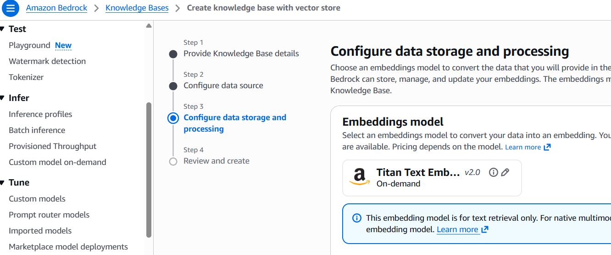

At this point the infrastructure looks like this:

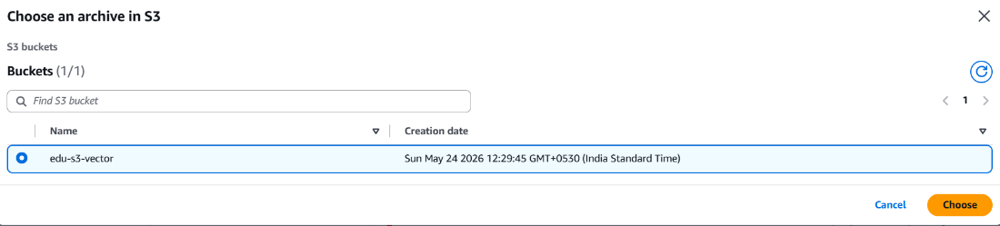

---

## Step 5: Set Up the Human-in-the-Loop (SageMaker A2I)

When the system's retrieval confidence is too low to trust an automated answer, it escalates to [Amazon Augmented AI (A2I)](https://docs.aws.amazon.com/sagemaker/latest/dg/a2i-use-augmented-ai-a2i-human-review-loops.html). This requires three components: a **worker task template**, a **private workforce**, and a **human review workflow**.

### 5a. Create the Worker Task Template

The worker task template defines the HTML interface reviewers see when evaluating an escalated query.

- Navigate to **SageMaker AI → Augmented AI → Worker task templates**
- Template name: `faq-human-review-ui`
- Template type: **Custom**

Paste the following crowd HTML as the template body:

```html
<script src="https://assets.crowd.aws/crowd-html-elements.js"></script>

<crowd-form>
  <div>
    <h3>Customer Question:</h3>
    <p>{{ task.input.question }}</p>
  </div>

  <div>
    <h4>Suggested FAQ (Low Confidence):</h4>
    <p>{{ task.input.faq_suggestion }}</p>
  </div>

  <crowd-text-area
    name="humanResponse"
    label="Your Response:"
    placeholder="Type your response here..."
    rows="6"
    required>
  </crowd-text-area>
</crowd-form>
```

This renders both the original customer question and the low-confidence FAQ suggestion so the reviewer has full context when writing their response.

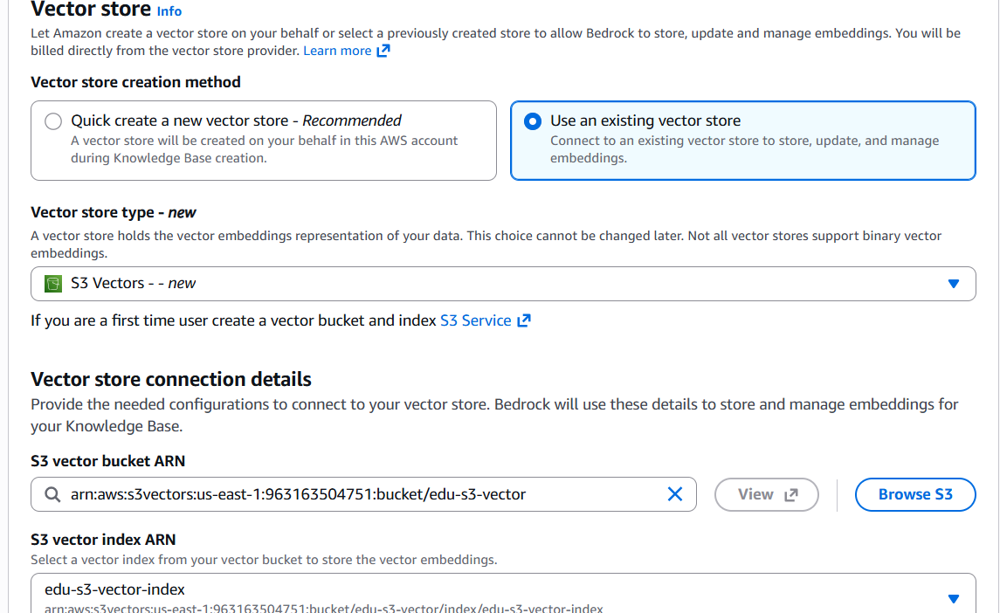

### 5b. Create a Private Workforce

- Go to **SageMaker AI → Ground Truth → Labeling workforces → Private**
- Team name: `HumanReviewTeam`
- Add your email address under "Invite new workers by email"

Check your inbox for the invitation email and complete the sign-in flow. You'll land on the worker portal showing **Jobs (0)** — ready to receive escalated queries.

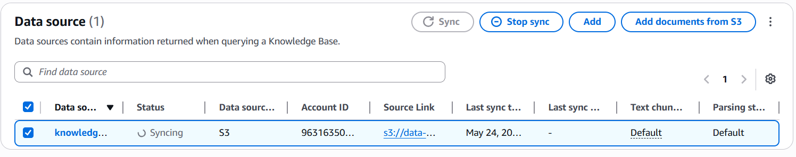

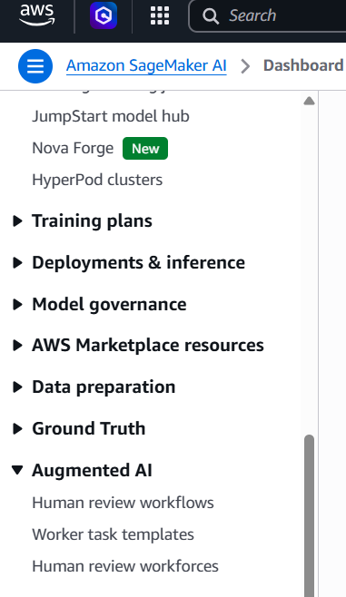

### 5c. Create the Human Review Workflow

This ties everything together — feedback bucket, IAM execution role, template, and private team.

- Go to **SageMaker AI → Augmented AI → Human review workflows**
- Workflow name: `escalation-review-workflow`
- S3 output path: `s3://feedback-bucket-<random_text>/output/`
- IAM role: `arn:aws:iam::<ACCOUNT_ID>:role/educative-sagemaker-role`
- Task type: **Custom**
- Worker task template: `faq-human-review-ui`
- Private team: `HumanReviewTeam`

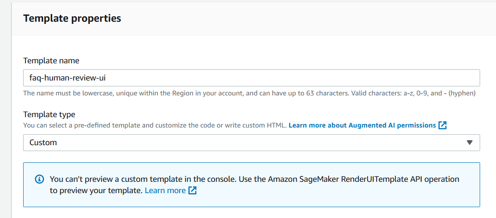

Copy the **Flow Definition ARN** from the workflow details — this goes into your Python code as `FLOW_ARN`.

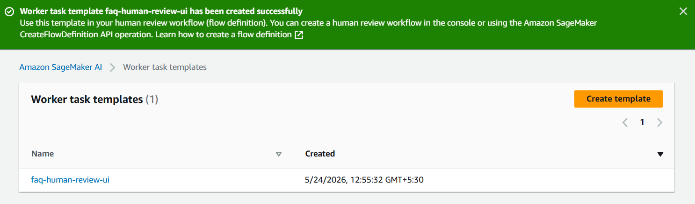

---

## Step 6: Understanding the Multi-Agent Workflow Design

Before writing the code, here's how the six agents collaborate:

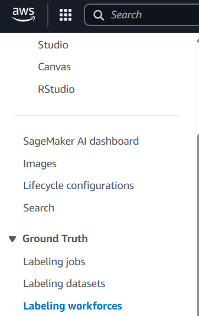

| Agent | Role |
|---|---|
| **Supervisor** | Entry point; triggers KB and Sentiment agents in parallel |
| **Knowledge Base Agent** | Semantic search via Bedrock KB; returns answer + confidence score |
| **Sentiment Agent** | Detects customer tone via Amazon Comprehend |
| **Join Node** | Synchronizes parallel branches before routing |
| **Confidence Router** | Score ≥ 0.75 → LLM generator; Score < 0.75 → human escalation |
| **LLM Generator** | Synthesizes polished response using Nova Pro |
| **Human Agent (A2I)** | Starts an A2I human loop for uncertain/complex queries |

**How branching works:**

| Condition | Path | Description |
|---|---|---|
| Confidence ≥ 0.75 | → LLM Generator | Fast, automated response |
| Confidence < 0.75 | → Human Agent | Escalated for human review |

The shared `AgentState` TypedDict is the backbone — every agent reads from it, writes its updates back, and passes the enriched state forward. This makes the workflow transparent and easy to debug.

---

## Step 7: Implement the RAG and Human-in-the-Loop Pipeline

Here's the full implementation. After completing this step, the provisioned infrastructure looks like:

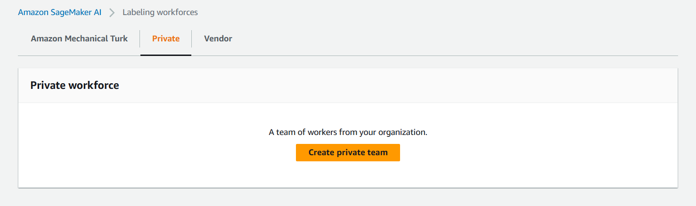

### Full code

```python
import boto3
from typing import TypedDict, Annotated
from langchain_aws import ChatBedrock
from langchain.prompts import ChatPromptTemplate
from langgraph.graph import StateGraph, END
import time, json
import operator

# -----------------------
# Configuration
# -----------------------
REGION = "us-east-1"
AWS_ACCESS_KEY_ID = "<YOUR_ACCESS_KEY>"
AWS_SECRET_ACCESS_KEY = "<YOUR_SECRET_KEY>"

KNOWLEDGE_BASE_ID = "<YOUR_KB_ID>"   # copy from Bedrock Knowledge Base details
FLOW_ARN = "<YOUR_FLOW_ARN>"         # copy from A2I Human Review Workflow

KB_NUM_RESULTS = 5
KB_OVERRIDE_SEARCH_TYPE = "SEMANTIC"
KB_CONFIDENCE_THRESHOLD = 0.75

# -----------------------
# AWS Clients
# -----------------------
bedrock_agent_runtime = boto3.client(
    "bedrock-agent-runtime",
    region_name=REGION,
    aws_access_key_id=AWS_ACCESS_KEY_ID,
    aws_secret_access_key=AWS_SECRET_ACCESS_KEY,
)

llm = ChatBedrock(
    model_id="amazon.nova-pro-v1:0",
    region_name=REGION,
    aws_access_key_id=AWS_ACCESS_KEY_ID,
    aws_secret_access_key=AWS_SECRET_ACCESS_KEY,
)

comprehend = boto3.client(
    "comprehend",
    region_name=REGION,
    aws_access_key_id=AWS_ACCESS_KEY_ID,
    aws_secret_access_key=AWS_SECRET_ACCESS_KEY,
)

a2i = boto3.client(
    "sagemaker-a2i-runtime",
    region_name=REGION,
    aws_access_key_id=AWS_ACCESS_KEY_ID,
    aws_secret_access_key=AWS_SECRET_ACCESS_KEY,
)

# -----------------------
# LangGraph State
# -----------------------
class AgentState(TypedDict):
    question: str
    kb_answer: str
    sentiment: str
    final_answer: str
    confidence: float
    next_step: str

# -----------------------
# Agent 1: Supervisor / Entry Router
# -----------------------
def supervisor_router(state: AgentState):
    """Entry point – triggers KB and Sentiment agents in parallel."""
    print("Supervisor: Starting orchestration → KB & Sentiment agents.")
    return state

# -----------------------
# Agent 2: Knowledge Base Agent
# -----------------------
def knowledge_agent(state: AgentState):
    query = state["question"]
    print(f"KB Agent: Searching knowledge base for '{query}'...")
    kb_answer = "No relevant FAQ found."
    confidence = 0.0
    try:
        response = bedrock_agent_runtime.retrieve(
            knowledgeBaseId=KNOWLEDGE_BASE_ID,
            retrievalQuery={"text": query},
            retrievalConfiguration={
                "vectorSearchConfiguration": {
                    "numberOfResults": KB_NUM_RESULTS,
                    "overrideSearchType": KB_OVERRIDE_SEARCH_TYPE,
                }
            },
        )
        results = response.get("retrievalResults", [])
        if results:
            top = sorted(results, key=lambda r: r.get("score", 0.0), reverse=True)[0]
            kb_answer = top.get("content", {}).get("text", "")
            confidence = float(top.get("score", 0.0))
        print(f"KB Agent: Top match score = {confidence:.2f}")
    except Exception as e:
        print(f"KB Agent Error: {e}")
        kb_answer = "Error retrieving from knowledge base."
        confidence = 0.0
    return {"kb_answer": kb_answer, "confidence": confidence}

# -----------------------
# Agent 3: Sentiment Agent
# -----------------------
def sentiment_agent(state: AgentState):
    text = state["question"]
    print("Sentiment Agent: Analyzing sentiment...")
    sentiment = "NEUTRAL"
    try:
        response = comprehend.detect_sentiment(Text=text, LanguageCode="en")
        sentiment = response.get("Sentiment", "NEUTRAL")
        print(f"Sentiment Agent: Detected '{sentiment}'")
    except Exception as e:
        print("Sentiment Agent Error:", e)
        sentiment = "NEUTRAL"
    return {"sentiment": sentiment}

# -----------------------
# Agent 4: Join Node
# -----------------------
def join_results(state: AgentState):
    """Synchronizes after KB and Sentiment agents complete."""
    print("Join Node: Both KB and Sentiment agents finished.")
    return state

# -----------------------
# Agent 5: LLM Final Answer Generator
# -----------------------
def generate_final_answer(state: AgentState):
    print("Final Generator: Synthesizing final response with LLM...")
    prompt = ChatPromptTemplate.from_messages([
        ("system", "You are a helpful and empathetic customer support agent."),
        ("human",
         "Customer Question: {question}\n"
         "Detected Sentiment: {sentiment}\n"
         "FAQ Answer: {kb_answer}\n\n"
         "Write a polite, professional response.")
    ])
    messages = prompt.format_messages(
        question=state["question"],
        sentiment=state["sentiment"],
        kb_answer=state["kb_answer"]
    )
    final_answer = "[Error generating response]"
    try:
        response = llm.invoke(messages)
        final_answer = response.content
    except Exception as e:
        print("LLM Error:", e)
    return {"final_answer": final_answer}

# -----------------------
# Agent 6: Human Escalation (A2I)
# -----------------------
def human_agent(state: AgentState):
    print("Human Agent: Escalating to A2I...")
    final_answer = "Unable to start human review at this time."
    try:
        loop_name = f"loop-{int(time.time())}"
        a2i.start_human_loop(
            HumanLoopName=loop_name,
            FlowDefinitionArn=FLOW_ARN,
            HumanLoopInput={"InputContent": json.dumps({
                "question": state["question"],
                "faq_suggestion": state["kb_answer"]
            })},
        )
        final_answer = (
            "Your question has been escalated to our human review team. "
            "You will receive a reply as soon as our team reviews the request."
        )
        print(f"Human Agent: Escalation started → Loop name: {loop_name}")
    except Exception as e:
        print("Human Agent Error:", e)
    return {"final_answer": final_answer, "confidence": 0.0}

# -----------------------
# Router: Confidence-based Branching
# -----------------------
def confidence_router(state: AgentState):
    score = state.get("confidence", 0.0)
    print(f"Router: Checking confidence = {score:.2f}")
    if score >= KB_CONFIDENCE_THRESHOLD:
        print("Router: High confidence → route to LLM response")
        return "generator"
    else:
        print("Router: Low confidence → escalate to human review")
        return "human"

# -----------------------
# Build LangGraph
# -----------------------
graph = StateGraph(AgentState)

graph.add_node("supervisor", supervisor_router)
graph.add_node("kb", knowledge_agent)
graph.add_node("sentiment", sentiment_agent)
graph.add_node("join_results", join_results)
graph.add_node("generator", generate_final_answer)
graph.add_node("human", human_agent)

graph.set_entry_point("supervisor")

# Parallel branches from supervisor
graph.add_edge("supervisor", "kb")
graph.add_edge("supervisor", "sentiment")

# Synchronize parallel results
graph.add_edge("kb", "join_results")
graph.add_edge("sentiment", "join_results")

# Conditional route based on confidence
graph.add_conditional_edges("join_results", confidence_router, {
    "generator": "generator",
    "human": "human"
})

graph.add_edge("generator", END)
graph.add_edge("human", END)

app = graph.compile()

# -----------------------
# Run Examples
# -----------------------
if __name__ == "__main__":

    # Scenario 1: High confidence query — automated response
    inputs_high = {"question": "How to reset my password?"}
    result_high = app.invoke(inputs_high)
    print("\nFinal Answer:\n", result_high["final_answer"])

    # Scenario 2: Low confidence query — human escalation
    # inputs_low = {"question": "I have a complex issue with multiple accounts, what do I do?"}
    # result_low = app.invoke(inputs_low)
    # print("\nFinal Answer:\n", result_low["final_answer"])
```

### Agent-by-agent walkthrough

**`AgentState` (TypedDict)** — The shared state object that flows through every node. Holds `question`, `kb_answer`, `sentiment`, `final_answer`, `confidence`, and `next_step`. Every agent reads the keys it needs and writes back only the keys it updates — keeping concerns cleanly separated.

**Supervisor (Agent 1)** — The entry point of the graph. Doesn't do computation itself but triggers both the KB and Sentiment agents in parallel, passing the initial state to each branch simultaneously.

**Knowledge Base Agent (Agent 2)** — Calls `bedrock-agent-runtime.retrieve()` with `SEMANTIC` search mode against your Bedrock Knowledge Base. Sorts results by score and returns the top match along with its confidence value. If nothing is found, defaults to a zero-confidence placeholder.

**Sentiment Agent (Agent 3)** — Calls `comprehend.detect_sentiment()` on the user's question. The detected label (`POSITIVE`, `NEGATIVE`, `NEUTRAL`, `MIXED`) gets embedded into the LLM prompt to ensure the tone of the final response matches the customer's emotional state.

**Join Node (Agent 4)** — LangGraph waits for both parallel branches to complete before passing state to the router. This ensures the confidence score and sentiment label are both available for the routing decision.

**Confidence Router** — The decision gate. If the KB retrieval score is `≥ 0.75`, routes to the LLM generator for an automated response. If lower, routes to the human escalation agent.

**LLM Generator (Agent 5)** — Uses `ChatBedrock` with Amazon Nova Pro to synthesize a natural, professional support reply. The prompt includes the original question, the detected sentiment, and the retrieved FAQ answer — giving the model all the context it needs.

**Human Agent (Agent 6)** — Calls `sagemaker-a2i-runtime.start_human_loop()` using your Flow Definition ARN. The reviewer sees the question and the low-confidence FAQ suggestion in the custom HTML template and writes a human-crafted response that gets saved to the feedback bucket.

---

## Step 8: Running the Pipeline and Reviewing Human Feedback

### Scenario 1: High Confidence (Automated)

Run the app with `"How to reset my password?"`. The KB agent retrieves a relevant FAQ with a score above 0.75, routes to the LLM generator, and produces a polished response.

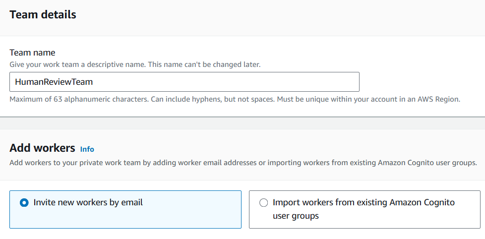

### Scenario 2: Low Confidence (Human Escalation)

Uncomment the second scenario in `__main__`. The KB agent returns a low-confidence match, the router sends the query to the human agent, and A2I creates a review loop.

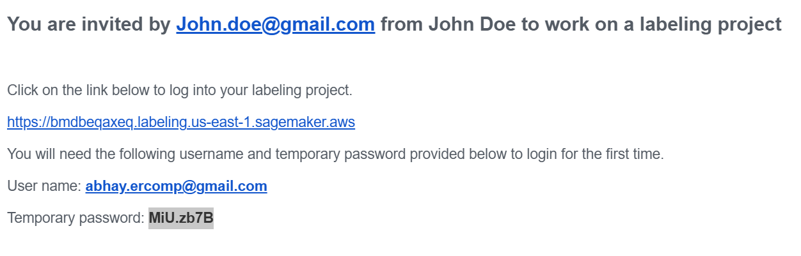

### Reviewing in the Worker Portal

- Open your worker portal URL (from the A2I setup email)
- Click **Start working** to begin the review
- You'll see the customer question and the low-confidence FAQ suggestion
- Enter your response in the reply box and click **Submit**

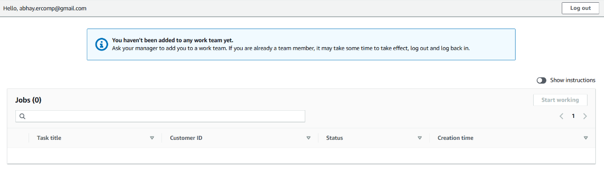

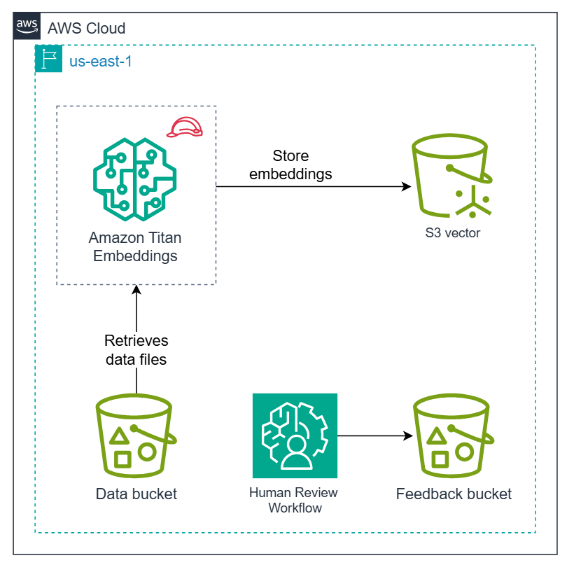

### Verifying the Output in S3

After submission, navigate to `feedback-bucket-<random_text>/output/` in S3 and download `output.json`. Open it in a JSON viewer to confirm your human-reviewed response is recorded.

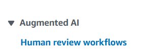

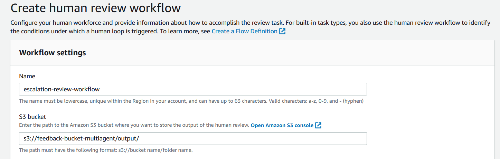

---

## What I Learned

A few things that stood out doing this hands-on:

**S3 Vector Buckets are purpose-built and worth understanding separately.** They're not just regular S3 with a plugin — they expose a native similarity-search interface and integrate directly with Bedrock Knowledge Bases. The 1024-dimension constraint is locked to the Titan Embeddings v2 model, so model choice and index dimensionality need to be decided together.

**LangGraph's StateGraph model makes parallel execution clean.** The fan-out from supervisor → (KB + sentiment) with a join node before routing is genuinely elegant. In a non-graph framework you'd wire this with threads or asyncio — here it's just edges in a graph definition. The shared `AgentState` as a TypedDict means you always know exactly what data is in flight.

**Confidence thresholds need to be tuned for your data.** The 0.75 threshold used here worked for the FAQ dataset but it's not universal. In production you'd want to look at score distributions across your actual query distribution before hardcoding a cutoff.

**A2I adds real accountability.** Every escalated query gets a timestamped record in S3 with both the original AI suggestion and the human override. That's an audit trail you'd want in any regulated or customer-facing production system.

---

## Tech Stack & References

| Technology | Purpose | Reference |
|---|---|---|
| LangGraph | Multi-agent orchestration via StateGraph | [LangGraph Docs](https://langchain-ai.github.io/langgraph/) |
| Amazon Bedrock | LLM (Nova Pro) + Knowledge Base + embeddings | [Amazon Bedrock Docs](https://docs.aws.amazon.com/bedrock/latest/userguide/what-is-bedrock.html) |
| Titan Text Embeddings v2 | 1024-dim semantic embeddings | [Titan Embedding Models](https://docs.aws.amazon.com/bedrock/latest/userguide/titan-embedding-models.html) |
| Amazon Nova Pro | Final response generation | [Amazon Nova Models](https://docs.aws.amazon.com/bedrock/latest/userguide/amazon-nova.html) |
| Amazon Comprehend | Sentiment detection | [Comprehend Docs](https://docs.aws.amazon.com/comprehend/latest/dg/what-is.html) |
| Amazon S3 Vector Buckets | Vector store for embeddings | [S3 Vectors Docs](https://docs.aws.amazon.com/AmazonS3/latest/userguide/s3-vectors.html) |
| SageMaker Augmented AI (A2I) | Human-in-the-loop review | [A2I Docs](https://docs.aws.amazon.com/sagemaker/latest/dg/a2i-use-augmented-ai-a2i-human-review-loops.html) |
| LangChain AWS | `ChatBedrock` integration | [langchain-aws Docs](https://python.langchain.com/docs/integrations/chat/bedrock/) |

---

*Built as part of a hands-on cloud lab exploring multi-agent AI systems on AWS.*
