# Working with Relational Databases: A Beginner's Guide to AWS RDS

> **Lab Completion** — This blog is based on a hands-on Cloud Lab I completed on [AWS](https://aws.amazon.com/). It walks through everything I did — from spinning up a VPC to creating Read Replicas — so you can follow along and build the same setup yourself.

---

## What You'll Learn

By the end of this guide, you'll have a solid understanding of:

- What **Amazon RDS** is and why it matters
- How to create and configure a **VPC**, an **EC2** instance, and an **RDS DB** instance
- How to connect to a database instance over SSH
- What **Multi-AZ Deployment** is and how to enable it
- What **Read Replicas** are and how to create them

---

## Technologies Used

| Service | Purpose | Official Link |
|---|---|---|
| Amazon VPC | Network isolation for RDS | [aws.amazon.com/vpc](https://aws.amazon.com/vpc/) |
| Amazon EC2 | Compute instance to connect to RDS | [aws.amazon.com/ec2](https://aws.amazon.com/ec2/) |
| Amazon RDS | Managed relational database service | [aws.amazon.com/rds](https://aws.amazon.com/rds/) |
| MySQL | Database engine used in the lab | [mysql.com](https://www.mysql.com/) |

---

## Cloud Lab Overview

[Amazon Relational Database Service (RDS)](https://aws.amazon.com/rds/) is an AWS service that lets you set up, operate, and scale relational databases in the cloud — without having to worry about the routine administration tasks like patching, backups, or hardware provisioning. RDS handles all of that so you can stay focused on your application and data.

In this lab, I:

1. Created a **VPC** to host all the resources
2. Launched an **EC2** instance that acts as a client to the database
3. Created an **RDS DB** instance using MySQL
4. Connected to the RDS instance through the EC2 instance via SSH
5. Enabled **Multi-AZ Deployment** for fault tolerance
6. Created a **Read Replica** to offload read traffic

Here's the high-level architecture of what we're building:

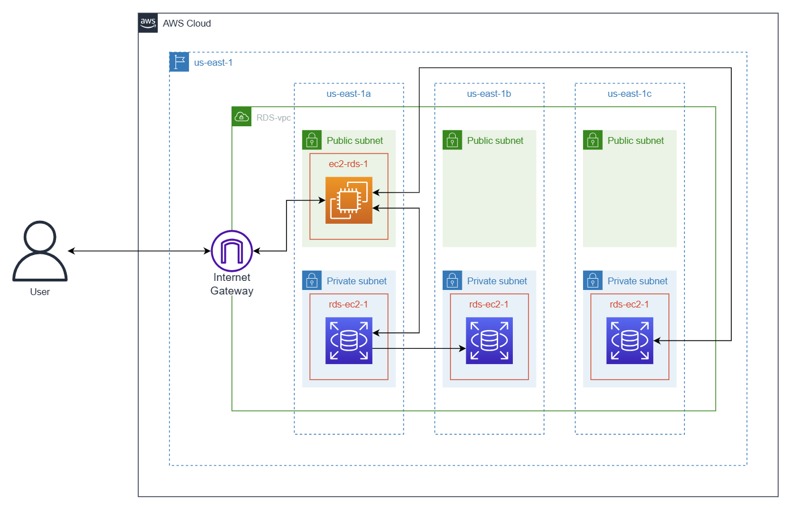

---

## Why Use Amazon RDS?

Before diving in, let me quickly explain why RDS is worth using in the first place.

[Amazon RDS](https://aws.amazon.com/rds/) supports the most widely used database engines — **MySQL**, **MariaDB**, **PostgreSQL**, **Oracle**, and **Microsoft SQL Server**. You can interact with your database using the same tools you already know.

On top of that, RDS gives you:

- **Built-in monitoring** for performance and security
- **Easy scalability** — you can scale up or down without downtime
- **Automated backups**, snapshots, and point-in-time recovery
- **High availability** via Multi-AZ deployments

It genuinely removes a lot of the operational overhead that comes with self-managed databases.

---

## Step 1 — Create a VPC

An RDS DB instance **must** live inside a [VPC (Virtual Private Cloud)](https://aws.amazon.com/vpc/). This is a hard requirement — it enhances security and provides network isolation. So the first thing I did was create a VPC.

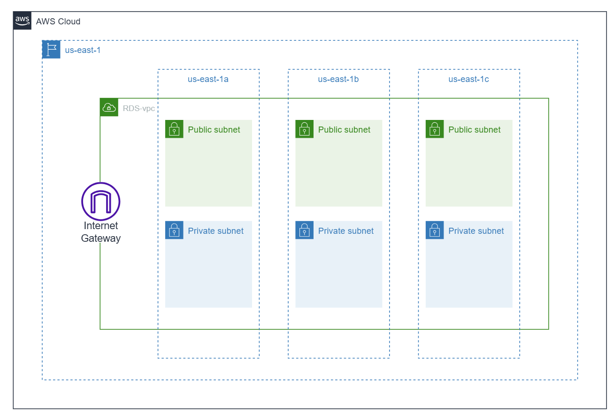

Here's what I did:

**Search for VPC in the AWS Console**

Use the search bar at the top of the [AWS Console](https://console.aws.amazon.com/) to search for "VPC" and select it from the results. This takes you to the VPC Dashboard.

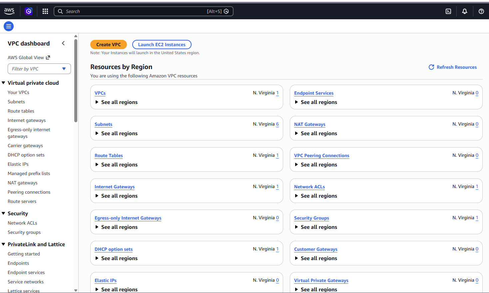

**Click "Create VPC"**

You'll be taken to the VPC creation page where you can configure everything.

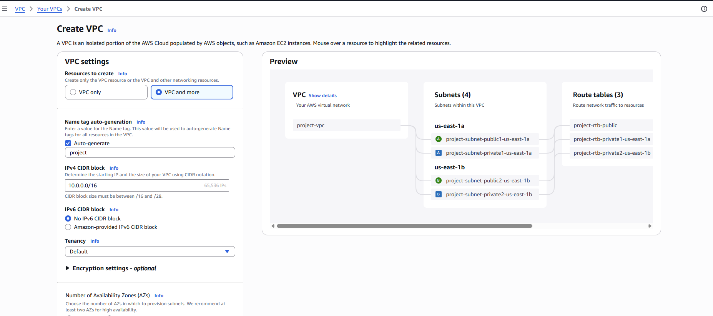

**Select "VPC and more"**

From the "Resources to create" section, choose **"VPC and more"** — this gives you more configuration options like subnets, route tables, and availability zones.

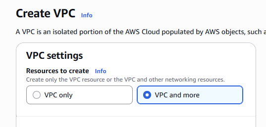

**Name the VPC**

In the "Name tag auto-generation" field, type `RDS` — this will name the VPC `RDS-vpc`.

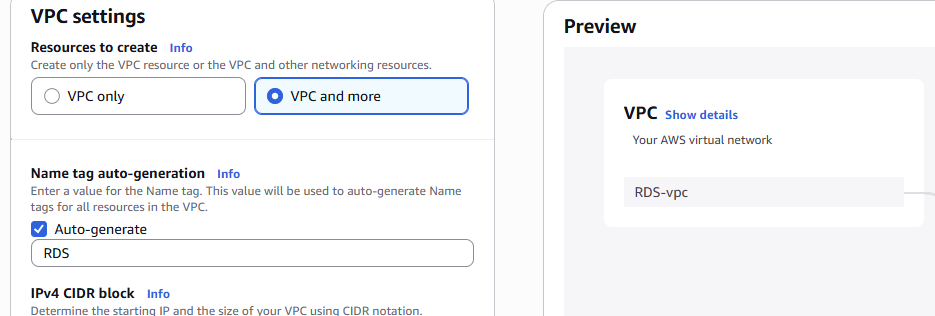

**Set Availability Zones to 3**

In the "Number of Availability Zones (AZs)" section, select **3**. This gives us better fault tolerance later.

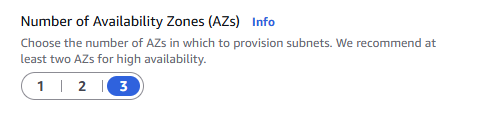

**Set VPC Endpoints to None**

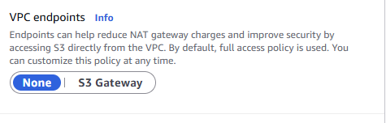

**Create the VPC**

Leave everything else as-is and click **"Create VPC"**. AWS will show you a workflow page and create the VPC in a few seconds.

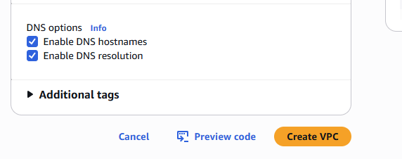

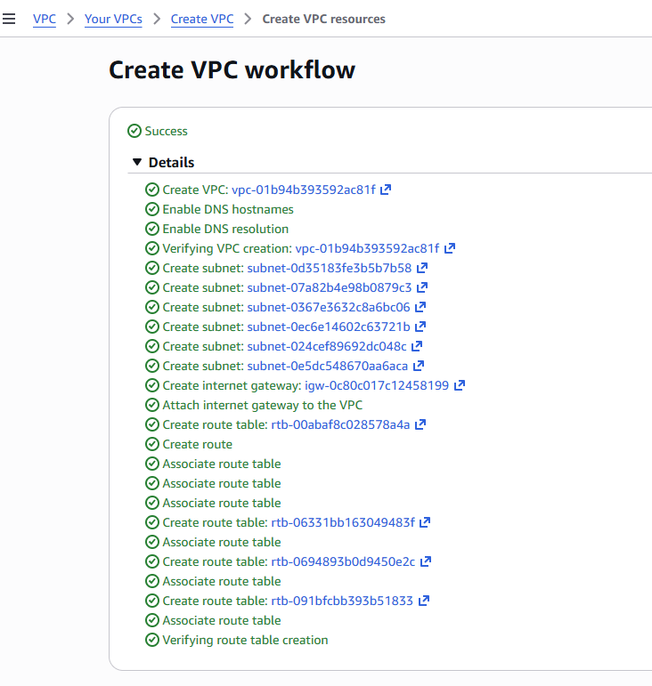

---

## Step 2 — Create an EC2 Instance

[EC2](https://aws.amazon.com/ec2/) and RDS are commonly used together. EC2 provides the compute power for your application, while RDS handles the database backend. In this lab, the EC2 instance acts as a **client** — we'll SSH into it and use it to connect to the RDS database.

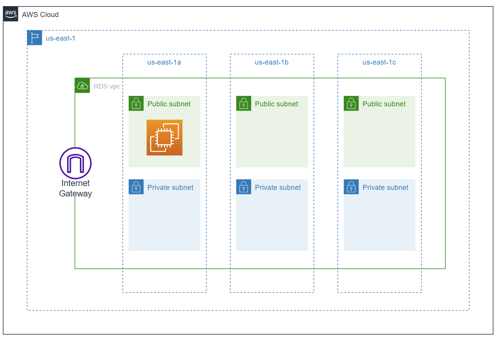

**Navigate to EC2**

Search for "EC2" in the AWS Console and click on **"Instances"** from the left sidebar.

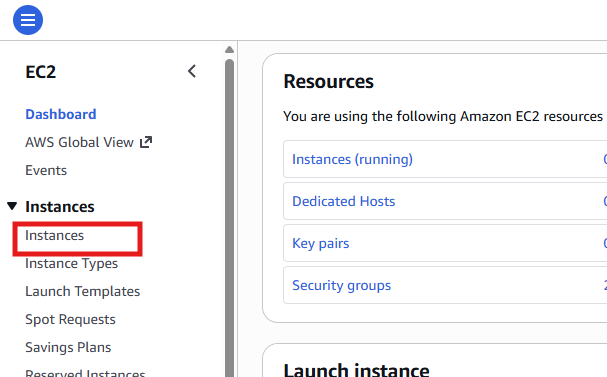

**Launch a new instance**

Click **"Launch instances"** to go to the instance configuration page.

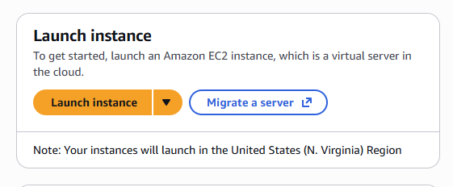

**Configure the instance**

- **Name**: `RDS-client`
- **OS**: Ubuntu → **Ubuntu Server 24.04 LTS (HVM), SSD Volume Type**

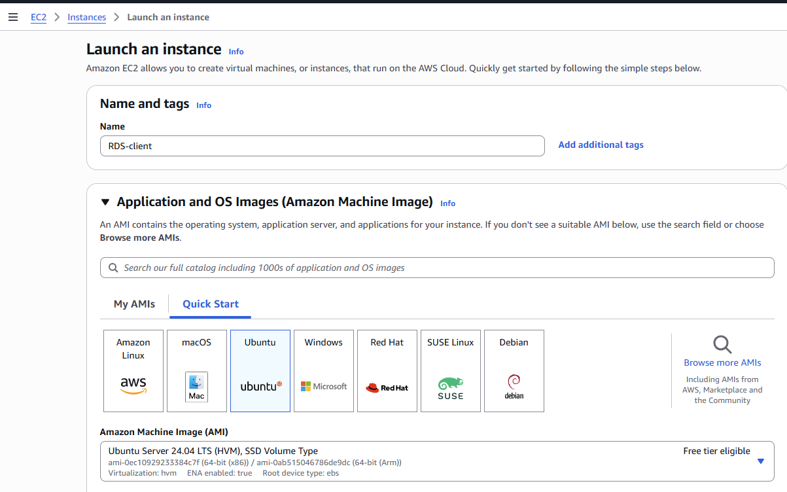

- **Instance type**: `t3.micro`

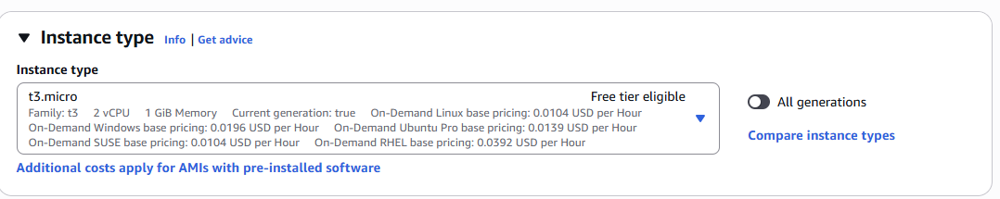

**Create a key pair**

You'll need a key pair to SSH into the instance. In the "Key pair (login)" section, click **"Create new key pair"** and name it `RDS-client-key-pair`.

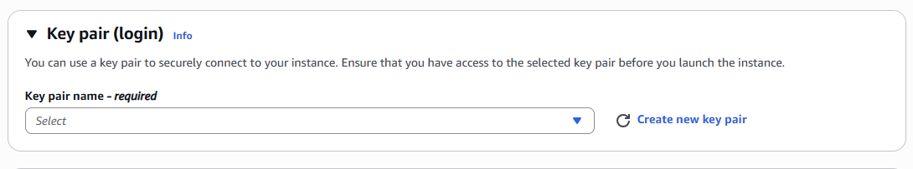

Make sure **RSA** and **.pem** are selected, then click **"Create key pair"**. The `.pem` file will be downloaded to your machine — keep it safe!

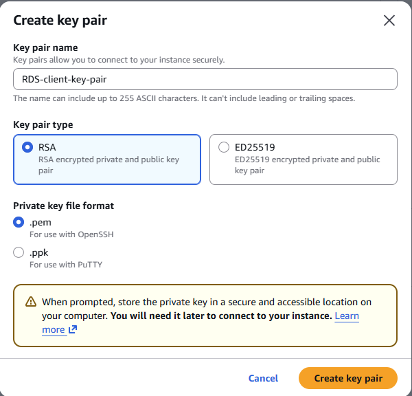

**Configure network settings**

Click **"Edit"** in the "Network settings" section.

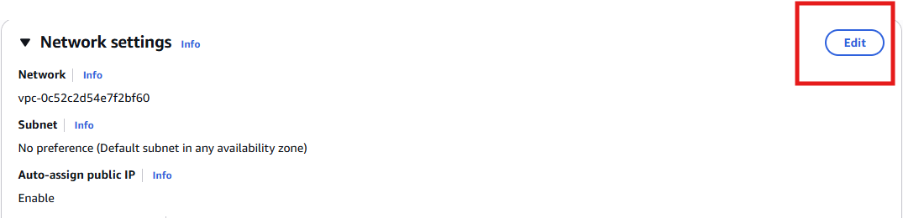

Set the following:
- **VPC**: `RDS-vpc`
- **Subnet**: `RDS-subnet-public1-us-east-1a`
- **Auto-assign public IP**: `Enable`

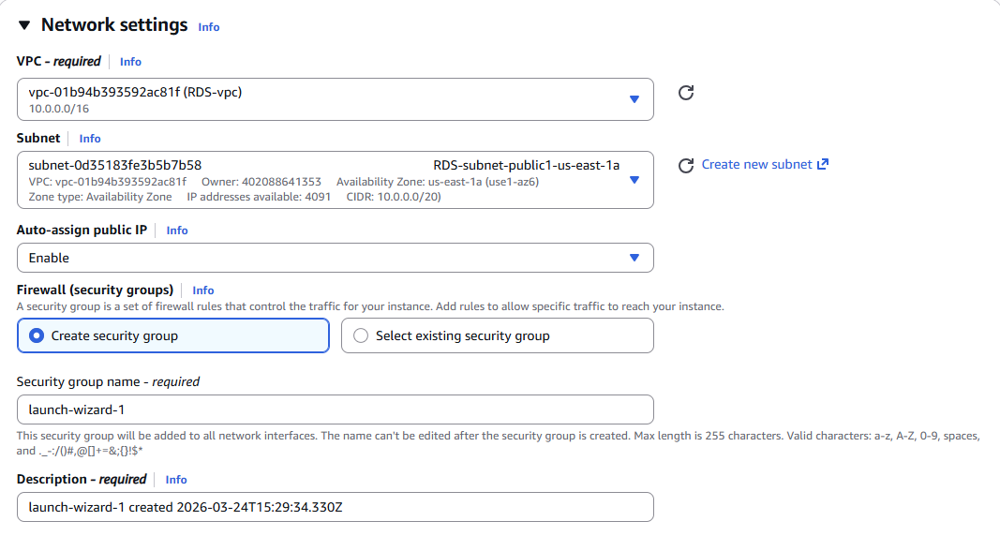

**Create a security group**

Under "Firewall (security groups)", choose **"Create security group"** and name it `RDS-client-security-group`.

For the inbound rule:
- **Rule type**: SSH
- **Source type**: Anywhere

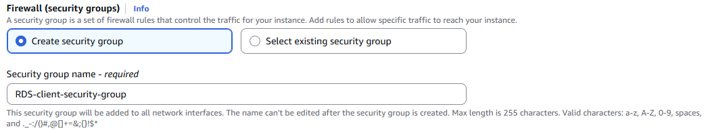

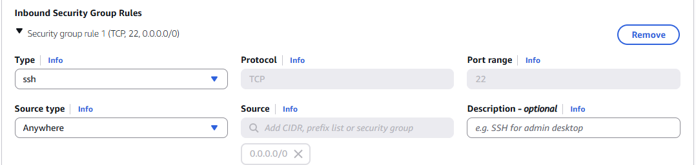

**Configure storage**

Make sure **8 GiB of gp3** storage is selected.

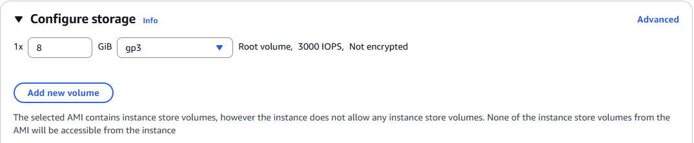

**Launch the instance**

Click **"Launch instance"**. Head back to the Instances page and wait for the state to show **"Running"**.

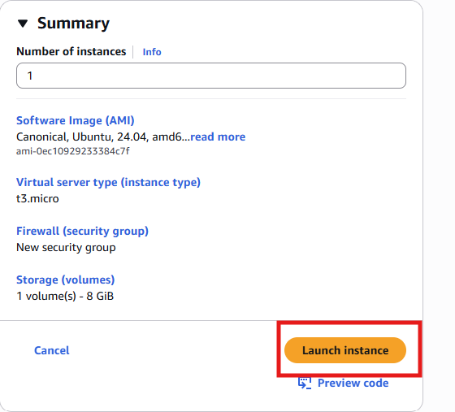

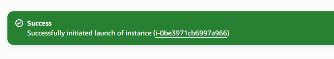

Once it's running, click on the instance ID and **copy the Public IPv4 address** — you'll need it later for the SSH connection.

---

## Step 3 — Create an RDS DB Instance

The core building block of [Amazon RDS](https://aws.amazon.com/rds/) is the **DB instance** — think of it as a virtual machine running a managed database engine, dedicated to your application. Each DB instance can host one or more databases.

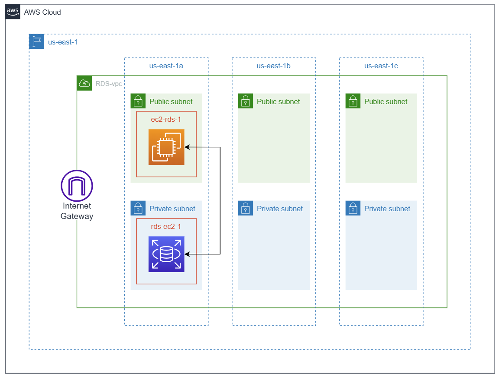

**Navigate to RDS**

Search for "RDS" in the console and select **"Aurora and RDS"**. Then click **"Databases"** from the left sidebar, followed by **"Create database"**.

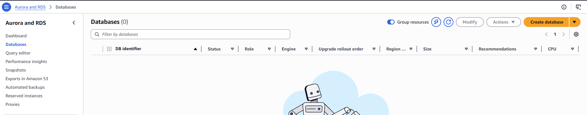

**Select MySQL as the engine**

From "Engine options", select **MySQL**.

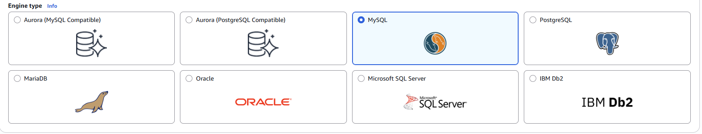

**Choose Full configuration**

Select **"Full configuration"** so we can customize everything.

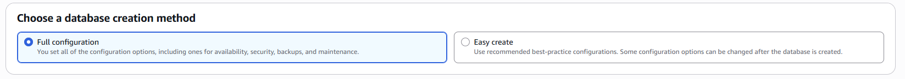

**Choose the Dev/Test template**

Select **"Dev/Test"** from the Templates section — this unlocks deployment configuration options.

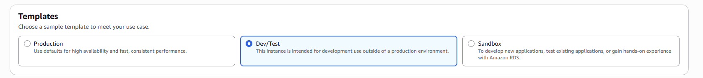

**Set Availability and Durability**

For this lab, select **"Single-AZ DB instance deployment (1 instance)"**. Here's a quick breakdown of all three options:

| Option | Instances | Use Case |
|---|---|---|
| Single-AZ | 1 | Development / Testing |
| Multi-AZ (2 instances) | 2 | High availability with failover |
| Multi-AZ Cluster (3 instances) | 3 | Best performance + redundancy |

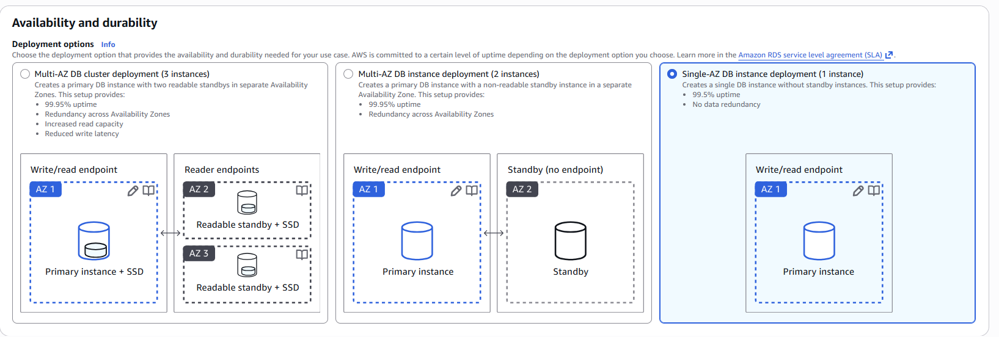

**Configure settings**

- **DB instance identifier**: `mysql8`

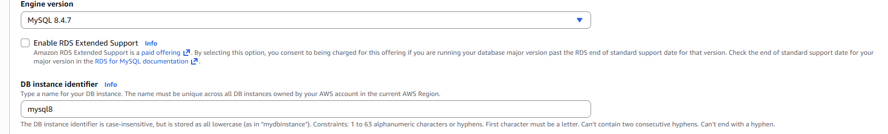

- **Master username**: `admin`
- **Credentials management**: Self-managed
- **Master password**: Your choice

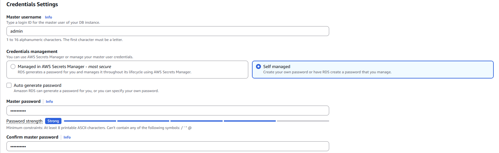

**Instance configuration**

- Select **Burstable classes (includes t classes)**
- Choose `db.t4g.micro`

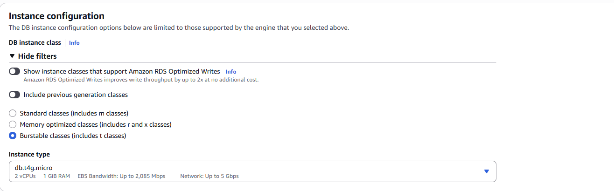

**Storage configuration**

- **Storage type**: Magnetic
- **Allocated storage**: 10 GiB

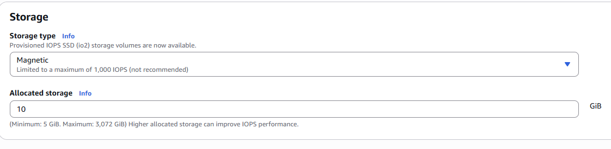

**Connect to EC2**

In the "Connectivity" section, click the refresh button and then select **"Connect to an EC2 compute resource"**. Choose the `RDS-client` instance from the dropdown.

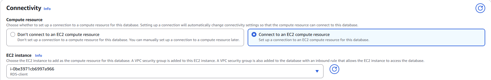

**Disable Enhanced Monitoring**

In the "Monitoring" section, uncheck **"Enable Enhanced monitoring"** to keep costs down for this lab.

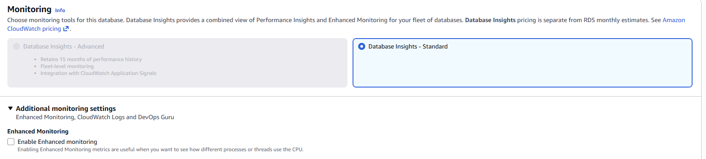

**Additional configuration**

Leave the backup settings as-is — we'll need automated backups later for the read replica task.

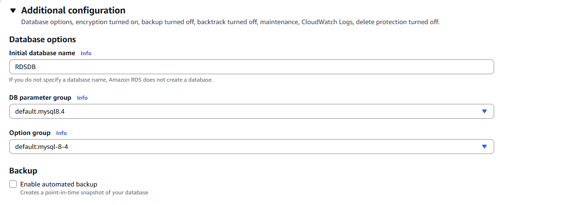

**Disable deletion protection**

Make sure **"Enable deletion protection"** is unchecked so we can clean up later.

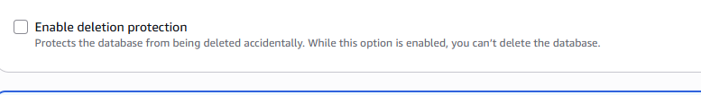

**Create the database**

Click **"Create database"** and wait a few minutes for the instance to spin up.

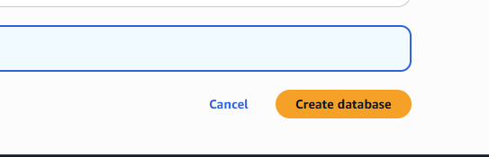

Once it's ready, click on the instance name and **copy the endpoint** from the "Connectivity & security" section. Save this — you'll need it to connect.

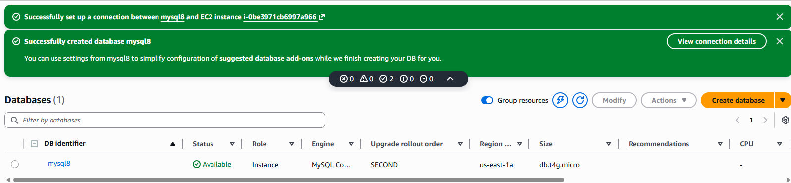

---

## Step 4 — Connect to the Database Instance

Now that the VPC, EC2, and RDS are all set up, it's time to actually connect to the database. Here's the architecture at this point:

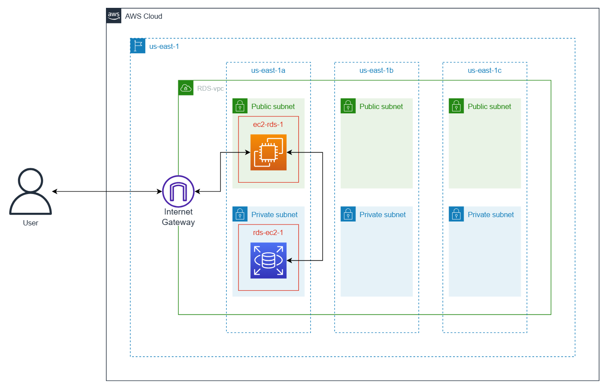

The flow is: **Your machine → SSH into EC2 → MySQL client connects to RDS endpoint**

**Open a terminal** and run the following to SSH into the EC2 instance:

```bash
ssh -i RDS-client-key-pair.pem ubuntu@{public-ipv4-address}
```

> Replace `{public-ipv4-address}` with the IPv4 address you copied earlier.

**Update apt packages inside the EC2 instance:**

```bash
sudo apt update
```

**Install the MySQL client:**

```bash
sudo apt install mysql-client-core-8.0
```

**Connect to the RDS instance:**

```bash
mysql -h {endpoint} -P 3306 -u admin -p
```

> Replace `{endpoint}` with the RDS endpoint you saved earlier.

Enter your password when prompted, and you should see a MySQL welcome message — you're in!

---

## Step 5 — Multi-AZ Deployment

**Multi-AZ deployment** replicates your database to a standby instance in a different availability zone. If the primary instance goes down for any reason, [Amazon RDS](https://aws.amazon.com/rds/features/multi-az/) automatically fails over to the standby — minimal downtime, no manual intervention needed.

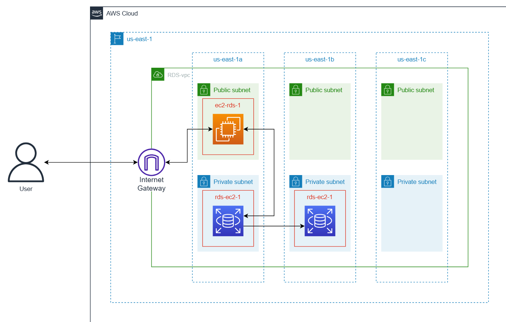

**Navigate to RDS → Databases** and select the `mysql8` instance.

Click **"Actions"** → **"Convert to Multi-AZ deployment"**.

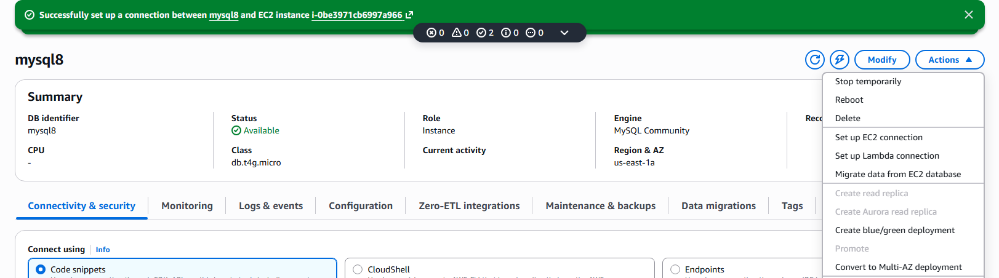

In the popup, select **"Apply immediately"** and click **"Convert to Multi-AZ"**.

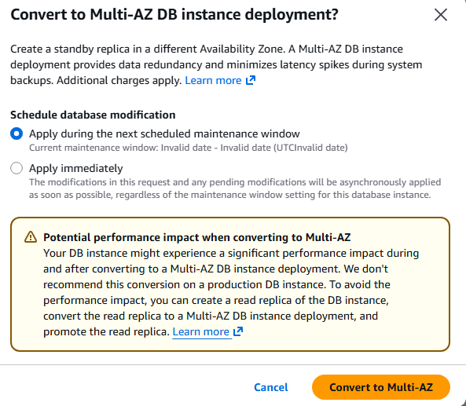

This modification takes about 10–15 minutes. Wait for the success message at the top.

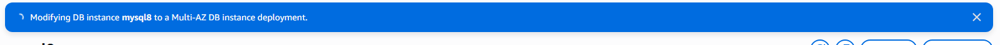

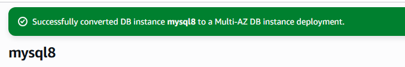

**Verify via AWS CLI:**

Once the conversion completes, run this command to verify:

```bash
aws rds describe-db-instances --db-instance-identifier mysql8
```

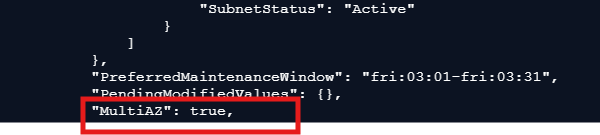

Look for `"MultiAZ": true` in the output — that confirms it's active. Your database is now fault-tolerant. ✅

---

## Step 6 — Create Read Replicas

A **read replica** is a read-only copy of your primary database. It's used to offload read-heavy traffic from the primary instance, which can improve performance significantly in production workloads.

Key benefits:
- **Better performance** — read queries go to replicas, not the primary
- **Lower latency** — replicas can be placed closer to users
- **Reduced load** — the primary handles only writes
- **Disaster recovery** — replicas in different regions provide geographic redundancy

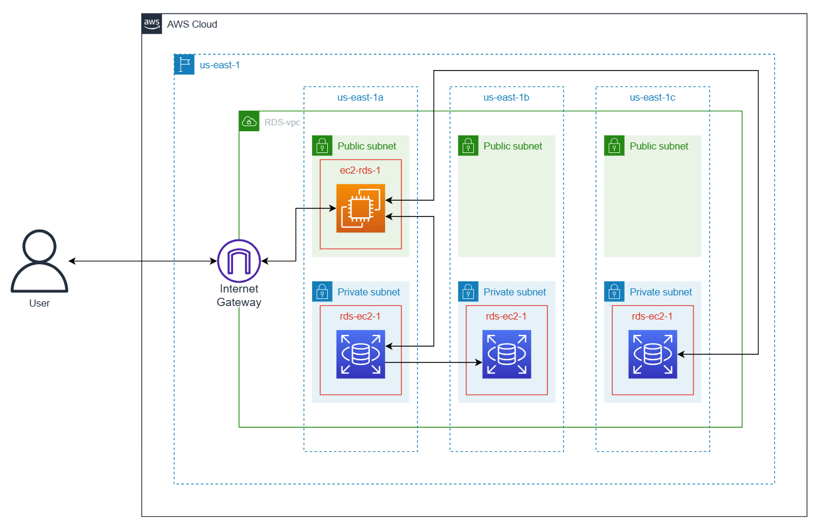

**Navigate to the `mysql8` instance dashboard** and click **"Actions"** → **"Create read replica"**.

Configure the replica:
- **DB instance identifier**: `Replica`
- **Enhanced monitoring**: Unchecked

Click **"Create read replica"** and wait for the Status column to show **"Available"**.

---

## Cleanup

Once you're done experimenting, make sure to delete all the resources you created:

1. Delete the **Read Replica** (wait for it to be deleted first)
2. Delete the **RDS instance** (`mysql8`)
3. Terminate the **EC2 instance** (`RDS-client`)
4. Delete the **VPC** (`RDS-vpc`)

Leaving these running will incur costs!

---

## Wrapping Up

This lab gave me hands-on experience with one of the most important AWS database services. Here's a quick summary of everything we covered:

| Task | What It Does |
|---|---|
| Create VPC | Isolated network for our AWS resources |
| Create EC2 | Client machine to interact with the database |
| Create RDS DB Instance | The managed MySQL database in the cloud |
| Connect via SSH | Establish EC2 → RDS database connection |
| Multi-AZ Deployment | High availability with automatic failover |
| Read Replicas | Improve read performance and scalability |

[Amazon RDS](https://aws.amazon.com/rds/) is genuinely one of the better managed database services out there. It removes a ton of operational overhead and lets you focus on what actually matters — building your application.

If you want to go deeper, here are some official resources worth bookmarking:

- 📖 [Amazon RDS Documentation](https://docs.aws.amazon.com/rds/)
- 📖 [Amazon VPC Documentation](https://docs.aws.amazon.com/vpc/)
- 📖 [Amazon EC2 Documentation](https://docs.aws.amazon.com/ec2/)
- 📖 [RDS Multi-AZ Deployments](https://aws.amazon.com/rds/features/multi-az/)
- 📖 [RDS Read Replicas](https://aws.amazon.com/rds/features/read-replicas/)
- 📖 [MySQL Documentation](https://dev.mysql.com/doc/)

---

*Written by Abhay Srivastava — based on the "Working with Relational Databases: AWS RDS" Cloud Lab.*


