# Building AI Agents with CrewAI and Amazon Bedrock Knowledge Base

So I recently spent some time going through a hands-on lab where I built a multi-agent AI system using [CrewAI](https://www.crewai.com/) and [Amazon Bedrock](https://aws.amazon.com/bedrock/). The use case was a laptop recommendation system — two agents working in tandem, one figuring out what specs a customer needs, and another actually searching an inventory knowledge base to find the right product. I thought it was a really clean example of how agentic AI can work in practice, so let me walk you through what I did.

---

## What Are We Building?

The overall idea is simple: a customer tells us what they want to do with a laptop, and our AI agents figure out what to recommend. Here's the flow:

1. **Customer Support Agent** — Interprets the customer's needs and translates them into technical specifications.
2. **Inventory Specialist Agent** — Takes those specs and queries a Bedrock Knowledge Base (backed by a real PDF of laptop inventory) to find the best match.

The final architecture ends up looking like this:

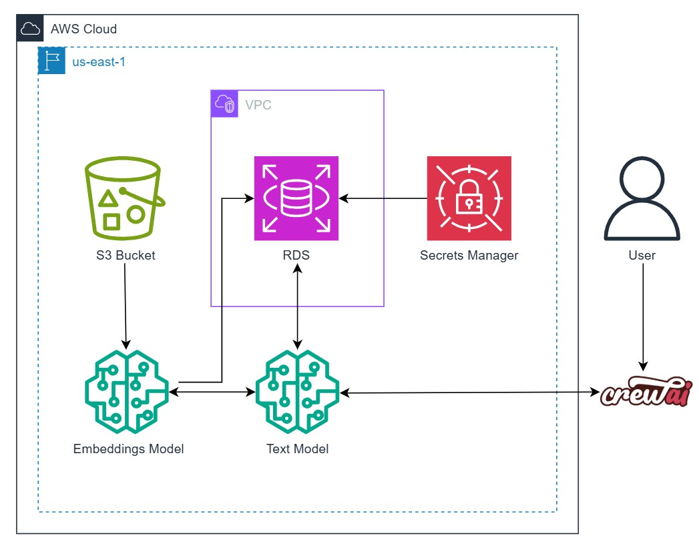

The whole thing runs on AWS — S3 for storing raw data, Aurora PostgreSQL as the vector store, Bedrock for embeddings and querying, and CrewAI orchestrating the agents on top.

---

## Why CrewAI Over Just Using an LLM Directly?

Fair question. When I first looked at this, I wondered the same thing. Here's why CrewAI makes sense for this kind of workflow:

- **Higher-level abstraction** — You define agents by role and goal, not by prompt engineering gymnastics.
- **Modularity** — Agents, tasks, and tools are defined independently and can be reused across projects.
- **Scalability** — Adding a new agent or capability doesn't require reworking everything. The `Crew` just coordinates them.

Think of it like building a team. You wouldn't have one person do everything — you'd hire specialists. CrewAI lets you do that in code.

> Official docs: [CrewAI Documentation](https://docs.crewai.com/)

---

## Step 1 — Create an S3 Bucket

First things first — we need somewhere to store our laptop inventory data. I used Amazon S3 for this.

Navigate to **S3 → General purpose buckets** in the AWS Console and hit **Create bucket**.

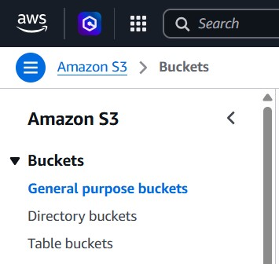

Give it a name (`clab-bucket-demo1` in my case) and leave everything else at defaults.

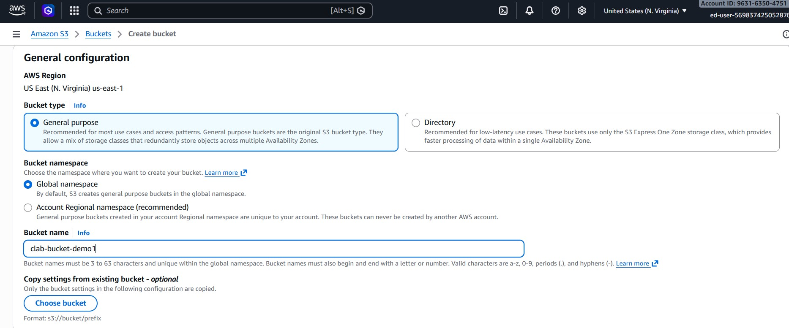

Once the bucket is created, download the laptop inventory PDF and upload it via **Upload → Add files**.

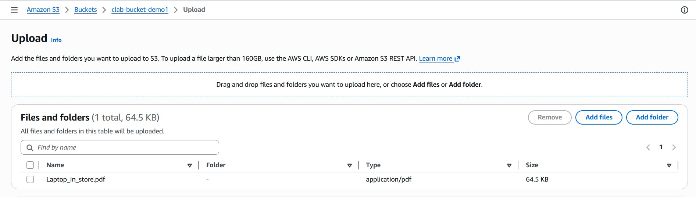

At this point the infrastructure looks like this — just an S3 bucket sitting in us-east-1.

---

## Step 2 — Create an Aurora PostgreSQL Cluster (Vector Store)

Amazon Bedrock Knowledge Bases need a vector store to actually persist the embeddings it generates. I used [Amazon Aurora PostgreSQL Serverless v2](https://docs.aws.amazon.com/AmazonRDS/latest/AuroraUserGuide/aurora-serverless-v2.html) for this.

The target state after this step:

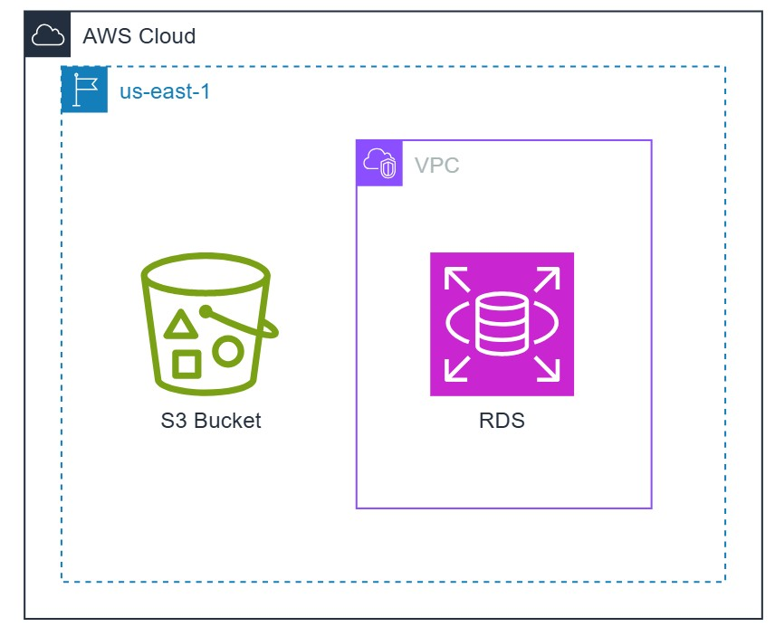

Search for **Aurora and RDS** in the console → **Databases → Create database → Full configuration**.

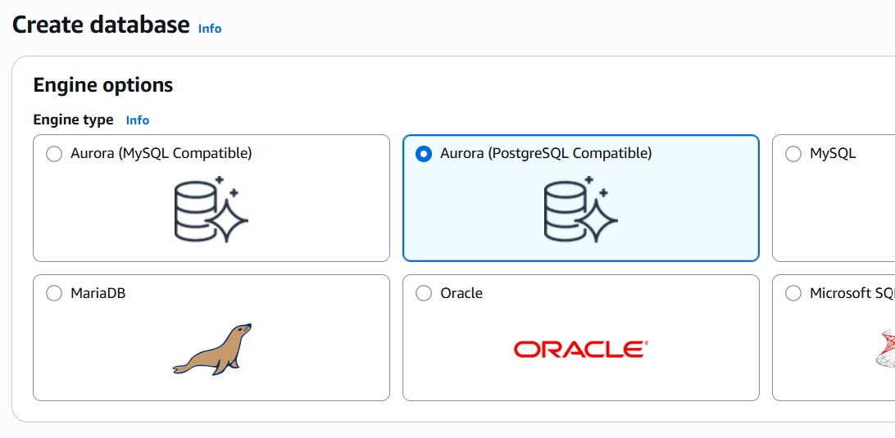

Key settings I used:

- **Engine:** Aurora (PostgreSQL Compatible)
- **Template:** Dev/Test
- **Instance class:** Serverless v2 (min 1 ACU, max 2 ACU)
- **Cluster identifier:** `clab-aurora-cluster`
- **Master username:** `postgres` / password: `password`
- **Initial database name:** `bedrock_integration`
- ✅ Enable RDS Data API (important — this lets us use the Query Editor and allows Bedrock to talk to it without a VPC connection)
- ❌ Disable Performance Insights and Enhanced Monitoring (not needed for this lab)

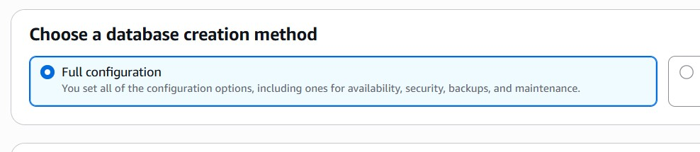

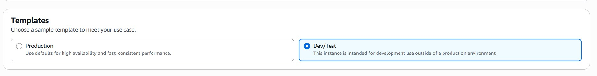

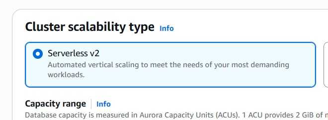

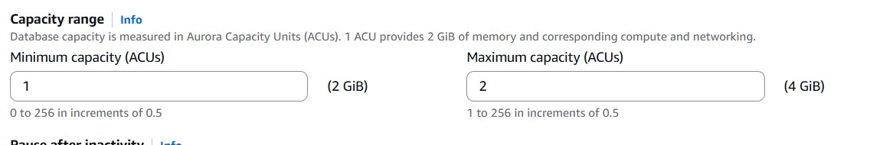

Once the cluster status changes to **Available**, grab the **ARN** from the Configuration tab — you'll need it later.

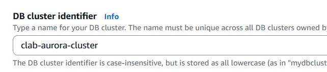

---

## Step 3 — Configure the Aurora Cluster (Tables + Vector Extension)

Now we need to set up the actual schema inside the database. This is where Bedrock will store the vector embeddings.

Head to **RDS → Query Editor** and connect using the credentials we just set:

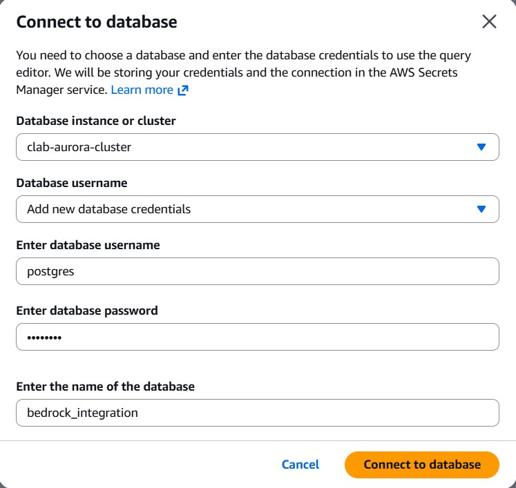

Paste and run the following SQL:

```sql
CREATE EXTENSION IF NOT EXISTS vector;
CREATE SCHEMA bedrock_integration;

CREATE TABLE bedrock_integration.bedrock_kb (
    id UUID PRIMARY KEY,
    embedding VECTOR(1024),
    chunks TEXT,
    metadata JSON
);

CREATE INDEX ON bedrock_integration.bedrock_kb USING gin (to_tsvector('simple', chunks));
CREATE INDEX ON bedrock_integration.bedrock_kb USING hnsw (embedding vector_cosine_ops) WITH (ef_construction=256);

CREATE ROLE bedrock_edu_user WITH PASSWORD 'password' LOGIN;
GRANT ALL ON SCHEMA bedrock_integration TO bedrock_edu_user;
ALTER TABLE bedrock_integration.bedrock_kb OWNER TO bedrock_edu_user;
```

What's happening here:

- We enable the `vector` extension (via [pgvector](https://github.com/pgvector/pgvector)) to store high-dimensional embeddings.
- We create a schema `bedrock_integration` to logically isolate the KB data.
- We create a table with four columns: a UUID primary key, a 1024-dim vector embedding, raw text chunks, and JSON metadata.
- The **GIN index** on `chunks` enables full-text search.
- The **HNSW index** on `embedding` enables fast approximate nearest-neighbor search — this is what powers semantic similarity lookup.
- Finally, we create a dedicated role `bedrock_edu_user` and hand it ownership of the table.

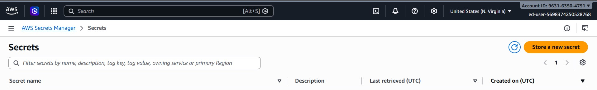

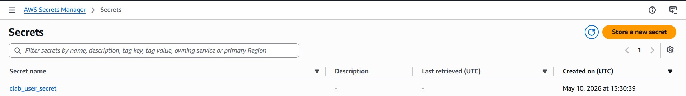

---

## Step 4 — Store DB Credentials in Secrets Manager

Before creating the Knowledge Base, we need to store the database credentials securely so Bedrock can access them at runtime.

Search for **Secrets Manager → Store a new secret → Credentials for Amazon RDS database**.

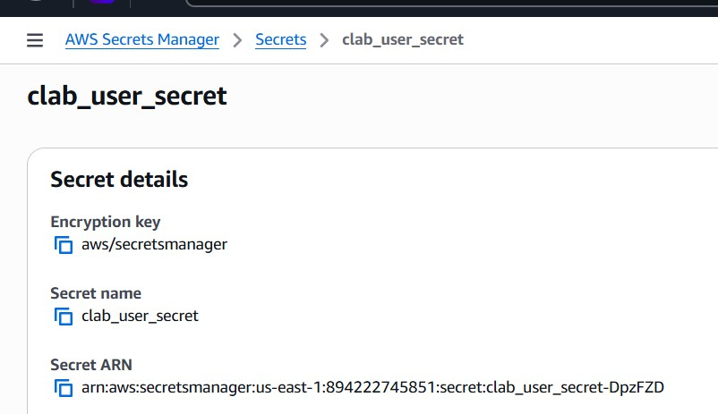

- **Username:** `bedrock_edu_user`
- **Password:** `password`
- Select the `clab-aurora-cluster` as the database.
- **Secret name:** `clab_user_secret`

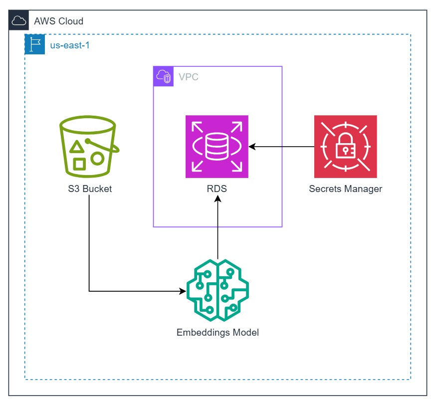

Once saved, open the secret and copy the **Secret ARN**. You'll need this in the next step.

The infrastructure now has Secrets Manager pointing credentials into RDS:

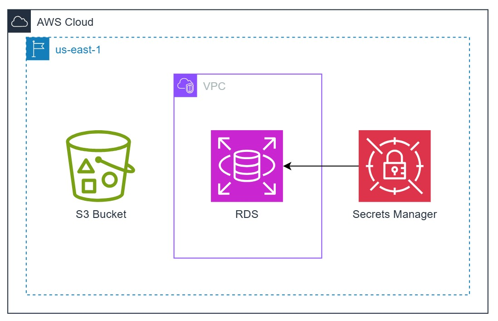

---

## Step 5 — Create the Amazon Bedrock Knowledge Base

Now the fun part. Go to **Amazon Bedrock → Knowledge Bases → Create → Knowledge Base with vector store**.

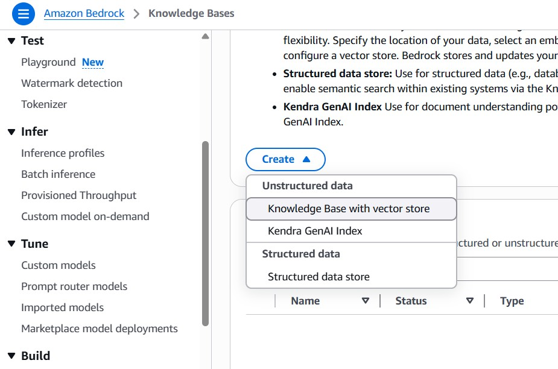

**Provide details:**

- **Name:** `clab-knowledge-base`
- **IAM role:** Use the existing `Bedrock-Role-For-KnowledgeBase` (this role has permissions for S3, RDS, and Secrets Manager)
- **Data source type:** Amazon S3

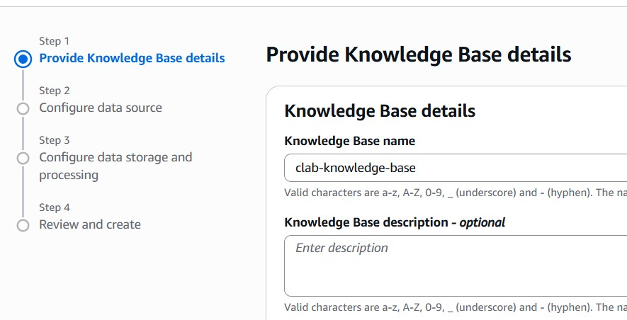

**Configure data source:**

- Browse to the S3 bucket we created earlier.
- Chunking strategy: Default chunking.

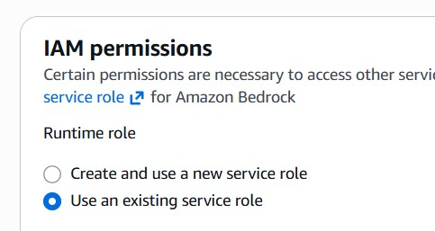

**Embeddings model:**

- Provider: Amazon
- Model: **Titan Text Embeddings v2**
- Vector dimensions: **1024**

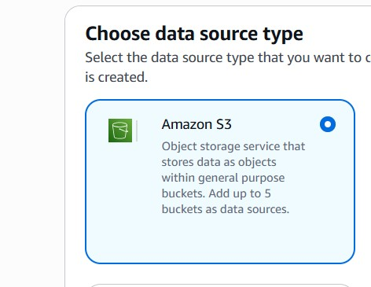

**Vector store configuration:**

- Use an existing vector store → **Aurora PostgreSQL Serverless**
- Paste the **Aurora cluster ARN**
- Database name: `bedrock_integration`
- Table name: `bedrock_integration.bedrock_kb`
- Paste the **Secret ARN** from Secrets Manager

**Index field mapping:**

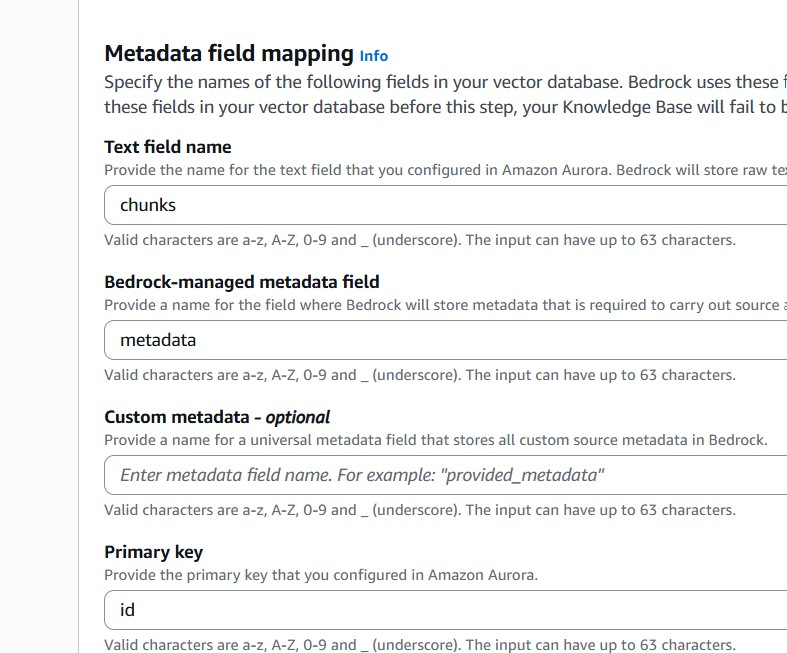

| Field | Value |
|---|---|
| Vector field | `embedding` |
| Text field | `chunks` |
| Metadata field | `metadata` |
| Primary key | `id` |

Review and hit **Create Knowledge Base**. Copy the **Knowledge Base ID** once it's created.

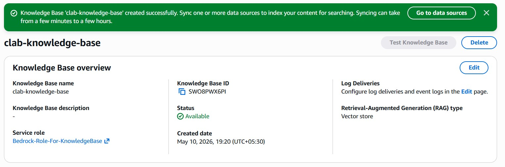

---

## Step 6 — Sync the Data Source

Once the Knowledge Base status is **Available**, select the data source and click **Sync**. This triggers Bedrock to:

1. Pull the PDF from S3.
2. Chunk the content.
3. Run it through the Titan Embeddings model.
4. Store the resulting vectors in our Aurora table.

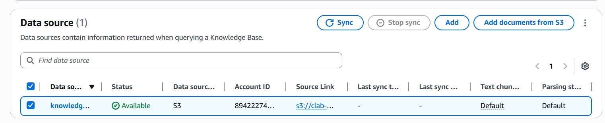

To test it, use the **Test Knowledge Base** panel on the right → select **Amazon Nova Pro** as the model and fire a test query like "provide a list of laptops available."

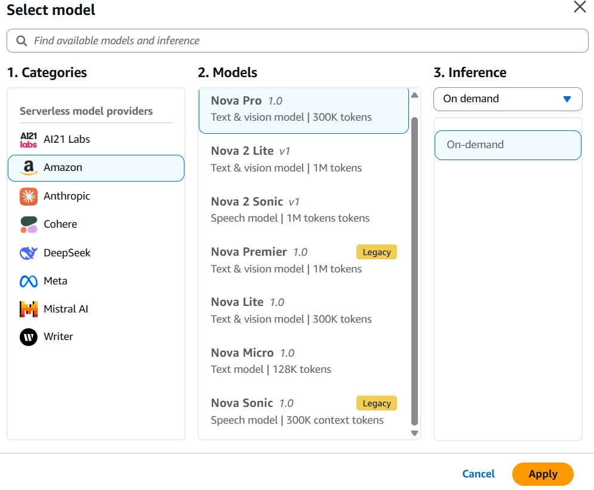

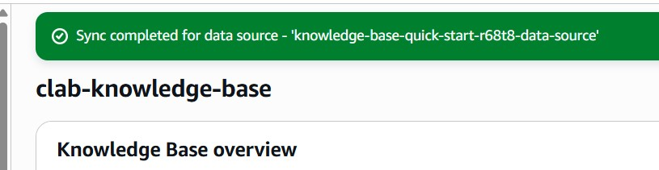

If you get a coherent answer back, the knowledge base is working.

---

## Step 7 — Build the CrewAI Agents

Now we wire everything together with CrewAI. The full `main.py` is below — I'll break it down piece by piece.

### The Tool

Tools in CrewAI are Python functions that agents can invoke. Our tool calls Bedrock's `retrieve_and_generate` API to query the knowledge base:

```python
@tool("LaptopTools")
def LaptopTools(question: str) -> str:
    """This expert has access to all details about the laptops we have in our inventory"""
    client = boto3.client('bedrock-agent-runtime', region_name='us-east-1')
    model_arn = 'arn:aws:bedrock:us-east-1::foundation-model/<Model ID>'
    
    response = client.retrieve_and_generate(
        input={'text': question},
        retrieveAndGenerateConfiguration={
            'type': 'KNOWLEDGE_BASE',
            'knowledgeBaseConfiguration': {
                'knowledgeBaseId': '<Knowledge base ID>',
                'modelArn': model_arn
            }
        },
    )
    return response.get('output', {}).get('text', '')
```

This uses the [Boto3 Bedrock Agent Runtime](https://boto3.amazonaws.com/v1/documentation/api/latest/reference/services/bedrock-agent-runtime.html) client — specifically `retrieve_and_generate`, which handles the full RAG pipeline in one call.

### The Agents

```python
customer_support = Agent(
    role="customer support agent",
    goal="Determine the optimal laptop specifications tailored to the customer's needs",
    backstory="You are an experienced customer support agent with a knack for finding 
               the perfect laptop according to specific needs and usage patterns.",
    verbose=True,
    llm=LLM(model=f"bedrock/{model_id}")
)

inventory_specialist = Agent(
    role="store inventory specialist",
    goal="Get laptop specifications as input and find the closest match using LaptopTools.",
    backstory="You work in a store and help customers find laptops using the given 
               specifications. You always ask LaptopTools before giving a response.",
    tools=[LaptopTools],
    verbose=True,
    llm=LLM(model=f"bedrock/{model_id}")
)
```

Notice the `inventory_specialist` is the only one given access to `LaptopTools`. The `customer_support` agent just uses the LLM directly — no tools needed for interpreting requirements.

### Tasks and the Crew

```python
customer_support_task = Task(
    description="find the specifications for a laptop that fulfills the customer's 
                 requirements in the query {task}",
    expected_output="answer to the query",
    agent=customer_support
)

inventory_specialist_task = Task(
    description="Review the specifications from the Customer support agent and use 
                 LaptopTools to find the name and price of the best matching laptop.",
    expected_output="a list of laptops that match customer specs with name and price",
    agent=inventory_specialist
)

crew = Crew(
    agents=[customer_support, inventory_specialist],
    tasks=[customer_support_task, inventory_specialist_task],
    process=Process.sequential,
    verbose=True
)
```

`Process.sequential` means the tasks run one after the other — customer support agent first, then inventory specialist picks up where it left off. This is the simplest process type; CrewAI also supports hierarchical processes with a manager agent, but that's a story for another day.

### Kicking It Off

```python
inputs = {
    'task': 'I want a laptop that will be used for playing heavy gaming'
}
result = crew.kickoff(inputs=inputs)
```

---

## The Result

When you run this, you'll see verbose output showing each agent's reasoning chain — it's genuinely fascinating to watch. The customer support agent will think through what specs matter for heavy gaming (GPU, RAM, refresh rate), and the inventory specialist will then query the knowledge base and come back with the closest matching product from the PDF.

The full infrastructure at this point:


---

## Key Takeaways

A few things stood out to me from this lab:

**The HNSW index matters.** If you're building production RAG systems on PostgreSQL, don't skip this. It's what makes semantic search fast at scale. pgvector's HNSW implementation is solid.

**`retrieve_and_generate` is deceptively powerful.** One API call handles chunking retrieval + generation. For quick prototypes it's great. For production you'd probably want to call `retrieve` separately so you have more control over how retrieved chunks get fed into the model.

**CrewAI's agent roles are more than labels.** The `backstory` and `goal` fields actually influence how the LLM behaves. Spend time on these — vague backstories produce vague agents.

**Secrets Manager for DB credentials is non-negotiable.** Never hardcode credentials, even in a lab. Getting into the habit of using Secrets Manager from day one saves headaches later.

---

## References

- [Amazon Bedrock Documentation](https://docs.aws.amazon.com/bedrock/)
- [Amazon Bedrock Knowledge Bases](https://docs.aws.amazon.com/bedrock/latest/userguide/knowledge-base.html)
- [Amazon Aurora PostgreSQL](https://docs.aws.amazon.com/AmazonRDS/latest/AuroraUserGuide/Aurora.AuroraPostgreSQL.html)
- [pgvector — Open-source vector similarity search for PostgreSQL](https://github.com/pgvector/pgvector)
- [CrewAI Documentation](https://docs.crewai.com/)
- [CrewAI GitHub](https://github.com/crewAIInc/crewAI)
- [Boto3 Bedrock Agent Runtime](https://boto3.amazonaws.com/v1/documentation/api/latest/reference/services/bedrock-agent-runtime.html)
- [Amazon S3 Documentation](https://docs.aws.amazon.com/s3/)
- [AWS Secrets Manager](https://docs.aws.amazon.com/secretsmanager/)
