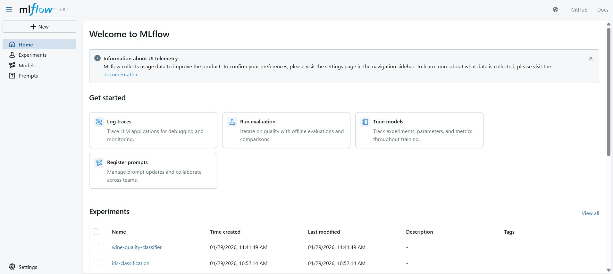
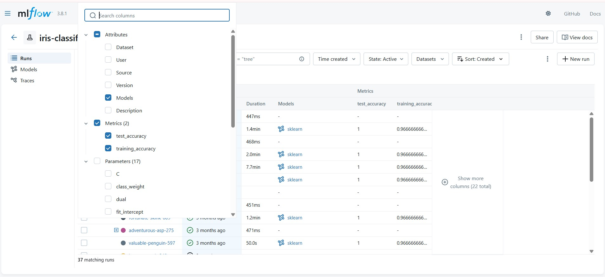
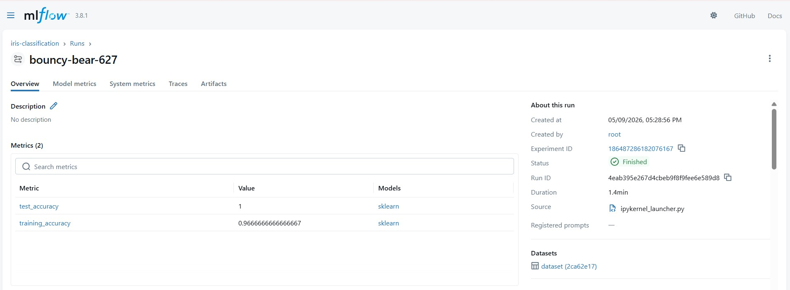
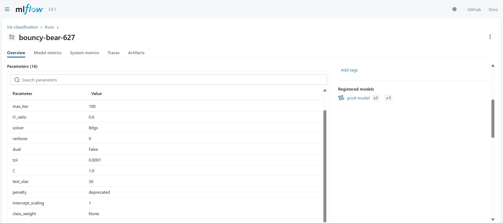
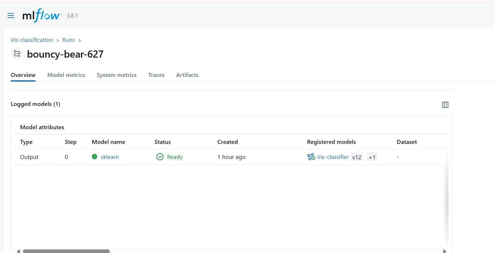
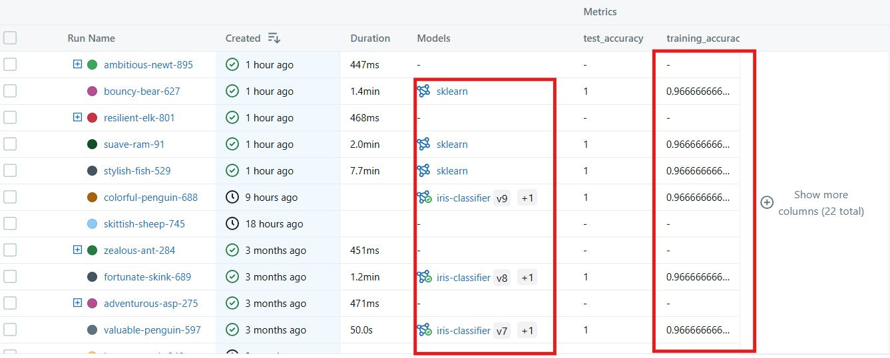
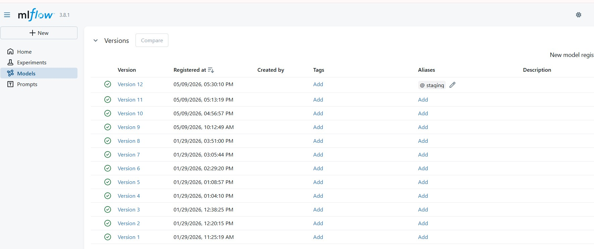
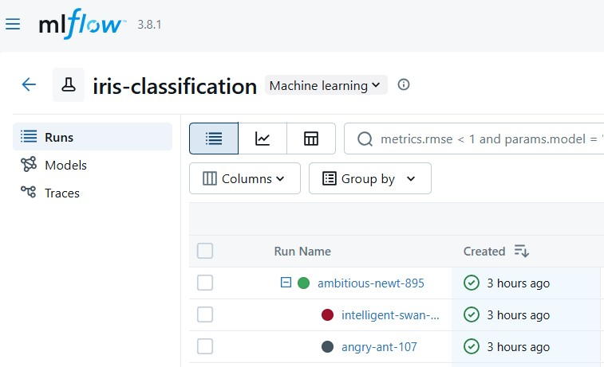
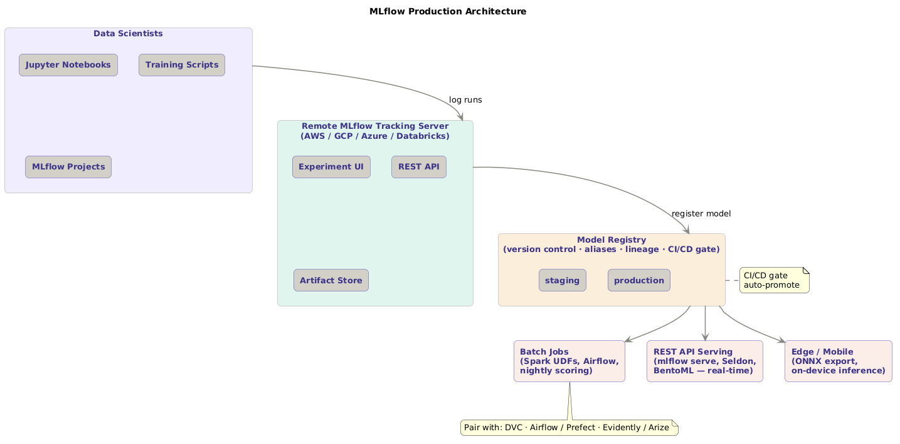

# Tracking ML Experiments with MLflow: A Hands-On Walkthrough

---
layout: topic
title: "Tracking ML Experiments with MLflow: A Hands-On Walkthrough"
permalink: /blogs/aws/mlflow-experiment/
date: 2026-05-09
categories: [aws, mlflow, mlops]
tags: [mlflow, tracking, model-registry, model-serving]
description: "Hands-on walkthrough for tracking experiments, versioning models, and serving with MLflow."
---

*A practical guide to experiment tracking, model versioning, and deployment using MLflow*

---

## What are we building?

The diagram below captures the full pipeline at a glance. We move through four phases — **Setup → Track → Model management → Inference** — with the MLflow Model Registry acting as the central source of truth at the end.



---

## Step 0 — Launch the MLflow tracking server

MLflow ships as a Python package and includes a CLI-driven **Tracking Server** — a web app and REST API for viewing and managing experiments. The server is launched with:

```bash
mlflow server --host 0.0.0.0 --port 5000 --allowed-hosts '*' --cors-allowed-origins '*'
```

The MLflow UI is then accessible at `http://localhost:5000`. According to the [official MLflow docs](https://mlflow.org/docs/latest/tracking/server.html), the Tracking Server stores metadata (runs, metrics, parameters) and optionally artifacts, providing a central hub for every experiment in your project.


---

## Step 1 — Create an MLflow experiment

An MLflow **experiment** is a named workspace that groups related runs together, making it easy to track, compare, and manage results over time. MLflow's [experiment concept](https://mlflow.org/docs/latest/tracking/tracking-server.html#mlflow-tracking-server) maps directly to a logical project: one experiment per model objective or dataset.

```python
import mlflow

# Point MLflow at the local tracking server
mlflow.set_tracking_uri("http://localhost:5000")

# Create (or reuse) an experiment
mlflow.set_experiment("iris-classification")
```

> 📸 **Screenshot here:** After running the cell, refresh the MLflow UI. Capture the **"iris-classification" experiment** appearing in the left sidebar. This confirms the server is connected and the experiment is registered.

---

## Step 2 — Log parameters, metrics, and artifacts

An MLflow **Run** represents a single execution of an experiment. Within a run you can log parameters (hyperparameters, data sizes), metrics (accuracy, loss), and arbitrary artifacts (figures, reports, pickled objects). The MLflow docs describe this as the core [logging API](https://mlflow.org/docs/latest/tracking/tracking-server.html).

```python
mlflow.start_run()

# Log a seaborn pairplot as an image artifact
mlflow.log_figure(fig, "iris_pairplot.png")

# Log dataset split sizes and model hyperparameters
mlflow.log_param("train_size", len(X_train))
mlflow.log_param("test_size", len(X_test))
mlflow.log_params(model.get_params())

# Log accuracy metrics
mlflow.log_metric("training_accuracy", training_accuracy)
mlflow.log_metric("test_accuracy", test_accuracy)

# Log a text classification report as an artifact
mlflow.log_text(report, "classification_report.txt")
```



---

## Step 3 — Visualise experiment results

The MLflow UI makes it easy to inspect any run visually without writing extra code:

1. Click the **iris-classification** experiment in the left sidebar.
2. Click the run name in the **Run Name** column.
3. The run detail page shows all logged **Parameters** and **Metrics** at a glance.







---

## Step 4 — Compare experiments and models

MLflow's UI lets you surface the metrics you care about directly in the runs table — no manual spreadsheets needed. As described in the [MLflow comparison guide](https://mlflow.org/docs/latest/tracking.html#logging-data-to-runs):

1. Click the **Columns** button above the Runs table.
2. Uncheck `Dataset` and `Source`; check `training_accuracy` and `test_accuracy`.
3. Those metrics now appear as sortable, filterable columns — making it easy to compare runs side-by-side.



---

## Step 5 — Save and log models

Logging the trained model as an artifact enables later inference or batch scoring without re-training. MLflow wraps the sklearn model in its own [model flavour system](https://mlflow.org/docs/latest/models.html), storing both the model and its environment dependencies:

```python
mlflow.sklearn.log_model(model, "sklearn", input_example=X_train[:5])
```

The `input_example` parameter stores a sample input so MLflow can auto-infer the model's signature — critical for reproducibility and deployment validation.



---

## Step 6 — Version and manage models

MLflow's **Model Registry** lets you version models and assign environment aliases. This alias-based approach is recommended in the [MLflow Model Registry docs](https://mlflow.org/docs/latest/model-registry.html) as a more flexible alternative to hard-coding version numbers in deployment scripts.

| Alias | Purpose |
|-------|---------|
| `staging` | Testing and validation |
| `production` | Live deployment |

```python
# Register the model
model_details = mlflow.register_model(
    model_uri=model_uri,
    name="iris-classifier"
)

# Assign a staging alias to Version 1
from mlflow.tracking import MlflowClient

client = MlflowClient()
client.set_registered_model_alias(
    name="iris-classifier",
    alias="staging",
    version=model_details.version
)

mlflow.end_run()
```


---

## Step 7 — Batch inference

Loading a logged model for batch scoring is a one-liner that abstracts away the underlying framework:

```python
model = mlflow.pyfunc.load_model(model_uri)
predictions = model.predict(X_test)
```

The `pyfunc` interface is MLflow's framework-agnostic wrapper — the same loading code works whether the underlying model is sklearn, XGBoost, PyTorch, or a custom Python function. See [MLflow pyfunc docs](https://mlflow.org/docs/latest/python_api/mlflow.pyfunc.html).

---

## Step 8 — Real-time inference via REST API

MLflow can serve any registered model as a REST endpoint without writing a Flask or FastAPI app:

```bash
export MLFLOW_TRACKING_URI=http://localhost:5000
mlflow models serve -m models:/iris-classifier@staging -h 0.0.0.0 -p 8001 --env-manager local
```

Once running, any HTTP client can hit the `/invocations` endpoint. The official [model serving docs](https://mlflow.org/docs/latest/deployment/deploy-model-locally.html) describe the request/response format — inputs go in as JSON, predictions come back as JSON.

---

## Step 9 — Nested MLflow runs

Nested runs allow you to organise a parent run (e.g. a hyperparameter sweep) with multiple child runs (individual trials). The MLflow UI shows a **+** button that expands the parent to reveal all children:

```python
with mlflow.start_run() as parent_run:
    with mlflow.start_run(nested=True):
        mlflow.log_param("run_name", "child_1")

    with mlflow.start_run(nested=True):
        mlflow.log_param("run_name", "child_2")
```

This pattern is built for [hyperparameter tuning workflows](https://mlflow.org/docs/latest/tracking.html#organizing-runs-in-experiments) — the parent logs the sweep config; each child logs one trial's results.




---

## Step 10 — MLflow Projects

An **MLflow Project** is a standardised, reproducible packaging format for ML code — a directory with a defined `MLproject` file and entry points. As the [MLflow Projects docs](https://mlflow.org/docs/latest/projects.html) explain, this makes workflows shareable and re-runnable across different machines without manual environment setup:

```python
mlflow.projects.run(
    uri="/usercode/wine-quality-classifier",
    entry_point="main",
    experiment_name="wine-quality-classifier",
    env_manager="local"
)
```

---

## How and when to use this in production

### Architecture in a real environment

The experiment we ran locally maps cleanly onto a production MLOps architecture. Here's how each step translates:



**When to reach for MLflow in production:**

**1. Team of data scientists sharing experiments.** When more than one person trains models, a shared remote MLflow Tracking Server (hosted on AWS, GCP, Azure, or Databricks) becomes the single source of truth. All runs from all team members land in one place, enabling fair comparisons. Databricks, which now maintains MLflow, offers [managed MLflow](https://docs.databricks.com/en/mlflow/index.html) as a first-class service.

**2. CI/CD for ML (MLOps pipelines).** The Model Registry alias system integrates naturally with CI/CD gates. A typical flow: a GitHub Actions or Jenkins pipeline trains the model, promotes it to `staging` via the MlflowClient API, runs automated validation tests (accuracy threshold, data drift checks), and only then promotes to `production`. This mirrors the [MLflow Model Registry workflow](https://mlflow.org/docs/latest/model-registry.html#transitioning-an-mlflow-model-to-production) described in the official docs.

**3. Reproducing results months later.** Every logged run stores the git commit hash, conda/pip environment, and input data snapshot alongside the metrics. When a stakeholder asks "what model produced last quarter's predictions?", the answer is one click in the registry — not a scavenger hunt through code history.

**4. Switching ML frameworks mid-project.** The `pyfunc` interface means deployment code never changes even if the underlying framework shifts from sklearn to XGBoost to a PyTorch neural network. The serving layer stays constant; only the model artefact changes.

**5. Large-scale batch scoring.** For nightly batch jobs scoring millions of rows, `mlflow.pyfunc.load_model()` works inside Spark UDFs via the [mlflow.pyfunc.spark_udf()](https://mlflow.org/docs/latest/python_api/mlflow.pyfunc.html#mlflow.pyfunc.spark_udf) API — no custom serialisation needed.

**What MLflow does NOT cover alone:**

- **Data versioning** — pair with [DVC](https://dvc.org/) or [Delta Lake](https://delta.io/) for tracking input datasets.
- **Feature stores** — MLflow tracks model inputs but not feature computation logic; pair with Feast or Tecton for that.
- **Model monitoring** — post-deployment drift and performance degradation require tools like Evidently AI, Arize, or WhyLabs alongside MLflow.
- **Orchestration** — for scheduling pipelines, pair MLflow Projects with Airflow, Prefect, or Kubeflow Pipelines.

---

## Summary

| Step | What we did | MLflow concept |
|------|-------------|----------------|
| 0 | Launched the tracking server | Tracking Server |
| 1 | Created the `iris-classification` experiment | Experiment |
| 2 | Logged params, metrics, and artifacts | Run / Logging API |
| 3 | Explored run details in the UI | MLflow UI |
| 4 | Customised the Runs table for comparison | UI column config |
| 5 | Saved the trained sklearn model | Model flavours |
| 6 | Registered and aliased the model (`staging`) | Model Registry |
| 7 | Loaded the model for batch inference | pyfunc API |
| 8 | Served the model as a real-time REST API | Model serving |
| 9 | Used nested runs for multi-child experiments | Nested runs |
| 10 | Packaged a wine classifier as an MLflow Project | MLflow Projects |

MLflow brings order to the often-chaotic world of ML experimentation. With a single unified platform covering tracking, the model registry, serving, and project packaging, it is an indispensable layer in any production MLOps stack — whether you are a solo data scientist or a team of fifty.

---

*References: [MLflow official documentation](https://mlflow.org/docs/latest/index.html) · [Databricks managed MLflow](https://docs.databricks.com/en/mlflow/index.html) · [MLflow GitHub](https://github.com/mlflow/mlflow) · [MLflow Model Registry](https://mlflow.org/docs/latest/model-registry.html) · [MLflow Projects](https://mlflow.org/docs/latest/projects.html)*
