# End-to-End ML on AWS: Training, Hosting, and Serving a Heart Attack Predictor with SageMaker, Lambda, and API Gateway

I've been wanting to get my hands dirty with a proper AWS ML deployment pipeline for a while — not just training a model locally and calling it a day, but the full loop: train in the cloud, host an endpoint, wire up a Lambda function, and expose it via REST API so anyone can call it. This lab gave me exactly that.

The use case: a binary classifier that predicts whether a patient has a **high or low risk of a heart attack** based on 13 clinical features. Simple enough to follow, but the infra stack is what makes this interesting.

Here's what we're building end-to-end:

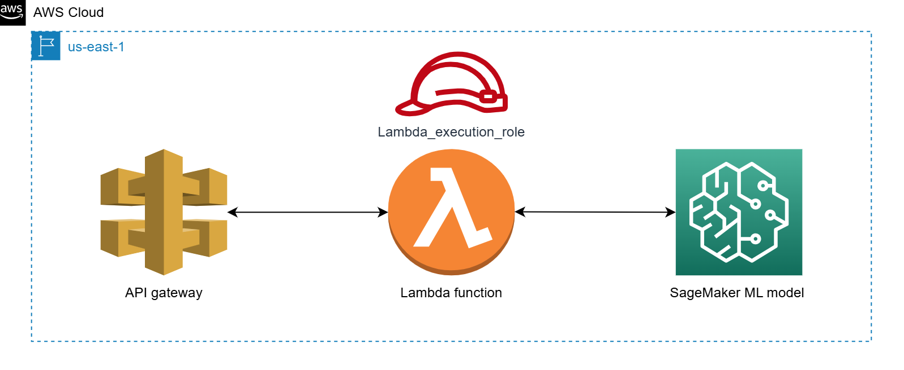

---

## The Stack

- **Amazon SageMaker** — notebook instance + Linear Learner training + endpoint hosting
- **AWS Lambda** — serverless function to invoke the SageMaker endpoint
- **Amazon API Gateway** — REST API (POST method) to expose the Lambda function
- **IAM** — `Sagemaker_role` for the notebook, `Lambda_execution_role` + `Execution_role_policy` for Lambda access

---

## Step 1: Spin Up a SageMaker Notebook Instance

First things first — we need compute. In SageMaker, that means a managed notebook instance. Navigate to **Amazon SageMaker AI → Applications and IDEs → Notebooks → Create notebook instance**.

The config I used:

- **Instance name**: `My-notebook-instance`
- **Instance type**: `ml.t2.medium` (cheap, good enough for a notebook)
- **Platform**: Amazon Linux 2, Jupyter Lab 4
- **IAM role**: `Sagemaker_role` (has all the S3 and SageMaker permissions we need)

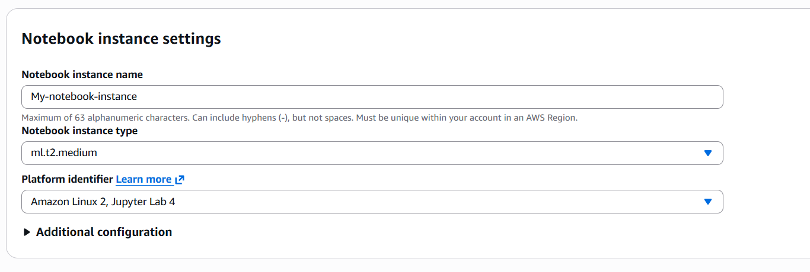

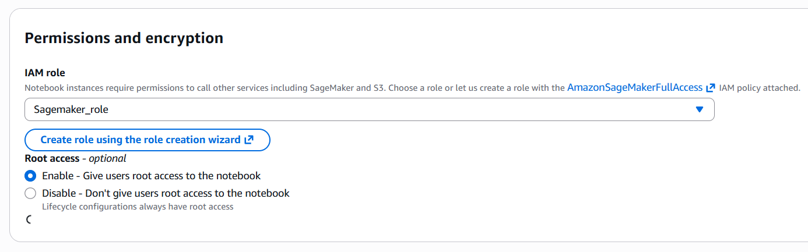

Once you hit **Create notebook instance**, it'll show `Pending` status for a couple of minutes.

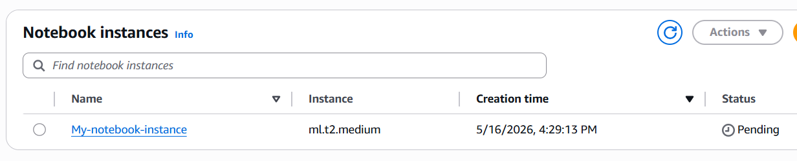

Wait for it to flip to `InService`, then click **Open Jupyter**.

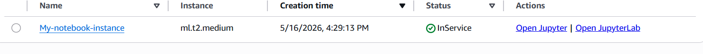

At this point, the infrastructure looks like this:

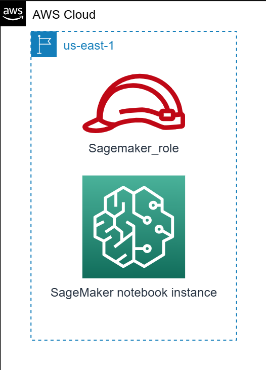

---

## Step 2: Train and Deploy the Model Inside the Notebook

Once inside Jupyter, upload `Train_and_deploy.ipynb` and `heart.csv`, then execute all cells. The notebook does four things:

### Import libraries

```python
import sagemaker
from sagemaker.sklearn.model import SKLearnModel
from sagemaker import get_execution_role
import numpy as np
```

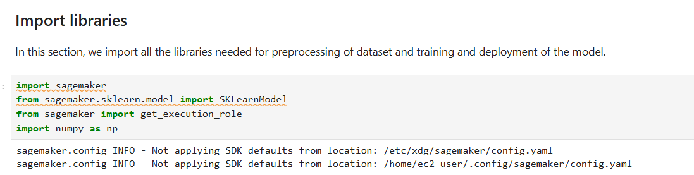

### Preprocess the data

The dataset (`heart.csv`) has 14 columns — 13 features + 1 label (`output`: 0 = low risk, 1 = high risk). We load it with `np.genfromtxt`, do an 80/20 train-test split, and separate features from labels.

```python
rawdata = np.genfromtxt("heart.csv", delimiter=',', skip_header=1)
train = rawdata[:int(len(rawdata) * 0.8)]
test  = rawdata[int(len(rawdata) * 0.8):]
Xtr = train[:, :-1]
Ytr = train[:, -1]
Xts = test[:, :-1]
Yts = test[:, -1]
```

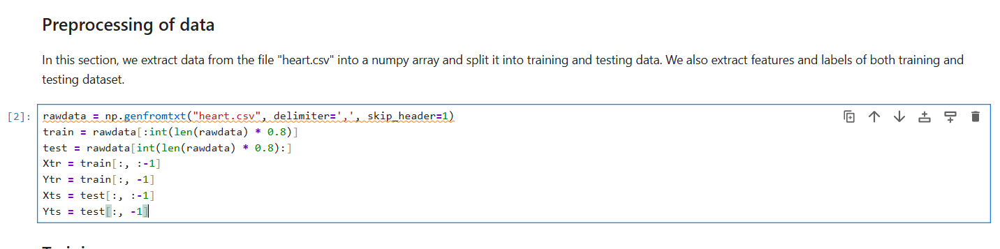

### Train the Linear Learner model

SageMaker's built-in `LinearLearner` is a managed algorithm that expects data in RecordIO Protobuf format. The SDK handles the format conversion — we just call `record_set()` and then `fit()`. Training spins up an `ml.m5.xlarge` instance behind the scenes.

```python
linear = sagemaker.LinearLearner(
    role=get_execution_role(),
    instance_count=1,
    instance_type='ml.m5.xlarge',
    predictor_type='binary_classifier',
    sagemaker_session=sagemaker.Session()
)
train_data_records = linear.record_set(Xtr.astype(np.float32), labels=Ytr.astype(np.float32), channel='train')
linear.fit(train_data_records)
```

The training job takes about 2 minutes. You can watch the job progress in the cell output — it goes through `Starting → Preparing → Downloading → Training → Uploading → Completed`.

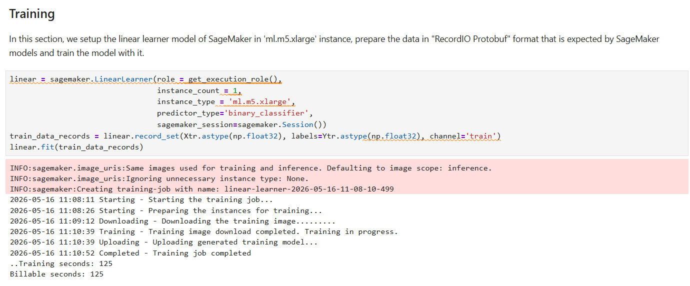

### Create the endpoint

After training, we deploy the model to a persistent endpoint on `ml.t2.medium`. This is what Lambda will call later.

```python
predictor = linear.deploy(initial_instance_count=1, instance_type='ml.t2.medium')
```

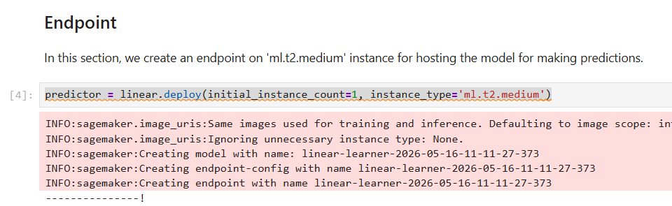

> **Note**: Endpoint creation takes 5–10 minutes. You can move on to creating the IAM role and Lambda function in parallel while it spins up.

---

## Step 3: Create the Lambda Execution Role

Lambda functions need an IAM role to talk to SageMaker. Here's the architecture at this point:

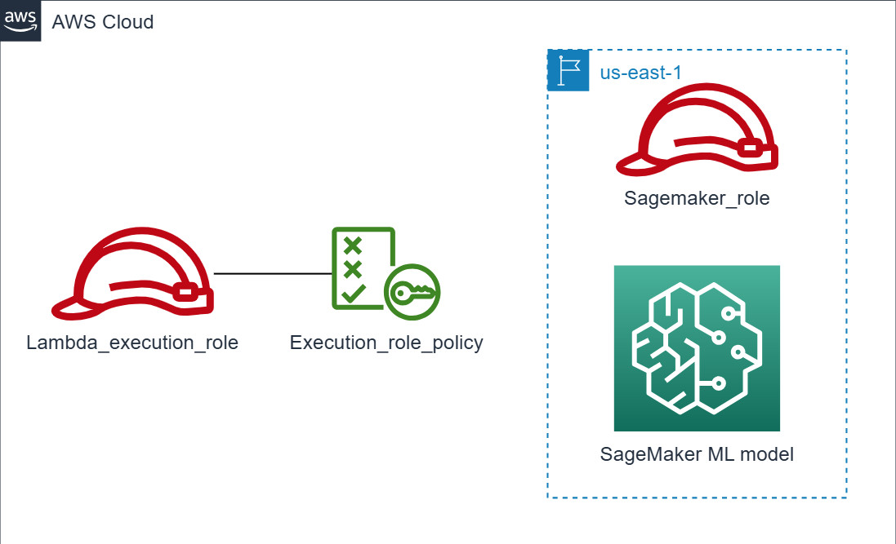

Navigate to **IAM → Roles → Create role**.

- **Trusted entity type**: AWS service
- **Use case**: Lambda

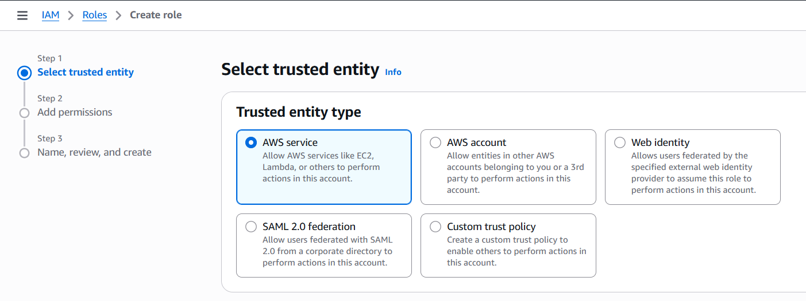

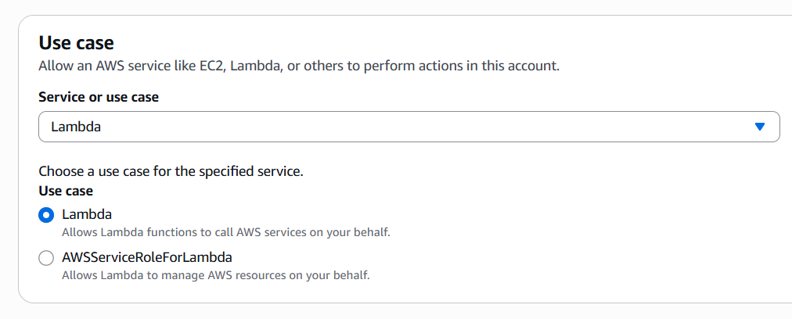

On the permissions page, search for and attach the customer-managed policy `Execution_role_policy`. This policy grants the Lambda function permission to invoke SageMaker endpoints and write to CloudWatch Logs.

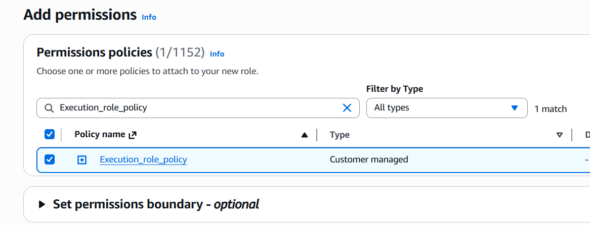

Name the role `Lambda_execution_role` and create it.

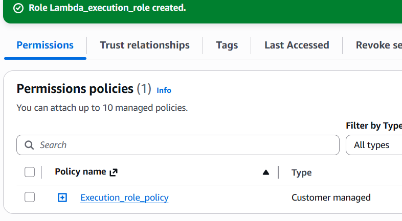

---

## Step 4: Create the Lambda Function

Go to **Lambda → Create a function**.

- **Option**: Author from scratch
- **Function name**: `Sagemaker_lambda`
- **Runtime**: Python 3.14
- **Execution role**: `Lambda_execution_role` (toggle "Custom execution role" in Additional settings)

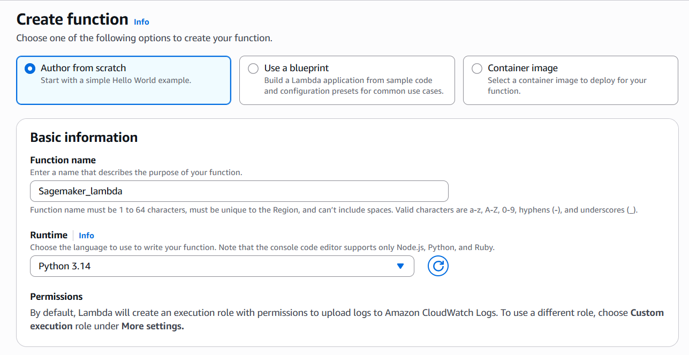

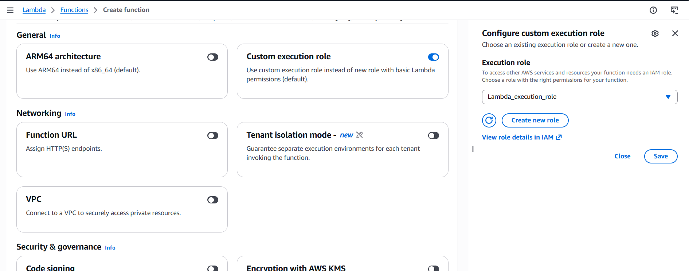

Once created:

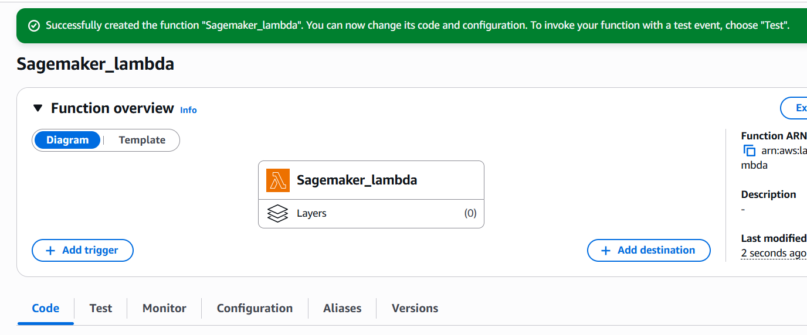

### Update the function code

Replace the default Hello World code with this:

```python
import os
import io
import boto3
import json
import csv

ENDPOINT_NAME = os.environ['ENDPOINT_NAME']
runtime = boto3.client('runtime.sagemaker')

def lambda_handler(event, context):
    print("Received event: " + json.dumps(event, indent=2))

    data = json.loads(json.dumps(event))
    payload = data['data']

    response = runtime.invoke_endpoint(
        EndpointName=ENDPOINT_NAME,
        ContentType='text/csv',
        Body=payload
    )

    result = json.loads(response['Body'].read().decode())
    pred = int(result['predictions'][0]['score'])

    return pred
```

What's happening here: the function reads the `ENDPOINT_NAME` environment variable, creates a SageMaker runtime client, invokes the endpoint with a CSV payload, and returns the prediction label (0 or 1). Click **Deploy** to save.

### Wire up the endpoint name

We still need to tell Lambda which endpoint to call. Go to **SageMaker → Deployments & Inference → Endpoints**, copy the endpoint name (it'll look like `linear-learner-2026-05-16-11-11-27-373`).

Back in the Lambda function, go to **Configuration → Environment variables → Edit** and add:
- Key: `ENDPOINT_NAME`
- Value: `<your endpoint name>`

---

## Step 5: Create the API Gateway (REST API)

With Lambda ready, we need a front door. Go to **API Gateway → Create an API → REST API (not private) → Build**.

- **API name**: `SageMaker_API`
- **Endpoint type**: Regional
- **Security policy**: TLS 1.3

### Create the resource and POST method

On the Resources page:
1. **Create resource** → name it `sagemaker_api_resource`
2. Select the resource → **Create method** → `POST`
3. Integration type: **Lambda Function**
4. Lambda function: select `Sagemaker_lambda`

That's it. You now have a REST endpoint that accepts POST requests → triggers Lambda → calls the SageMaker endpoint → returns the heart attack risk prediction.

---

## What I Learned

A few things that stood out during this lab:

**SageMaker's managed algorithms are genuinely convenient.** The `LinearLearner` handles RecordIO format conversion, spins up dedicated training compute, and uploads the model artifact to S3 automatically. You're really just specifying the config.

**The IAM chain matters.** There are two separate roles here — `Sagemaker_role` for the notebook to access S3 and SageMaker services, and `Lambda_execution_role` with `Execution_role_policy` for Lambda to invoke the endpoint. Getting this wrong is the most common failure point.

**Endpoints are not free.** The `ml.t2.medium` endpoint runs 24/7 until you delete it. If you're running this lab, don't forget to clean up — delete the endpoint from the SageMaker console once you're done.

**Lambda as the middle layer is clean.** Having Lambda sit between API Gateway and SageMaker means you can add preprocessing, auth, logging, or routing logic without touching the model serving infra. Nice separation of concerns.

---

## Resources

- [Amazon SageMaker LinearLearner docs](https://docs.aws.amazon.com/sagemaker/latest/dg/linear-learner.html)
- [SageMaker Python SDK — LinearLearner](https://sagemaker.readthedocs.io/en/stable/algorithms/tabular/linear_learner.html)
- [AWS Lambda — invoking SageMaker endpoints](https://docs.aws.amazon.com/lambda/latest/dg/services-sagemaker.html)
- [API Gateway REST API tutorial](https://docs.aws.amazon.com/apigateway/latest/developerguide/apigateway-rest-api.html)
- [RecordIO Protobuf format in SageMaker](https://docs.aws.amazon.com/sagemaker/latest/dg/cdf-training.html)
