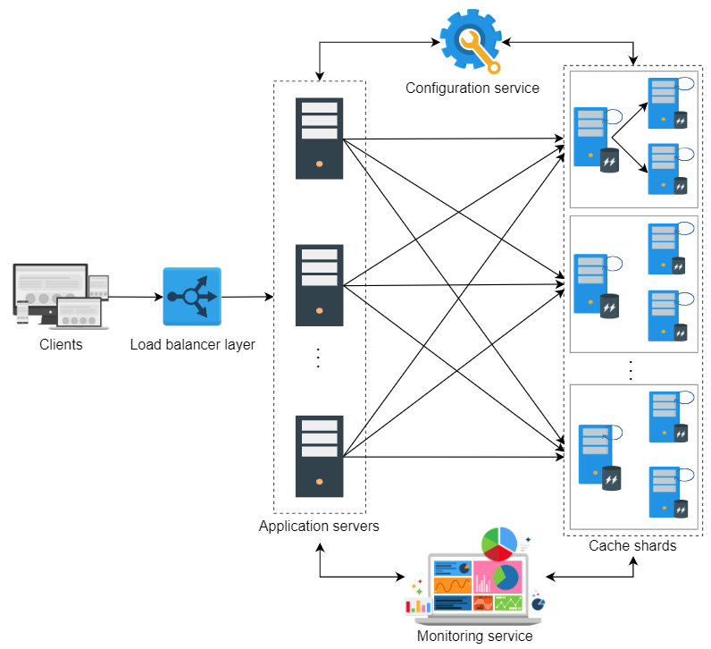
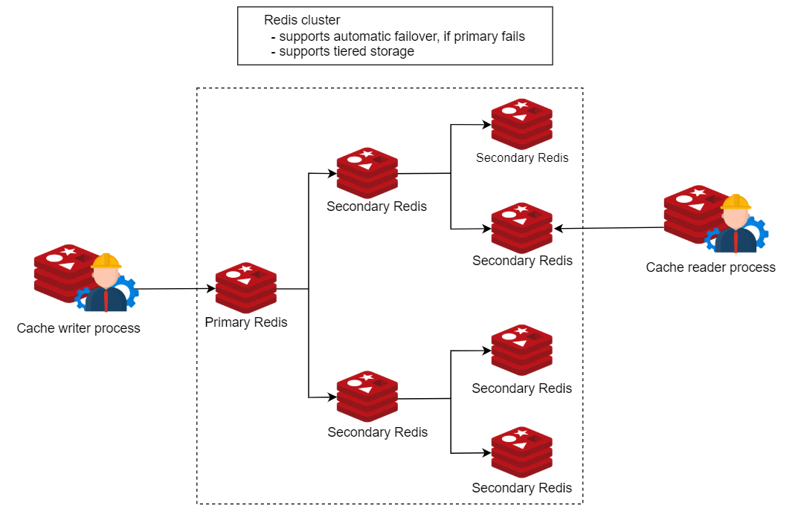
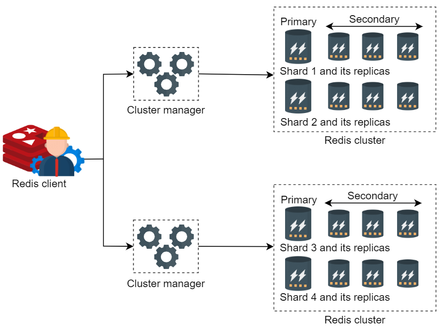
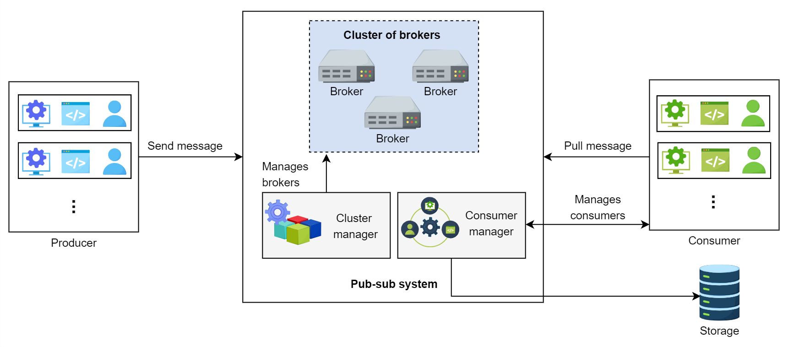

# Database

## Data Replication:

Replication refers to keeping multiple copies of the data at various nodes (preferably geographically distributed) to achieve availability, scalability, and performance. 

There are 2 types of replication :
  - Synchronous replication : Primary node wait for the acknowledgment from secondary nodes about updating the data.After receiving the acknowledgment from all secondary nodes primary node report success to the client.
  - Asynchronous replication : Primary node does not wait for acknowledgment from secondary nodes and report success to the client after updating itself.

 source : Educative

## Data Replication Model:

  - **Single leader or primary-secondary replication**:
    *  In primary-secondary replication, data is replicated across multiple nodes. One node is designated as the primary. It’s responsible for processing any writes to data stored on the cluster. It also sends all the writes to the secondary nodes and keeps them in sync. This strategy is good when our workload is read heavy, if its write heavy then its not a good option.
    *  Its read resilient means seondary nodes can still can handle read request if primary node fails.
    *  If we use aynchronous replication, it may lead to inconsistency.
    
    source : Educative
    * In case of failure of primary node there are 2 ways by which primary nodes are decided first one manual approach , in which pamary node is decided manually and notified to all other nodes. Second approch is automatic approach,where selection happens through the leader election process.
    * There are  different methods for primary secondary replication:
      * Statement based replication <TBA>
      * WAL (write ahead log shipping) <TBA>
      * Logical replication <TBA>

  - **Multi-leader replication**:
    * In this approch there are multiple primary nodes that process the write and then send them to all other primary and secondary nodes to replicate. 
    * Usefull in application in which we can continue work even in offline mode for example calender application. 

    

    * Conflict <TBA>

  - **Peer-to-peer or leaderless replication**:

    * All the nodes have equal weightage and can accept read and write request.
    * Like primary secondary replication, this replication also yield inconsistency. This is because when several nodes accept write request. it may lead to concurrent writes.A helpful approach used for solving write-write inconsistency issue is called quorums. 

    

    * **Quorums**:
  - In distributed system, quorum means minimum number of replicas on which a distributed operation (commit/abort) must be completed before claiming the operation's success.

## Data Partitioning:

To divide load among multiple nodes, we need to partition the data by a phenomenon known as partitioning or sharding. In this approach, we split a large dataset into smaller chunks of data stored at different nodes on our network.

There are 2 ways to shard the data:
  * **Verticle Sharding** : 
  We can different tables in various database instances, which might be running on different physical servers.We might break the a table into multiple tables so that some columns are in one table while the rest in another. It increases the speed of data retrieval from a table.

  * **Horizontal Sharding**: In this approach, partitioning is used to divide the table into multiple tables, by splitting the data row-wise.
  There are 2 strategies available:
    1) **Key-range based sharding** : In key-range based sharding, the data is divided into ranges based on the values of the sharding key. Each range is assigned to a different shard. For example, if we are sharding based on user ID, users with IDs from 1 to 1000 might be stored in one shard, while users with IDs from 1001 to 2000 might be stored in another shard. This approach makes it easy to perform range queries.
       
    2) **Hash based sharding**:It uses a hash function on an attribute, this hash function produces a hash value that is used for partitioning.

**If we want to read a specific key, how do we know which IP address we need to connect to read ?**

This problem is called **service discovery** and there are couple of approches for that:

  1) Allow the client to request any node in the network, if that node doesn't have requested data then it forward the request to the node that contains the related data.

  2) The second approach contains a routing tier, and all the request are first forwarded to the routing tier and it determines which node to connect to fulfill the request. 

  3) The client already have the information about the partitions, so they can directly contact the node that contain the data. 

  **How these components know about updates in the partitioning of the nodes ?**
  
  Rebalacing of the partitions :    
  * Avoid the hash  mod n.
  * Fixed number of partitions.
  * Dynamic Partitions.
  * Partition proportionally to node.

 **what if we have to access the records through secondary indexes?**

 There are 2 approches:
  - Partition secondary indexes by document.
  - Partition secondary indexes by tern.
    
## Distributed Cache:
Its a caching system where multiple cache servers co-ordinate to store frequently access data. Its required where a single cache server is not enough to store all the data. Its scalable and provide higher degree of availibility. Cache uses **loyality of reference** principle. 

* They minimize user-perceived latency by precalculating results and storing frequently accessed data.
* They pre-generate expensive queries from the database.
* They store user session data temporarily.
* They serve data from temporary storage even if the data store is down temporarily.
* Finally, they reduce network costs by serving data from local resources.

### Writing Policies:
  * Write-through Cache
  * Write-back Cache
  * Write-arround Cache

### Eviction Policy 
  * LRU (Least recently used)
  * MRU (Most Recently Used)
  * LFU (Least Frequently Used)
  * MFU (Most Frequently Used)

 

   * The client requests reach the service hosts through the load balancers where the client reside.
   * Cache client uses consistent hashing to identify the cache server.
   * Cache client will forward the request to the cache server.
   * Each server has primary & replica server. Internally every server uses the same mechanism storing and eviction of cache entries.
   * Configuration service ensure that all the clients see the updated and consistent view of cache servers.
   * Monitoring services can be additionally used to log and report different metrics of the caching service.

#### Memcached:
  * It store the data in form of key-value pair. Key and value both are string.
  * It does not support and cann't manipulate different data structures.
  * It has a client and server component.
  * It follows shared-nothing architecture means servers are unaware of each other, and there is no sync, data sharing and communication between the servers.
  * This is the reason why it is fast.
  * It scales horizontally. 

#### Redis
  * Its a data structure store, that can be used as a cache, database, message broker.
  * Redis understand the different data strucrtures, so for any change we dont need to retrieve data and then change and then save. We can make in-house changes that save both time and effort.
  * It can persist all in-memory blobs on the secondary storage.
  * Redis can also act as a Message Broker and can translate millions of messages per second from one component to another in the system.
  * It provides built-in replication mechanism, automatic failover, and different level of persistence.
  * It seperates data access from clusture management.
  * It *doen not provide strong consistency* due to the use of asynchronous replication.
 

  * A clusture has one or more redis databases that are queried using multithreaded proxies.
  * Redis clusture perform automatic sharding where each shard has primary and secondary node.
  * Number of shards in a database is configurable.
  * Each clusture is maintained by a *clusture manager*. Clusture Manager's job is to detect failure and perform automatic failover. 

 
 
  * Redis uses the pipelining to speed up the request-response model. Pipelining is the process of combining multiple request from client side without waiting for the response.

**Memcached is prefered for smaller, simple read-heavy systems, whereas Redis is useful for systems that are complex and are both read-write heavy**

# Pub-Sub Model:

  * Its an asynchronous service to service communication method thats is popular in serverless and microservice architecture.
  * Messages can be sent asynchronously to different subsystem of a system using the pub-sub system.
  * It enables the push based distribution that allevate the need for message recipients to check for the new information and changes regularly.It lowers the delivery latency.
    
## Functional Requirments:
  * Create/Delete a topic
    * create(topic_id, topic_name) , delete_topic(topic_ID)
  * Write a message
    * write(topic_ID, message)
  * Subscription
    * subscribe(topic_ID) , unsubscribe(topic_ID)
  * Read Message
    * read(topic_ID)
  * Specify Retention Time
  * Delete Message

## Non-functional Requirements:
  * Scalable
  * Available
  * Durable
  * Fault Tolerance
  * Concurrent

### Architecture Design:

  * At a high Level, pub-sub system will have following components:
    * **Broker**:
      * This server will handle the messages. It will store the messages sent from the producer and allow the consumer to read them.
      * It will handle the write and read request.
      * A broker will have multiple topics, where each topic can have multiple partitions associated with it.
      * We use partitions to store messages in the local storage for persistence.
      * Partitions contain messages encapsulated in **segments**.
      * Using segments, consumer consume the message of their choice from a partition by reading from a specific offset.
      * The data belonging to a single topic can be present in numerous partitions.  

    * **Clusture Manager**:
      * We need a clusture manager to supervise broker's health. If broker fails it will notify.
      * **Broker and Topic Registry**: This stores the list of topic for each broker.
      * **Manage Replication**: Clusture Manager manages the replication by using the leader follower approach.
      * **Authorization** : It handles authorization for broker and topic access. 
    * **Storage**:
      It is used to store consumer's details such as subscription information, and retention period.
      
    * **Consumer Manager**:
      This manages consumers. For example, It will verify, that consumer is authorized to read a message from certain topic or not.
      * Verify the consumer.
      * Retention Time Management
      * Message Receiving option management
      * Allow multiple read.
  
    
