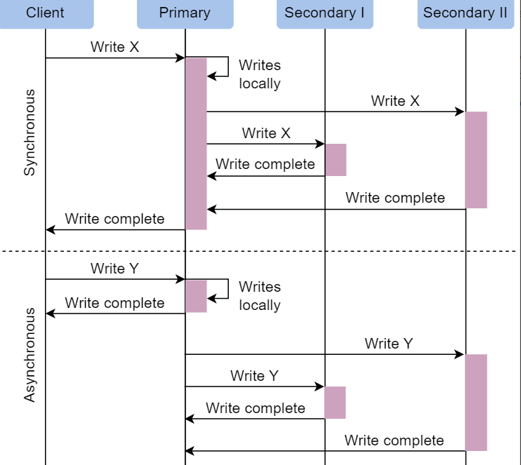
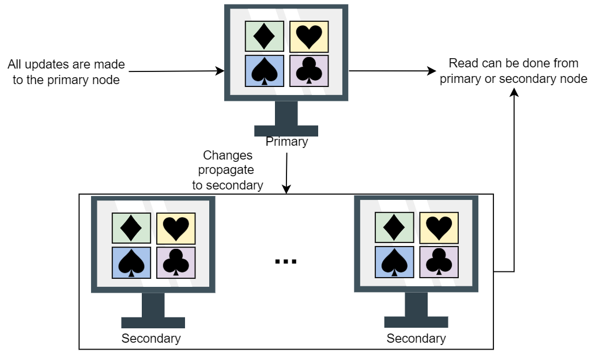

# Database

## Data Replication:

Replication refers to keeping multiple copies of the data at various nodes (preferably geographically distributed) to achieve availability, scalability, and performance. 

There are 2 types of replication :
  - Synchronous replication : Primary node wait for the acknowledgment from secondary nodes about updating the data.After receiving the acknowledgment from all secondary nodes primary node report success to the client.
  - Asynchronous replication : Primary node does not wait for acknowledgment from secondary nodes and report success to the client after updating itself.

 source : Educative

## Data Replication Model:

  - **Single leader or primary-secondary replication**:
    *  In primary-secondary replication, data is replicated across multiple nodes. One node is designated as the primary. It’s responsible for processing any writes to data stored on the cluster. It also sends all the writes to the secondary nodes and keeps them in sync. This strategy is good when our workload is read heavy, if its write heavy then its not a good option.
    *  Its read resilient means seondary nodes can still can handle read request if primary node fails.
    *  If we use aynchronous replication, it may lead to inconsistency.
    source : Educative
    * In case of failure of primary node there are 2 ways by which primary nodes are decided first one manual approach , in which pamary node is decided manually and notified to all other nodes. Second approch is automatic approach,where selection happens through the leader election process.
    * There are  different methods for primary secondary replication:

  - Multi-leader replication
  - Peer-to-peer or leaderless replication

  - 
