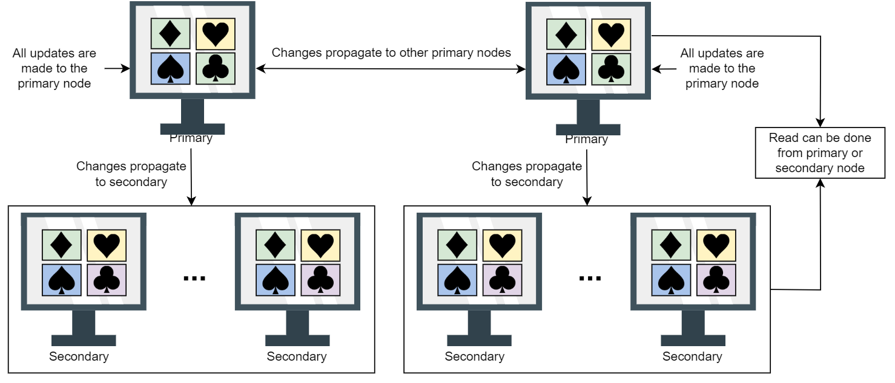

# Database

## Data Replication:

Replication refers to keeping multiple copies of the data at various nodes (preferably geographically distributed) to achieve availability, scalability, and performance. 

There are 2 types of replication :
  - Synchronous replication : Primary node wait for the acknowledgment from secondary nodes about updating the data.After receiving the acknowledgment from all secondary nodes primary node report success to the client.
  - Asynchronous replication : Primary node does not wait for acknowledgment from secondary nodes and report success to the client after updating itself.

 source : Educative

## Data Replication Model:

  - **Single leader or primary-secondary replication**:
    *  In primary-secondary replication, data is replicated across multiple nodes. One node is designated as the primary. It’s responsible for processing any writes to data stored on the cluster. It also sends all the writes to the secondary nodes and keeps them in sync. This strategy is good when our workload is read heavy, if its write heavy then its not a good option.
    *  Its read resilient means seondary nodes can still can handle read request if primary node fails.
    *  If we use aynchronous replication, it may lead to inconsistency.
    
    source : Educative
    * In case of failure of primary node there are 2 ways by which primary nodes are decided first one manual approach , in which pamary node is decided manually and notified to all other nodes. Second approch is automatic approach,where selection happens through the leader election process.
    * There are  different methods for primary secondary replication:
      * Statement based replication <TBA>
      * WAL (write ahead log shipping) <TBA>
      * Logical replication <TBA>

  - **Multi-leader replication**:
    * In this approch there are multiple primary nodes that process the write and then send them to all other primary and secondary nodes to replicate. 
    * Usefull in application in which we can continue work even in offline mode for example calender application. 

    

    * Conflict <TBA>

  - **Peer-to-peer or leaderless replication**:

    * All the nodes have equal weightage and can accept read and write request.
    * Like primary secondary replication, this replication also yield inconsistency. This is because when several nodes accept write request. it may lead to concurrent writes.A helpful approach used for solving write-write inconsistency issue is called quorums. 

    

    * **Quorums**:
  - In distributed system, quorum means minimum number of replicas on which a distributed operation (commit/abort) must be completed before claiming the operation's success.

## Data Partitioning:

To divide load among multiple nodes, we need to partition the data by a phenomenon known as partitioning or sharding. In this approach, we split a large dataset into smaller chunks of data stored at different nodes on our network.

There are 2 ways to shard the data:
  * **Verticle Sharding** : 
  We can different tables in various database instances, which might be running on different physical servers.We might break the a table into multiple tables so that some columns are in one table while the rest in another.

  It increases the speed of data retrieval from a table. 
  * **Horizontal Sharding**:

  In this approach, partitioning is used to divide the table into multiple tables, by splitting the data row-wise. There are 2 strategies available:
    1) **Key-range based sharding :**

       In key-range based sharding, the data is divided into ranges based on the values of the sharding key. Each range is assigned to a different shard. For example, if we are sharding based on user ID, users with IDs from 1 to 1000 might be stored in one shard, while users with IDs from 1001 to 2000 might be stored in another shard. This approach makes it easy to perform range queries.
    2) **Hash based sharding:**

     It uses a hash function on an attribute, this hash function produces a hash value that is used for partitioning.

**If we want to read a specific key, how do we know which IP address we need to connect to read ?**

This problem is called **service discovery** and there are couple of approches for that:

  1) Allow the client to request any node in the network, if that node doesn't have requested data then it forward the request to the node that contains the related data.

  2) The second approach contains a routing tier, and all the request are first forwarded to the routing tier and it determines which node to connect to fulfill the request. 

  3) The client already have the information about the partitions, so they can directly contact the node that contain the data. 

  **How these components know about updates in the partitioning of the nodes ?**
  
    Rebalacing of the partitions :
      - Avoid the hash  mod n.
      - Fixed number of partitions.
      - Dynamic Partitions.
      - Partition proportionally to node.

 **what if we have to access the records through secondary indexes?**

 There are 2 approches:
  - Partition secondary indexes by document.
  - Partition secondary indexes by tern.