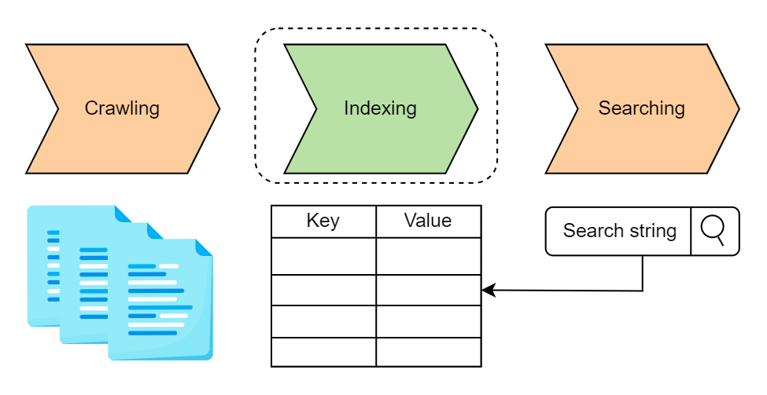
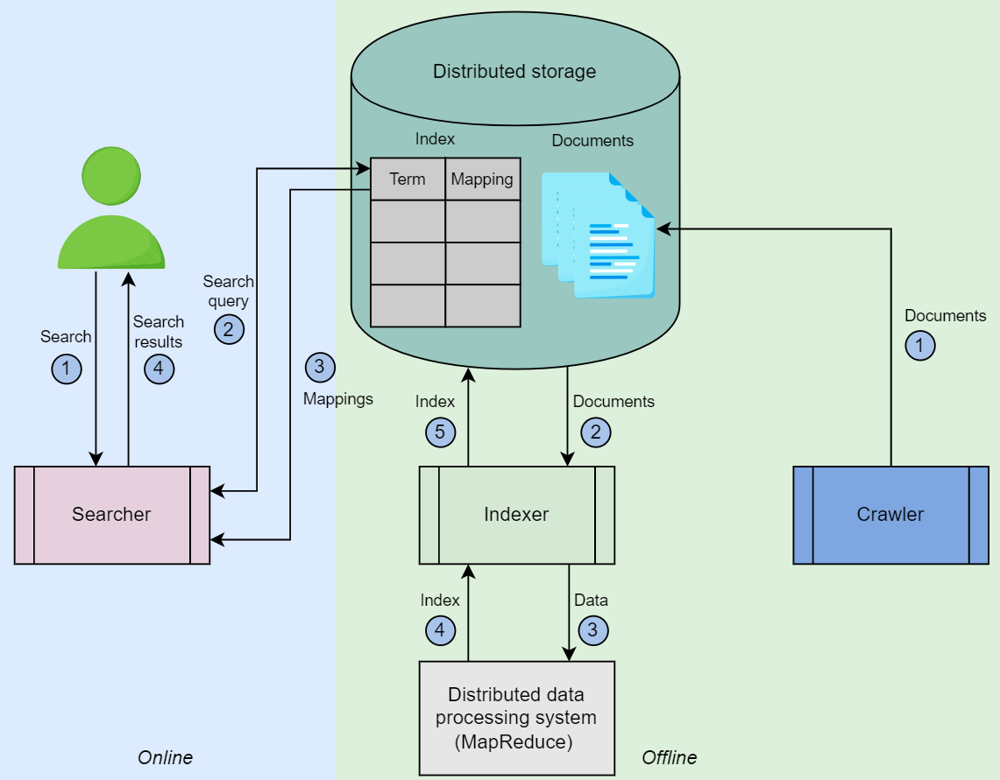

# Distributed Search

There are 3 main component in a search system:
  * A Crawler : Fetches content and creates documents(json or similar).
  * An Indexer : Creates a searchable index. 
  * A Searcher : It responds to search queries by running the search query on indexes.

  

## Functional Requirement:
 * Search

## Non-functional Requirement

 * Availability
 * Scalability
 * Fast Search on Big Data
 * Reduced Cost

The response time to a search query depends on a few factors:
 * The data organization strategy in the database.
 * The size of the data.
 * The processing speed and the RAM of the machine that’s used to build the index and process the search query.

Running the search queries on billions of documents that are **document-level indexed** will be a slow process. It may take minuts or even hours. 

### Inverted Index

 * Its HashMap like data structure that employs a document-term matrix.
 * Instead of storing the complete document as it is, it split the documents into individual words , discards some low importance words and then create indexes for frquently occurring words.
 * For each term, the index computes the following information:
   * List of document in which term appeared.
   * The Frequency with which the term appears in each document.
   * The position of the term in each document.
 * Reduces the time of counting the occurance of a word in each document at run time because we have mapping against each term.
 * There is storage overhead  for maintaining the inverted index along with the actual document.
 * Maintenance overhead (while adding or deleting the document we need to update the inverted index)

## High-level design:

 There are 2 phases of such systems 
  1) **Online Phase** : consist of searching for results against the search query by the user.
  2) **Offline Phase** : It involves data crawling and indexing

  

  * **Crawler** : It collect the content from intended resources. From the extracted content from resources it generates the JSON document and store it into the storage.
  * **Indexer**: It fetches the document from a distributed storage and index them using MapReduce.
  * Distributed storage is used to store the document and its idexes.
  * The **Searcher** parses the search string and searches for mapping from the index that are stored in distributed storage. 

  

