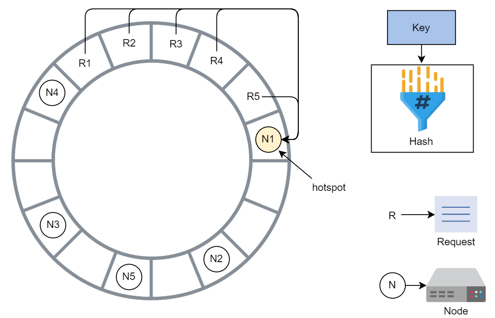

# Distributed Search

There are 3 main component in a search system:
  * A Crawler : Fetches content and creates documents(json or similar).
  * An Indexer : Creates a searchable index. 
  * A Searcher : It responds to search queries by running the search query on indexes.

  

## Functional Requirement:
 * Search

## Non-functional Requirement

 * Availability
 * Scalability
 * Fast Search on Big Data
 * Reduced Cost

The response time to a search query depends on a few factors:
 * The data organization strategy in the database.
 * The size of the data.
 * The processing speed and the RAM of the machine that’s used to build the index and process the search query.

Running the search queries on billions of documents that are **document-level indexed** will be a slow process. It may take minuts or even hours. 

### Inverted Index

 * Its HashMap like data structure that employs a document-term matrix.
 * Instead of storing the complete document as it is, it split the documents into individual words , discards some low importance words and then create indexes for frquently occurring words.
 * For each term, the index computes the following information:
   * List of document in which term appeared.
   * The Frequency with which the term appears in each document.
   * The position of the term in each document.
 * Reduces the time of counting the occurance of a word in each document at run time because we have mapping against each term.
 * There is storage overhead  for maintaining the inverted index along with the actual document.
 * Maintenance overhead (while adding or deleting the document we need to update the inverted index)

## High-level design:

 There are 2 phases of such systems 
  1) **Online Phase** : consist of searching for results against the search query by the user.
  2) **Offline Phase** : It involves data crawling and indexing

  

  * **Crawler** : It collect the content from intended resources. From the extracted content from resources it generates the JSON document and store it into the storage.
  * **Indexer**: It fetches the document from a distributed storage and index them using MapReduce.
  * Distributed storage is used to store the document and its idexes.
  * The **Searcher** parses the search string and searches for mapping from the index that are stored in distributed storage.

### Distributed indexing and searching 

To develop an index in a distributed fashion, we employ large number of low-cost machines and partition or divide the documents based on resourses they have. 
This process requires us to partition or split the input data among these nodes.  How do we perform these partitioning ?

 * Document Partioning
 * Term Partitioning 

#### Indexing Phase
 * The *clusture manager* splits the input documents into N number of partition. Clusture Manager monitor the health of each node through the perioidic heartbeat.
 * After making the partition clusture manager runs the indexing algorithm for all partitions and creates tiny inverted index, which is stored on local storage of nodes. 
 
#### Searching Phase
 * When a user query comes in, we run parallel searches on each tiny inverted index.
 * The search result from each inverted tiny index is a list of results which is merged by the merger.
 * Merger sorst the list of documents from the aggregated mapping list(created on previous step) based on the frequncy of the term in each document.
 * Sorted list of document is returned to the user.
We can make replicas of the indexing nodes that produce inverted index for assigned partition. We continue using the same architecture but instead of having only one group of nodes , we can have R group of nodes.The number of replicas can expand or shrink. 

#### Problem with this design ?
 1) Colocated indexing and searching
 2) Index recomputation

# The Key-Value Store

Key-value stores are distributed hash tables (DHT). Key bind to a specific value and does not assume anything about the structure of value. A value can be a blob, image, server name, or anything the user wants to store against a unique key. It is preferred to keep the size of value relatively smaller. We can put the large data in blob store and its link to value field. 

## Non-Functional Requirement:

1) Scalability
2) Fault Tolerance

## Functional Requirement:

1) get(key)
2) put(key, value)

### Consistent Hashing:

In consistent hashing, we consider that we have conceptual ring of hashes from 0 to n-1 , where n is the number of available hash values. We use each node's id, calculate its hash and then map it to the ring. We apply the same process to the requests. Wherever a new node is added to the ring, the immediate next node is affected. It has to share its data with the newly added node and other nodes are unaffected. 

The primary benefit of consistent hashing is that as nodes joins or leave, it ensures that minimum number of keys need to move but the problem is request load is not equally dividied in practice.

We'll use *virtual nodes* to ensure more evenly distributed load across the nodes. Instead of applying the single hash function we apply the multiple hash function onto the same key. 

  

### Data Versioning 

When network partitions and node failures occur during an update, an object version history might become fragmented. As a result system meen reconcillation effort. In distribted systems, based on timestampo resoling the conflicts is not a good appraoch thats why we follow the **Vector Clock**. A vector clock is list of (node, counter) pairs. For all the versions of an object will have the same vector clock. 
Modify the API Design:
1) get(key)
2) put(key, context, value)

*How it handle the temporary failure?*

It uses a sloppy quorum instead of strict quorum membership. In sloppy quorum, the first n healthy nodes from preference list handle all read and write operations. The n healthy nodes may not always be the first n nodes discovered when moving clockwise in consistent hashing. 

 Source : https://www.educative.io/courses/grokking-the-system-design-interview/enable-fault-tolerance-and-failure-detection#Handle-temporary-failures

 This article talk about *hinted handoff* method to achieve availibility, but this technique has a drawback is that hinted replica may become unavailable before being restores to the original replica node in certain circumstances. 

 *How to handle the permanent failure?*

 In the event of permanent failure of nodes, we should keep our replicas synchronized to make our system more durable. We need to speed up the detection of inconsistencies between replicas and resuce the quantity of transferred data. We use *Merkle Tree* for that. Markle tree is a mechanism to implement anti-entropy, which means to keep all the data consistent. 

 Source: https://www.educative.io/courses/grokking-the-system-design-interview/enable-fault-tolerance-and-failure-detection#Handle-permanent-failures
 
 Each node keeps a dictinct Merkle tree for the range of keys. The root of Merkle Tree defines the range of keys that is exchanged between two nodes. Thats awesome technique, it follows the below steps :

 1) Compare the hashes of the root node of Merkle trees.
 2) Do not proceed if they'are the same.
 3) Traverse left and right childred using recursion. The nodes identify if they have any differences and need synchronization.

The main advantage of using Merkle tree is that each branch of Merkle tree can be examined independently without requiring nodes to download the tree or complete dataset.It reduces the quantity of data that must be exchanged for sync and number of disc access that are required. The disadvantage is that when a node joins or departs the system, the tree’s hashes are recalculated because multiple key ranges are affected.
