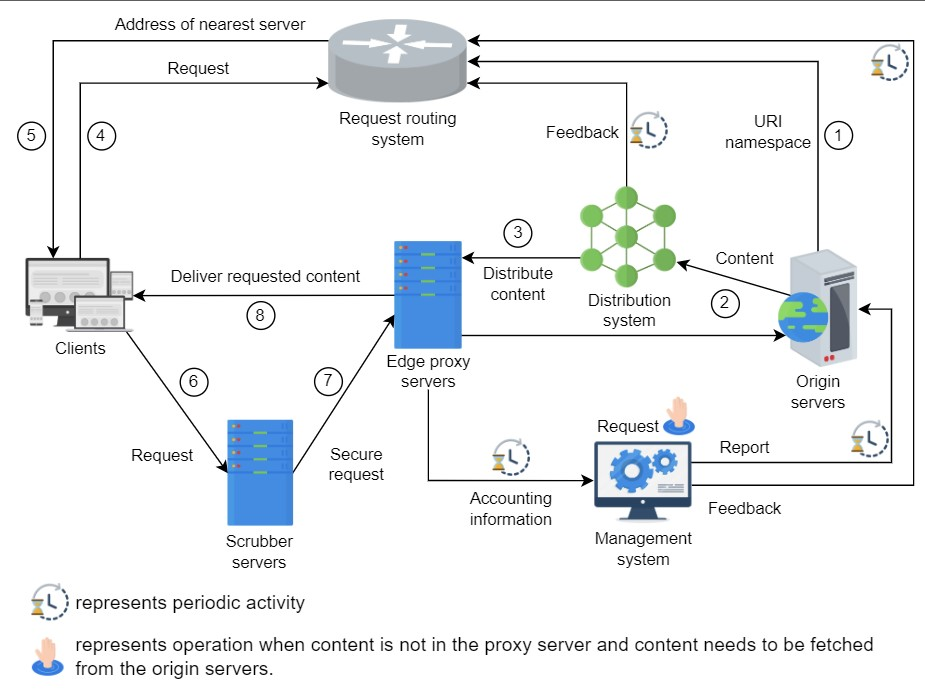

# CDN
A CDN is a group of geographically distributed proxy servers.A proxy server is an intermediate server between a client and origin server. 

## Functional Requirements:
1) Retrieve
2) Request
3) Deliver
4) Search
5) Update
6) Delete

## Non-functional Requirements:

1) Performance
2) Availability
3) Scalibility
4) Reliability and Security

## CDN Components and workflow:

1) The origin server provide the URI namespace delegation of all objects cached in CDN.
2) Origin server publishes the content to the distributed system, which then distribute the data to proxy servers.
3) The distribution system distribute the content among the proxy server and provide feedback to the request routing system.
4) The client request the routing system for a suitable proxy server from request routing system.
5) Request routing system will return the IP address of nearest proxy server.
6) Client request the routes through the scrubber server.
7) Scrubber server forward good traffic to the proxy server.
8) Proxy server provides accounting information to Management System periodically.  

There are 2 strategies for Content Cashing in CDN :
* Push CDN : In this content is pushed by origin server to the proxy server. It is usefull for static content like images.
* Pull CDN : In this content is pulled by proxy servers from origin server. It is usefull when the content is changing very fast.

## Mult-tier CDN Architecture

CDN follows a tree-like structure to ease the data distribution process for the origin server. The edge proxy servers have some peer servers that belong to the same hierarchy. This set of servers receives the data from parent node in the tree and eventually receive the data from origin node. 

Whenever a new proxy server enters the tree of a CDN, it request the control core, which maintains information on all the proxy servers in the CDN. 

Different consistency mechanisms can be used to ensure the consistency of data based on push or pull model. 

1) Periodic polling
2) Time-to-live
3) Leases 
