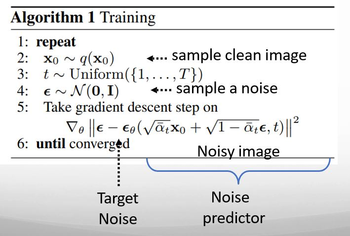
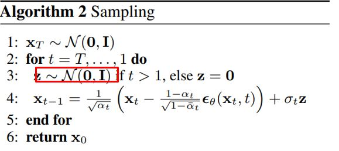

# Diffusion Model 

Diffusion Model is a Generative model , that means It is capable of generating the data. It generates the the data through the process of adding the noise into data and then removing it. It takes the sample of pure noise and iteratively transform it into data like images or audio. It works in following 2 steps: 

## Forward Diffusion Process :
  Process that begin with clean data sample(like an image), and we gradually add the noise into data over multiple steps. This process transforms the data close to  pure Gausian Noise. This process is modeled as *Markov Chain* , where each step is small amount of noise.  

## Reverse Diffusion Process:
   The main task of Diffusion Model is to learn the reverese process that means denoising the data step by step. Typicallly. a neural network (often a U-Net) is trained to perform this denoising task. 

## Training Process 

 Source : Diffusion Model Training 

**Step1** : 
The Training process is repeated untill model the converges. 

**Step2**: 
A clean image is sampled from the dataset , this is the image before any noise is added. 

**Step3**:
A random timestamp t is selected from 1 to **T** where T is total number of diffusion steps. 

**Step4**: 
A noise sample is 𝜖 is drawn from standard normal distribution. This noise will be added to the clean image. 

**Step5**: Gradient Descent
The model, represented by 𝜖𝜃 , is trained to predict the noise 𝜖 added to the clean image. The following components are involved:
Noisy Image: 
Loss Function:  Gradient Descent is used to minimize the difference between the predicted noise and true noise. Goal is to make them as close as possible. 
Target Noise: True noise will be target for the model's prediction. 

- Training process involves learning to predict the noise added to clean image. Then model is optimized by minimizing the difference between predicted noise and actual noise.

## Diffusion Sampling 
 Source : Diffusion Model Sampling

In this step, we process noise and generates new data. 

**Step1**: 
We will start with pure gaussian noise which is sampled from Normal distribution with mean 0 and idenity covariance. 

**Step2**:
Loop over timestamp T ... 1 and in each step we gradually reduces the noise and moving close to the original data. 

**Step3**:
for t>1 , we keep on adding the random noise , so that we can generate the variety of data. 

**Step4**: 

This is core reverse diffusion steps:
  - x_t  is the current noisy sample.
  - The term 𝜖𝜃(𝑥𝑡,𝑡) is the model's prediction of the noise added to 𝑥𝑡 at time step t.
  - This prediction is adjusted by subtracting a fraction based on 𝛼𝑡(which controls the noise scale) to denoise the sample.
  - σ_t z adds a small amount of noise 𝑧scaled by 𝜎_𝑡 ​to the result, introducing some randomness.

This process will continuously reduce the noise and will retrun the final outpur x_0.

