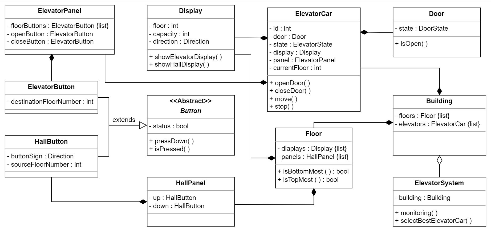

# Elevator System Design 

## Requirements
1) There exist multiple elevator cars and floors in the building.
2) The elevator car can move up or down or be in an idle state.
3) The elevator door can only be opened when it is in an idle state.
4) Every elevator car passes through each floor.
5) The panel outside the elevator should have buttons to call an elevator car and to specify whether the passenger wants to go up or down.
6) The panel inside the elevator should have buttons to go to every floor. There should be buttons to open or close the lift doors.
7) There should be a display inside and outside the elevator car to show the current floor number and direction of the elevator car.
8) Each floor has a separate panel and a display for each elevator car.
9) The elevator system should be able to control the elevator car movement and the door functioning and monitor the elevator car.
10) The elevator control system should be able to send the most appropriate elevator to the passenger when the passenger calls the elevator car.

## Actors

### Primary Actors
- Passenger

### Secondry Actors
- System

## Classes:

1) Button
2) ElevatorButton
3) HallButton
4) ElevatorPanel
5) HallPanel
6) Display
7) Door
8) ElevatorCar
9) Floor
10) Building
11) ElevatorSystem

### Enumerations
1) ElevatorState: Idle, Up, Down
2) Direction : Up, Down
3) DoorState: Open, Close 

## Relations 
### Aggregation
- ElevatorSystem has an aggregation relationship with Building

### Composition
- Building is composed of ElevatorCar & Floor.
- ElevatorCar is composed of Door, ElevatorPanel, Display.
- Floor is composed of Display & HallPanel.
- HallPanel is composed of Hall Button.
- ElevatorPanel is composed of ElevatorButton.

### Inheritance
- ElevatorButton & HallButton extends the Button class.

 Source: Educative
## Design Patterns useful for this problem:

**Singleton Pattern**: We need a single instance of the elevator controller, which will manage all the elevators.
**Observer Design Pattern**: The display will show the current state of an elevator, so the elevator will be a subject and the display will be an observer.
**State Pattern**: The elevator has different states like Idle, Moving, etc., so these different states can be managed by State patterns.
**Command Pattern**: There are several commands for the elevator that can be triggered through button presses, so the Command Pattern can be used.
**Factory Pattern**: Can be used for creating different types of buttons like HallButton, ElevatorButton.
**Strategy Pattern**: For different dispatcher algorithms.

