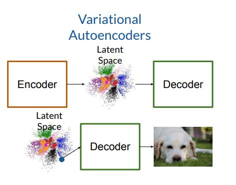
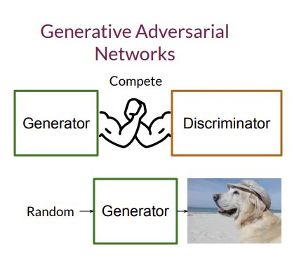

# Generative Models

### What are Generative Models and  how do they differ from Discrinative Models ?

  - **Generative models** learn to produce realistic examples of a certain class or category. These models captures the probability distribution of features of a class.
  - These models take random noise as input and generate a set of features that represents a class. These models can generate the different examples of the same class.
  - **Discriminative models** are used in classification task, They learn basically how to distinguish between different classes.
  - They take a set of features as input and determine the probability of a certain class for given features.
  
# Popular Generative Models:

## Autoencoder & Variational Autoencoders:

**Autoencoder**:  

It basically consist of 2 parts:
        - **Encoder**: It maps the input data into latent space, which is basically the comppressed representation of the data.
        - **Decoder**: It reconstruct the input data from latent space.
    - This latent space is deterministic and does not have a probabilistic interpretation. It means that it does not capture any randomness or uncertainty. If I will give any image X then we will always get the same latent vector.
    
**Variational Autoencoder**: 

It also consist of the same 2 blocks : **Encoder** & **Decoder**. In VAE, the encoder outputs parameters of a probability distribution instead of fixed latent space. The Encoder maps the input data to a distribution and represented by a *Mean* and a *Standard Deviation*. 

The decoder takes the sampled latent variable and reconstruct the input data from it. Because of this VAE is capable of generating the new samples from latent space. 
Papers : https://arxiv.org/pdf/1804.00891   

 Source : Coursera deeplearning.io 

## Generative Adversarial Networks 

GAN is composed of the 2 models one is **Generator** and **Discriminator**, Generator takes some kind of noise as input and generates images as output. Discriminator looks at images output from generator and discriminate that which one is fake and which one is real. These models compete each other, that is why these called adversarial. This process continues untill we dont need the discriminator model anymore and Generator is capable of generating good images. 

 Source : Coursera deeplearning.io 

### How Discriminator works ?

This is nothing but a classifier , instead of classifying the input data into many classes , it classifies the data into 2 classes either *fake* or *real*. 
It takes the features and feed it into neural network and learns set of parameters , these weights learns overtime that how cat looks like or dogs looks like. These parameters tries to map lernt parameters to the output Y^. Goal is to minimize the difference between the output label and true label. For that we need to use cost function. Based on that cost function we need to update the parameters. In GAN context, it gives the probability of input being fake given input features X. This probabilities are the feedback for the generator.  

During the training process, the discriminator and generator are optimized  in an adversarial manner:

  -The discriminator is trained to maximize its ability to correctly classify real and fake data.
  -Meanwhile, the generator is trained to produce data that can fool the discriminator, minimizing the discriminator's ability to distinguish between real and fake.

### How Generator works ?

Final goal of Generator is to produce the data from a certain class. It takes a random noise vector as input and it returns some variables(like an Image) that looks like that class. Once we received the generator in training processes that looks good we need to save the parameters of generator. So that will be a saved generator and when we will input different noise to  this saved generator it will produce different data from the same class. 

