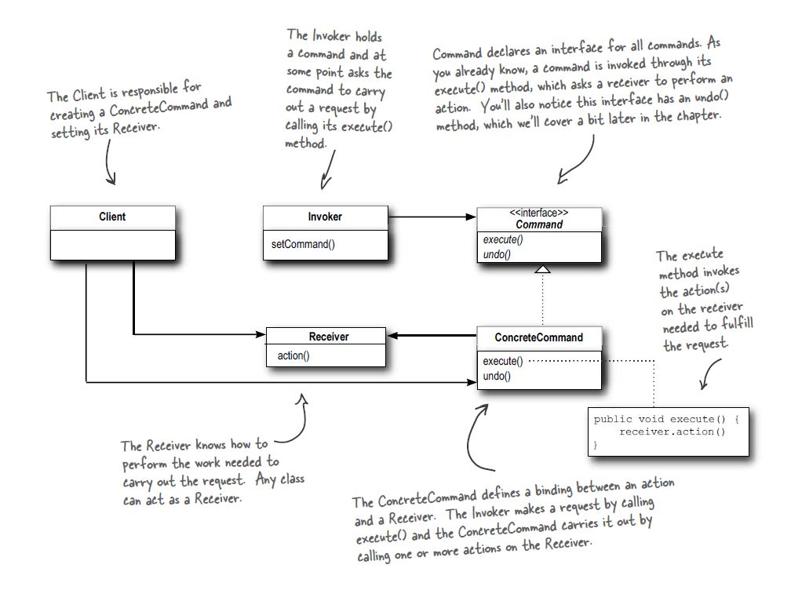

# Design Patterns from GoF

## Adapter Design Patterns (Structural)

### Intent
Convert the interface of a class into another interface that client expect. Adapter lets classes work together that coult not otherwise because of incompatible interface.

### Participants 
**Target** : Interface that is visible to the client.

**Adapter** : It implements the Target interface and translate the client request to the "Adaptee" in a way it can understand. 

**Adaptee** : Define an existing interface that is incompatible with target interface. The Adapter uses this class and translate its interface so that it can work with target. 

**Client** : Collaborates with objects that implement the Target interface. 

## Composite Design Patterns (Structural)
### Intent
Compose the object into the tree like structures to represent the part-whole hierarchies. Composite lets clients treat individual object and composition of the object in the same way.

### Participants 

**Component** : Declares the interface for objects in composition, which can be treated uniformly.

**Leaf** : Represent the leaf object in composition. It implements the Component Interface.

**Composite** :  Container of child component, and it also implements Component Interface. 

**Client** : It interact with the composite object using Component interface. Client need not to know whether its working with leaf object or composite object.

 Source : Head First 

## Decorator Pattern  (Structural)

### Intent 

Attach additional responsibilities to an object dynamically Decorators provide a flexible alternative to subclassing for extending functionality. 

### Participants 

**Component**  : Objects that can have responsibilites added to them dynamically. 

**ConcreteComponent** : Implements the Component interface and define the core behavior. 

**Decorator** : Implement the Component interface and contains the reference to a Component Object.

**Concrete Decorator** : Extende the decorator class to add responsibilities. 

 Source : Head First 

## Facade Design Pattern

Provide a unified interface to a set of interfaces in a subsystem. It defines a higher level interface that makes the subsystems earier to use. 

### Participants 

**Facade** : A simple interface to complex subsystem. It delegates the client request to approprate subsystem. 

**Subsystem Classes** : These classes implement the subsystem's functionality. Subsystem classes are complex and handle the actual work but it dont directly interact with the client. 

 Source : Head First 

## State Design Pattern

### Intent 
Allow an object to alter its behavior when its internal state changes. The object will appear to change its class.

### Participants 

**Context**:
 - Context holds a reference to  a state object, which represent the current state of the context.
 - It delegates state-specific behavior to current state object.
 - It can also transition to another state by changing the reference to a different State object.

**State** (Abstract State):
 - The State interface declares the methods that all concrete state must implement . These methods encapsulate the behavior associated with perticular state of context.

**ConcreteState**: 
 - Each ConcreteState corresponds to a specific state of the context and define its specific behavior. These classes handle requests from Context and also decide the transition the Context to a different state.  

 Source : Head First 

 
## Command Design Patterns 

### Intent 
Encapsulate request as an object, thereby letting you parameterize clients with different requests, queue or log requests and support undoable operation. 

**It Means** : Wrap the request in an object, so that we can give it to a different part of the program. 

### Participants

### Command (Interface)
 -  Its an interface for executing an operation. It includes an **execute()** method, which is implemented by concrete command classes to perform specific actions. 

### ConcreteCommand
 - Implements the **Command** interface and define the binding between receiver object and an action. It calls methods on the Receiver to perform an specific an action. 

### Receiver 
 - It knows actually how to perform an operation for any request. 

### Invoker:
 - It asks the command to carry out the request. It stores a command object and and invokes Command's trigger() method. 

### Client
 - Creates a **ConcreteCommand** and set its **Receiver**.
 - Configure the **Invoker** with the **ConcreteCommand** object. 

 Source : Head First 

