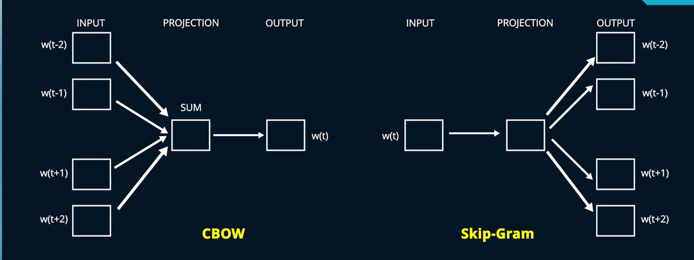
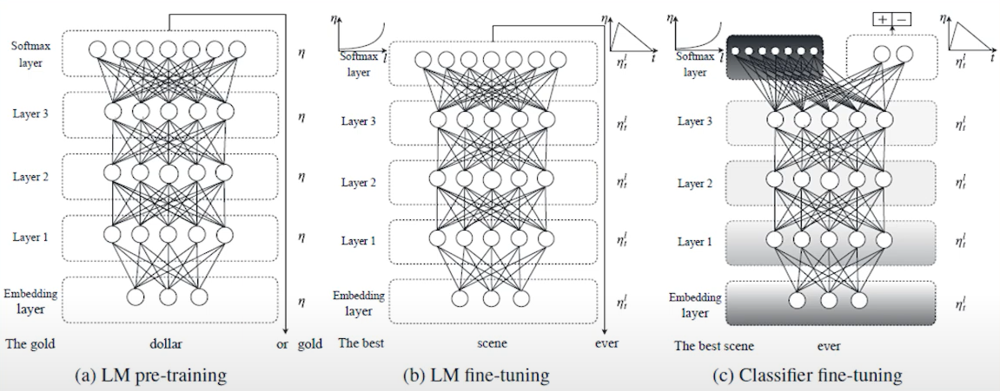

## Tokenization

The process of breaking down these documents into set of sentences and each sentence into words is called the Tokenization.  The tokens could be individual words punctuations, or part of short forms of the words. For instance, don’t could be broken down into do and n apostrophe t.

## Text Pre-processing Tasks
- Stop words removal
- Stemming : Stemming is a crude process of severing the suffixes of the word without checking whether the word after chopping is a valid dictionary form of a word or not.
- Lemmatization : lemmatization is a more refined way of converting the words to the base form, as it checks the dictionary after the process to ensure the word is a proper vocabulary term.

Besides these pre-processing steps there are many more pre-processing steps, such as creating Bi-grams that is instead of considering New Delhi as two words, we consider it as single word. Then we have Tri-grams etc. Part of speech tagging, which is useful for name entity recognition application.

## Numericalization 

Now that, we have the tokens and have performed the pre-processing steps, we need to encode or numericalize the output tokens into numbers. There are various ways of encoding the token:

- One-Hot Encoding
- Count Vectorization
- TF-IDF (Term Frequency Inverse Document Frequency) Vectorization
- Word Embedding: Learning word embeddings involves using algorithms like Word2Vec and GloVe 

### Word2Vec
Word2Vec Model has two different variants. Continuous Bag-of-Words that is CBOW and Skip-Gram.In CBOW architecture the input layer is the context, that is the surrounding words that is both to the left and the right of the target word and is used to predict the target that is the middle word.In Skip-Gram Architecture, the input layer is the middle word and is used to predict the context that is the words to the left and the right of the target word.

-  From a large corpus when we capture multiple contexts using different sentences, we could expect the word embeddings of similar words to be similar.
-  Typically, the embeddings are represented in 50 or higher dimensions, which makes it difficult to visualize the embeddings.However, we could use the **dimension reduction** technique and reduce the dimension to 2
or 3 and plot it to check, whether we can observe any relationship between the words.

### GloVe Global Vectors for Word Representation

## Sequential Data

In sequential data, input values are independent of each other but there is a time relationship between these data points. This relationship can not be leveraged by multi layer perceptron architecture and we lose the temporal information. Beside that in multilayer perceptron network the input and the output size are expected to be fixed for every data instance. 

*One of the problems with these embeddings is that for any word, we get only 
one fixed representation, which is context independent and which combines all the 
different senses of the word*.

## ELMo (Embedding from Language Model)

ELMo (Embeddings from Language Models) generates context-dependent word embeddings using a bidirectional LSTM, allowing words to be understood based on their surrounding context. This approach improves performance in various NLP tasks by capturing both syntactic and semantic nuances.

## Bidirectional Language Models

Bidirectional Language Models process text in both directions (left-to-right and right-to-left), providing a comprehensive understanding of context, which is essential for accurate language modeling and enhancing the quality of embeddings like ELMo.

## ULMFiT (Universal Language Model Fine-tuning for Text Classification)

ULMFiT is a Transfer Learning technique for NLP that involves pre-training a language model on a large corpus and fine-tune it for specific task. This approach allows for superior performance on specific task.

- ULMFiT consists of three major steps; that is:
    -  General domain language modeling pre_training. (LM Pre-training)
    - Target task language modeling fine-tuning.(LM fine-tuning)
    - Target task classifier fine-tuning.(Classifier fine-tuning)

- Fine tuning was implemented by introducing the techniques such as 
*discriminative fine-tuning* and *slanted triangular learning rates*.

