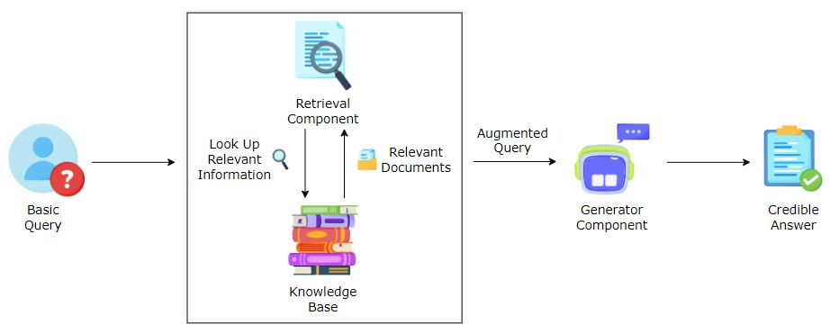

# RAG Model 

Retrieval-Augmented Generation (RAG) is a technique that enhances generative AI models by combining them with a retrieval component. It works by retrieving relevant information from a large corpus of documents or knowledge base and then using this information to generate more accurate and contextually rich responses. RAG models leverage both the generative capabilities of AI and the precision of retrieval systems, enabling more informed and coherent outputs, especially in complex or knowledge-intensive tasks.

RAG Model is hybrid model that has two components:
  1) Retrieval Model
  2) Generation Model

In practice, when RAG model is prompted to generate some text or answer of any question , it first retrieves the relevent information from the knowledge base and provides the augmented query. It then uses this context as a direct input to guide the generative process, due to this it also uses real world data and dont fully rely on training data.This dynamic approch allows RAG model to produce more accurate and updated information.  

 Source:Educative.io 

## Step by Step Procedure:

### 1) Data Preparation
  - Gathering document data with pertinent metadata.
  - Initial preprocessing includes identifying, removing, redacting or replacing personal informations.
  - Segment data into manageable chunks or segments.
  - Chunk size should be carefully selected based on the requirements of embedding model and downstream LLM application. 

### 2) Index Relevent Data:
  - Data is preprocessed and chunked. 
  - Create document embeddings. 
  - Use embeddings to populate a vector search index.
  - The index enables efficient searching.
  - Retrieve relevent data chunks. 

### 3) Retrieve Relevent Data

RAG model has certain challenges: 
  1) RAG model heavily depends on knowledge base, so any problem in knowledge base will affect the model performence. So regular update of knowledge base is required.
  2) Intergrating the Retreival model with generation model together to work well is not easy.
  3) If the data size, scaling an RAG model is an issue in terms of speed and efficiency.

Retrieval strategy is crucial because that will determine the quality of data that will feed into generation model. Retrieval strategy in RAG:

  - Query formation
  - Document Retrieval
  - Document Selection
  - Augumentation 

**Similarity Search** searches for documents in corpus similar to the input query. It uses distance metrics like cosine similarity between embeddings.

**Maximum Marginal Relevance(MMR)** balances relevance and diversity in selecting the documents. It prevents redundancy and brodens information coverage. 

