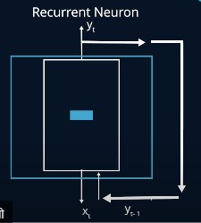
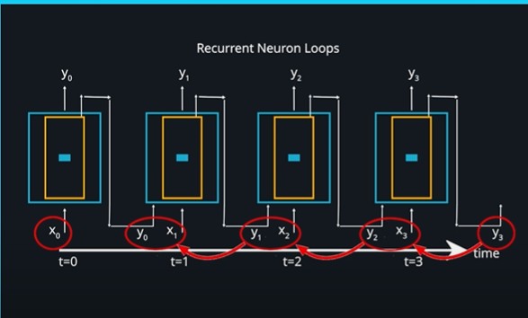
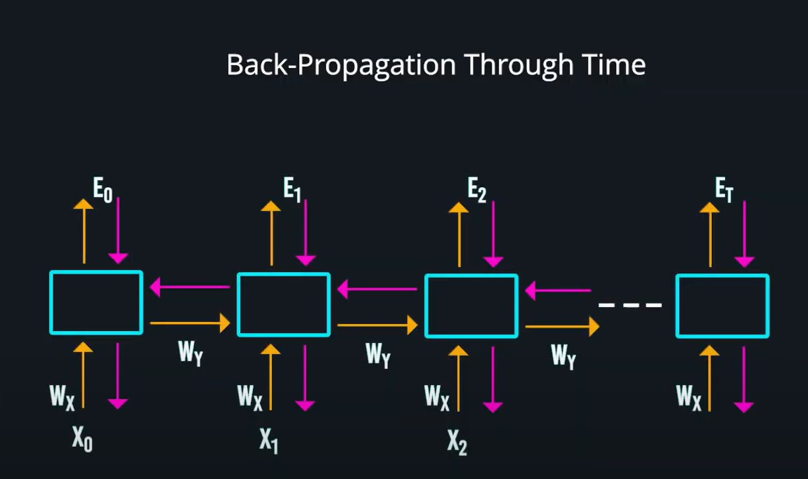
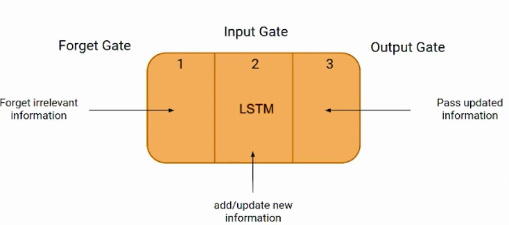
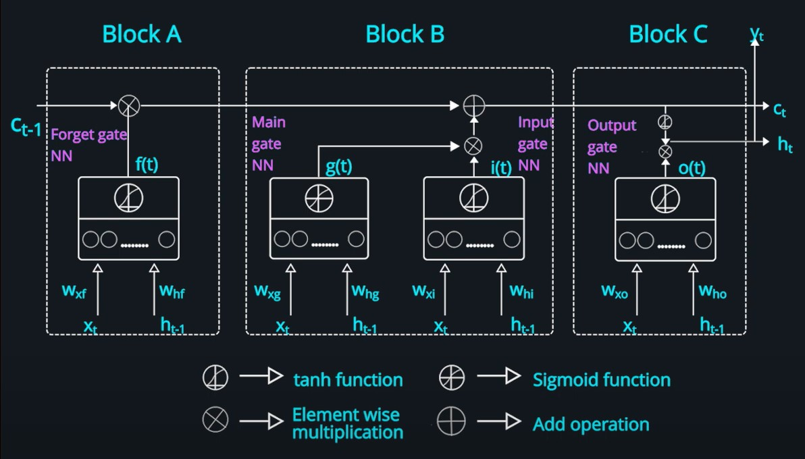
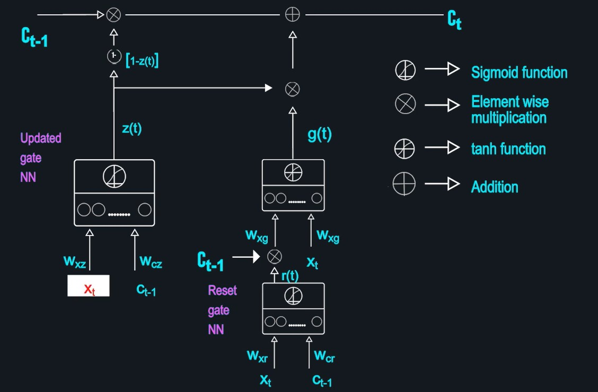
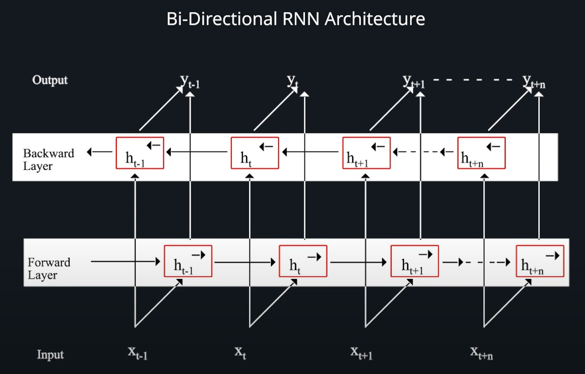
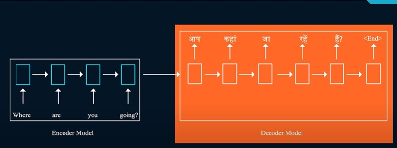

# RNN

A Recurrent Neural Network (RNN) is a type of neural network designed for processing sequential data. It features loops that allow information to be retained across time steps, making it effective at capturing temporal patterns. This capability makes RNNs particularly useful for applications such as time series forecasting, speech recognition, and natural language processing. More advanced variants, like Long Short-Term Memory (LSTM) and Gated Recurrent Unit (GRU) networks, have been developed to overcome the limitations of traditional RNNs, such as difficulty in learning long-term dependencies.

- Regular neuron which has only one weight Wx to represent its contribution, a recurrent neuron has two weights Wx and Wy to represent the contribution of the input and previous output respectively.

### Flat Model

-   Generally each layer has multiple recurrent neurons . In this layer each neuron is connected to the input and the previous output and number of units within each layer is a hyperparameter. 

- Recurrent neurons or cells maintain some kind of 
state or has a memory, which gets added or updated by the recurrent connections, which allows it to learn features from the sequential data

### Types of RNN 

**One-to-One (1:1)**: This is a standard feedforward neural network used for non-sequential data.

**Many-to-One (N:1)**: This type processes multiple inputs to produce a single output, such as in sentiment analysis.

**One-to-Many (1-N)**: This setup uses a single input to generate multiple outputs, such as in image captioning.

**Many-to-Many (N-N)**: This configuration handles multiple inputs and produces multiple outputs, which is common in machine translation.

**Many-to-Many (N-M)**: This flexible structure allows for varying sequence lengths in both inputs and outputs, useful in applications like video analysis.

**Long Short-Term Memory (LSTM)**

**Gated Recurrent Unit (GRU)**

**Character Prediction**

**Stacked RNNs**

**Bidirectional RNNs**

### Training RNN BPTT

- It performs forward propagation from left to right. So, for the first time step the input X0 is multiplied with the weight WX.The bias term is added as well and the activation function is applied on this value to produce Y of 0, which is then compared with the actual output to calculate the error E of 0. Similarly, for the next time step input X1 is multiplied with WX and the previous output is multiplied with the WY and the activation function is applied on the sum of these two values and the bias term to produce the output Y of 1, which is used to calculate the loss for that time step.

- This way the loss terms are calculated for every time step and the cumulative loss is the loss for the entire sequence. The next step is to perform back propagation in which the gradients of the error is calculated with respect to the weights WX and WY.

### LSTM(Long Short Term Memory)

- To address the memory issue, added 2 states: 
    1) Long term state (c) 
    2) Short term state(h)

Forgets or filters not so important old memories and update the old memory and form  new memories.

- LSTM dont have pre-defined logic instead but it uses neural network for it to learn what state to retain or forget. For this it uses 4 gates: 
    1) Main Gate 
    2) Forget Gate 
    3) Input Gate 
    4) Output Gate

Each gate above is fully connected neural network.

-   Main neural network produces the output based on the input and previous state of cell and updates the long term memory.

- Forget Gate determines how much of the long-term memory needs to be forgotten or retained.

- Input Gate figures out the important part of the input and concatenates that to the long-term state.

- Output Gate decides how much of the updated long-term memory should be considered as part of the output cell.

### GRU (Gated Recurrent Unit)

- Unlike in LSTM, which had two different states that is long-term and short-term state, GRU merges the two states and hence has just one state c of t.

- Unlike in LSTM, where we have two separate neural networks to control the input gate 
and forget gate, in GRU only one neural network is used.

- LSTM which has the main neural network with n number of neurons and tanh activation 
function, GRU also has a similar main neural network, but the inputs are slightly 
different.

- The input Xt is the same and the second input that is the previous state term Ct-1 is 
controlled by the Reset gate output and is not fed directly. The Reset gate neural network with n number of neurons takes an input as Xt and the previous state Ct-1 and sigmoid activation function is applied on the output to produce r(t).

- Unlike the LSTM cell which has an output gate the GRU cell has no such gate.

### Stacked and Bi-Directional RNNs

-  The limitation of a Standard RNN is that, it takes inputs only from one direction that is left to right and does not consider words in future time steps.

- Bi-directional RNN has two LSTM GRU cells instead of one, and uses the same input sequence as the input for both.

- However one of them processes the input sequence from the first to the last word, that is left to right direction and other one computes the input in reverse direction that is from last to first word.

- The state in forward layer and backward layer at a particular time step is considered to produce the output for the corresponding time step.

*The issue with the standard RNN architecture with many to many cardinality is that it anticipates the input and the output sequence to be of similar size or length. And besides that fetching output at each time step would not have enough context for the model to predict the correct word, especially for the initial few words of the sentence.And in some languages we might need to know the complete sentence before starting the translation and in some case the subject of the sentence could be at the end of the sentence. In such cases these architectures would not perform well.*

### Encoder-Decoder Model

- The encoder model is a RNN model typically an LSTM as it can learn long term 
dependency between input and output sequence and the input is the English sentence.

- The *state vector* represents the information of the whole input English sentence. The decoder model which is also a RNN model typically LSTM as well is the second part of the architecture which decodes the encoded information stored in the state vector to other language.

- *Start* in angular brackets as the input for the first time step and for the next time steps we could use the predicted output of the previous time step as the input at each time step. 

- **Since the output sequence length could vary in machine translation how do we decide on the number of time steps in the decoder model?** To address this we fix a certain number of steps generally by taking the average length of the documents and introduce a token *End* in the angular brackets to indicate the end of a sentence.

- To avoid erroneous, Teacher forcing technique is utilized.  we provide the first word of the translated language text as input for the second time step instead of the previous predicted output at each time step as shown.This ensures that even if the prediction is wrong correction happens at that time step itself.