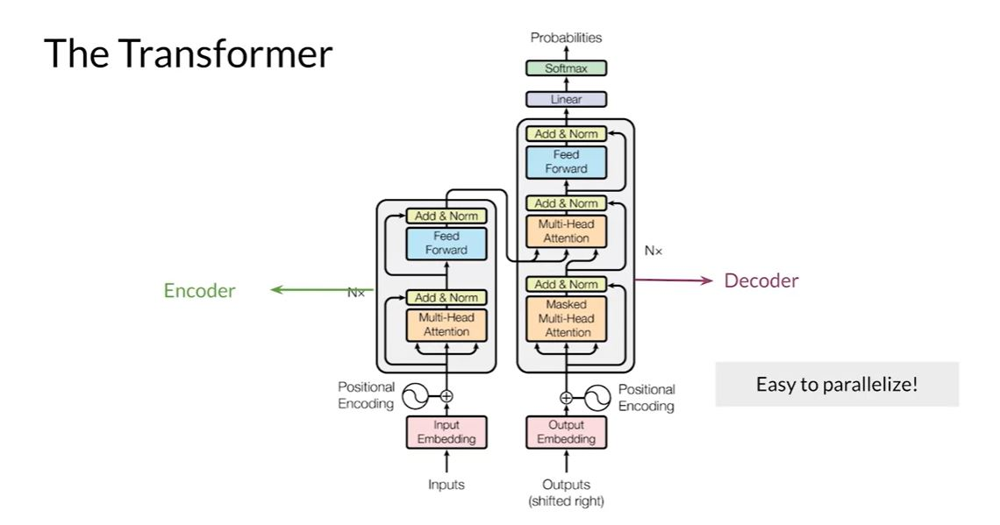
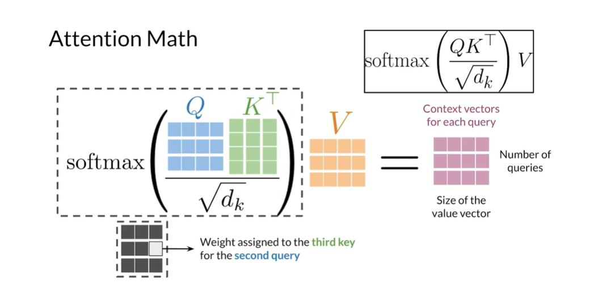
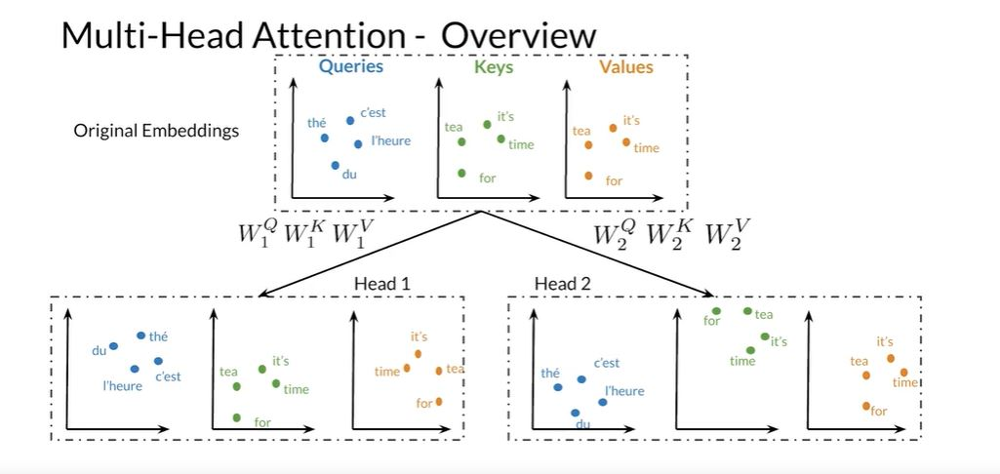
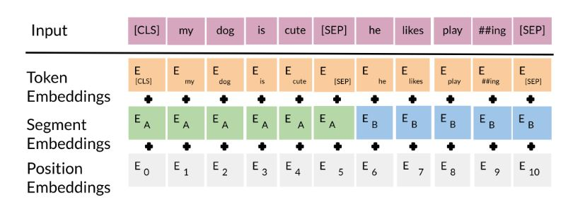

# Transformer Architecture

## Basics

### BLEU Score (Bilingual Evaluation Understandy)
  - Compares candidate translations to reference(human) translations.
  - The closer to 1, the better.
  - How many word from the *candidate* appear in the *reference* translation and then divide that count by total number of words in the **candidate translation**.
  - In the modified version of the BLEU score, a word is removed from the reference sentences whenever it is found.
  - It does not consider the semantic meaning of words.
    
### Rouge N Score (something recall oriented :-))
  - How much human created references appeared in candidate translation.
  - Count word matches between reference and candidates and divide by the number of **words in references**.
  - If there are multiple refences, then we need to get ROUGE score for each and then get the max out of it.
    
- he **F1 score** is calculated using the formula: 2 (precision recall) / (precision + recall). In this case, precision is represented by the modified BLEU score and recall is represented by the ROUGE-N score.

## Transformer Encoder

Normal Seq2Seq models (RNN or LSTM or GRU) suffers from the problem of Vanishing Gradient Problem or Loss of information. Including Attention to these model is the way to tackel this problem.
- Transformer architecture uses **Scaled Dot-Product Attention** . We also use **Multi-head Attention** layer , this layer runs in parallel and it has multiple Scaled dot product attention mechanism and multiple linear transformations of input **Query, Keys and Values**.  In this layer, Linear transformations has learnable paramaters.
- Encoder starts with multi-head attention module that performs **Self Attention** mechanism in the input sequence. This is followed by residual connection and normalization layer and then one more feedforward and residual connection and normalization. This entire block is one encoder layer and repeated N times. This Encoder gives a textual representation of each item in inout sequence.
- Decoder is constructued similarly to encoder. First attention Module is masked multi-head attention so that every position attends to previous position. Second step  **Multi-Head Attention** Every position from the decoder attents to output from the encoder. 
- It also encorporates a positional encoding , in positional encoding , there are values , that are added to the embeddings so that for very words that have information about its order and positions.
  


-  In Scaled dot product attention , we have queries , keys and values. Attention layer outputs context vectors for each query and context vectors are similarites between queries and keys , weights assigned to each values.To get the Query, Key and value matrices first transform the words in sequence into embeddings. Query matrix contains the individual word embedding as rows, columns will be the size of embedding.
-  To get the key matrices need to create the matrix in the same way.
-  Now we need use Scaled Attention formula,  multiply the Query and Key Matrices and then scale it with the Square root of dimention of the key vectors and then calculate the softmax after that need to multiply it value matrix. Result matrix will have rows that will represent the Context vector for each query and columns size will be size of value vector.
  


- There are different types of attention mechanism:
    - **Encoder Decoder Attention** : Queries from one sentence, keys and values from another.
    - **Self Attention** - Query, Keys , values comes from the same sentence.
    - **Masked Self Attention** : Query, Keys, and Values comes from the same senetences but query dont attend the future positions.
-  IN Multi Head Attention, we apply the attention mechanism to multiple set of these Query, Key and Value matrices that can generated by Transforming the orginal matrices.
  


- First we need to Transform Query, Key and Value matrices into multiple vector spaces.
- Then need to apply Scaler dot product Attention mechanism.
- Concatenate results into a single matrix and transform the matrix to get the output context vector.

## Transformer Decoder
  - Sentence will get word embedding from the words, then embedding will be added with positional encoding.
  - This will be the input to a multihead attention layer.
  - After attention layer we have a feed-forward layer.
  - After each attention and feed forward layer, we have have residual or skip connection.
  - These steps are repeated N times
  - Then we have a Dense Layer and then Softmax.

## Transfer learning options 
  - **Feature-Based Transfer Learning** : Feature-based learning involves learning word vectors or embeddings, which can then be used as input features for other tasks like translation
  - **Fine-Tuning Based Transfer Larning** : Involves taking an exisitng model and tweaking its weight to make it work for specific task.

## BERT (Bi-Directional Encoder representation For Transformer)

  - Makes use of transfer learning/pre-training.
  - In BERT there are 2 steps:
    - Pre-training : Model is trained on unlabeled data on different training task. 
    - Fine Tuning  : BERT is initialized with pretrained parameters and then parameters are fine tuned with the labed data for downstream task.
  - Multi layer bidirectional transformer.
  - BERT_Base :
    - 12 Layers
    - 12 Attention heads
    - 110 million parameters
      
  - **Choose 15% of the tokens at random: mask them 80% of the time, replace them with a random token 10% of the time, or keep as is 10% of the time.** :
    -  it means that out of all the words or tokens in a sentence, 15% of them will be selected randomly.
    -  The selected tokens will be replaced with a special mask token. This is done to hide the original word and encourage the model to learn how to predict the masked word based on the surrounding context.
    -  The selected tokens will be replaced with a completely random word.This helps the model learn to handle situations where it encounters unfamiliar words.
    -  In the remaining 10% of the cases, the selected tokens will be left unchanged. This allows the model to learn from the original words without any modifications

  - The input embeddins are sum of the *Token embeddings*, *Segment Embedding*, *Positional Embedding* . *CLS* token in the input embedding indicate the beginning of the senetnce and *SEP* to indicate the end of the senetnce. **Segment Embeddings** allows you to indicate the different sentences. **Positional Encodding** allows to indicate the position in the sentence. 



- **Objective1 : Multi-Mask LM**: First objective of BERT is to find the missing words in a sentence. This is done by randomly masking out some words in the input sentence then training the model to predict the masked words  based on context provided by surrounding words. 

- **Objective2 : Next Sentence Prediction**: Predicts whether two sentences in a pair are consecutive or not. This model is trained to determine if the second sentence follows the first sentence in the original text.

- After the pre-training, we have to fine-tune it for different task. For example, we can use it for Named Entity Recognition, Paraphrasing, Sequence Tagging, classification etc.


## Summery of the tokenizers 
### Word based tokenization 
Word-based tokenization is a technique where text is split into individual words, treating each word as a token. It is one of the simplest and most intuitive tokenization methods, where spaces or specific delimiters are used to separate words.

```
Input: "I love Transformers!"
Output: ["I", "love", "Transformers!"]
```
Tokenizers may either keep punctuation attached to the word or split it into separate tokens.

```
With punctuation: ["Transformers!"]
Without punctuation: ["Transformers", "!"]
```
Contractions like "don't" or "it's" can either be treated as a single token or split into multiple tokens.
```
Input: "Don't you love AI?"
Output: ["Don't", "you", "love", "AI", "?"] 
Or: ["Do", "n't", "you", "love", "AI", "?"]
```

### Character based tokenization

Character-based tokenization is a technique where each character in the input text is treated as an individual token. Unlike word-based tokenization, this method does not split text into words or subwords but breaks it down into its smallest unit: characters.

```
Input: "Transformers!"
Output: ["T", "r", "a", "n", "s", "f", "o", "r", "m", "e", "r", "s", "!"]

```

### Subword based tokenization
Subword tokenization algorithms rely on the principle that frequently used words should not be split into smaller subwords, but rare words should be decomposed into meaningful subwords.

#### Byte-Pair Encoding

Byte-Pair Encoding (BPE) tokenization is a popular and effective method used in Natural Language Processing (NLP) for creating subword tokens. It's particularly useful for handling large vocabularies and out-of-vocabulary words. Here's an overview of BPE tokenization:

Basic Concept: BPE starts with a vocabulary of individual characters and iteratively merges the most frequent pair of consecutive bytes or characters to form new tokens.

Process: a. Initialize the vocabulary with individual characters. b. Count the frequency of adjacent pairs in the corpus. c. Merge the most frequent pair to create a new token. d. Repeat steps b and c for a predetermined number of merge operations or until a desired vocabulary size is reached.

I understood the concept from following video thanks to Huggingface : 

[](https://www.youtube.com/watch?v=HEikzVL-lZU)


#### Wordpiece 
#### Unigram
#### SentencePiece
     
